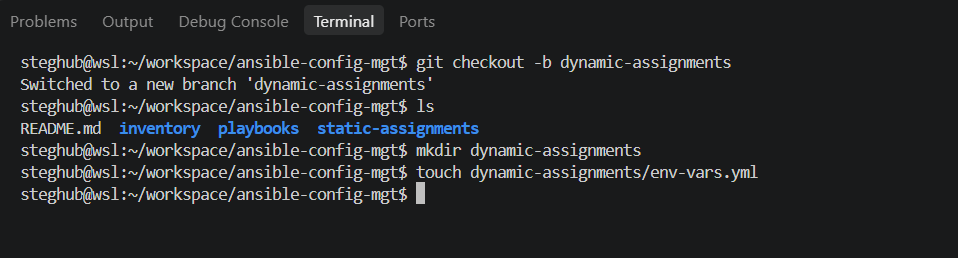
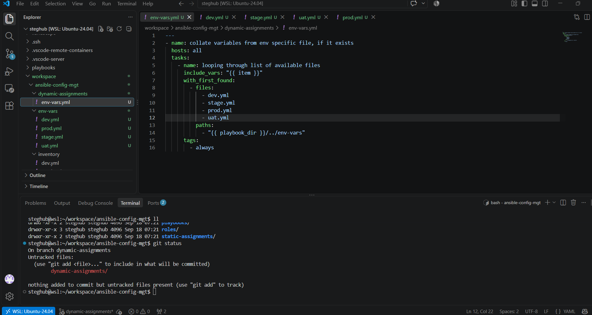
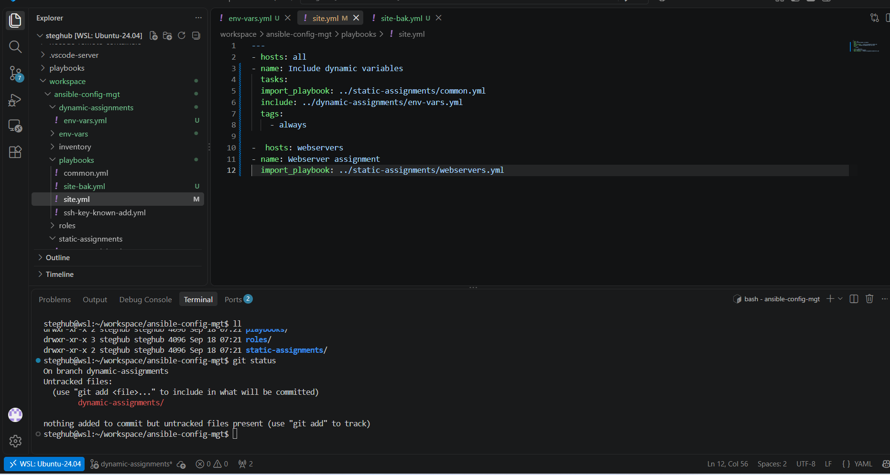
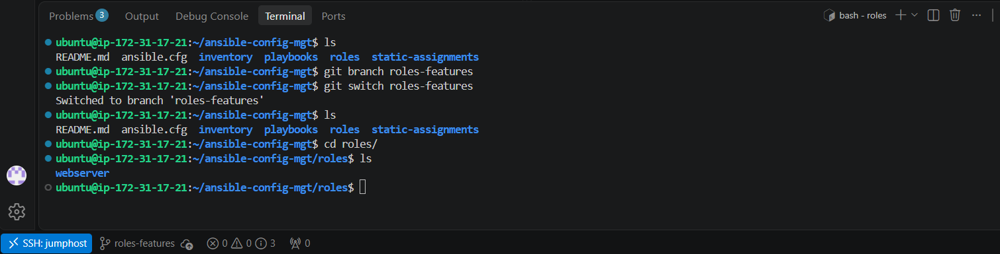
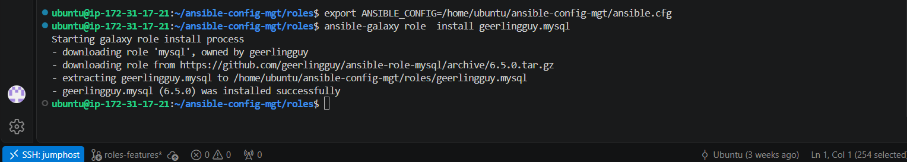
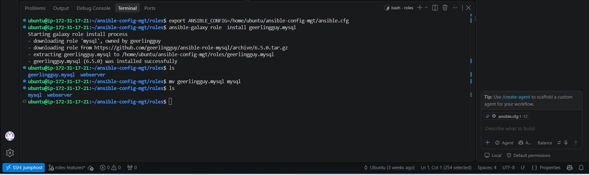

## Ansible Dynamic Assignments (Include) and Community Roles
### Introduction:

Refactoring is primarily about improving code readability and maintainability by leveraging the built-in capabilities of programming frameworks and tools. It can also extend to the design layer: well-known design patterns used by software developers are, in a sense, a form of design-level refactoring. Since Ansible is a configuration management language, applying refactoring practices is especially valuable for producing cleaner, more reusable, and easier-to-maintain automation code.
For better understanding or Ansible artifacts re-use read this article on[playbook-reuse](https://docs.ansible.com/projects/ansible/latest/playbook_guide/playbooks_reuse.html).
 


This lab consists of two parts:
1. Ansible code Refactoring 
2. Running playbook against UAT environment
### Introducing Dynamic Assignment Into Our structure:
To take into consideration differents configurations dynamically in ansible, we have to organize our project structure to be ready for this design.
Your layout should now look like this.
> ```
>├── dynamic-assignments
>│   └── env-vars.yml
>├── env-vars
>    └── dev.yml
>    └── stage.yml
>    └── uat.yml
>    └── prod.yml
>├── inventory
>    └── dev
>    └── stage
>    └── uat
>    └── prod
>├── playbooks
>    └── site.yml
>└── static-assignments
>    └── common.yml
>    └── webservers.yml
> ```

First of all we need to start a new branch and call it dynamic-assignments
```git
git checkout -b dynamic-assignments
```
create dynamic-assignments directory and create a config file named env-vars.yml 


insert the following code in env-vars.yml to load dynamically differents environments.

```yaml
---
- name: collate variables from env specific file, if it exists
  hosts: all
  tasks:
    - name: looping through list of available files
      include_vars: "{{ item }}"
      with_first_found:
        - files:
            - dev.yml
            - stage.yml
            - prod.yml
            - uat.yml
          paths:
            - "{{ playbook_dir }}/../env-vars"
      tags:
        - always
```

Update playbooks/site.yml with dynamic assignment as bellow:
```yml
---
- hosts: all
- name: Include dynamic variables 
  tasks:
  import_playbook: ../static-assignments/common.yml 
  include: ../dynamic-assignments/env-vars.yml
  tags:
    - always

-  hosts: webservers
- name: Webserver assignment
  import_playbook: ../static-assignments/webservers.yml
```

For now we have build the essential part that make our project load dynamically depending our environnment: dev,stage,uat and prod.


### Community Roles

Code reusability is a cornerstone of modern development practices. The underlying principle is simple: why reinvent the wheel when the community has already developed robust, pre-built roles available via Ansible Galaxy?

#### Download Mysql Ansible Role

You can browse available community roles [here](https://galaxy.ansible.com/ui/).

We will be using a MySQL role developed by [geerlingguy](https://galaxy.ansible.com/ui/standalone/roles/geerlingguy/mysql/).






