## Ansible Dynamic Assignments (Include) and Community Roles
### Introduction:
Ansible provides built-in modules and features that help DevOps engineers automate infrastructure consistently. Its active community also publishes reusable roles through Ansible Galaxy, enabling teams to standardize configurations and reduce duplicated automation work.

This lab consists of the following parts:

1. Configure dynamic inventory assignment.

2. Use community-maintained Ansible roles to deploy and configure MySQL,Apache and Nginx.

### Introducing Dynamic Assignment Into Our structure:
To take into consideration differents configurations dynamically in ansible, we have to organize our project structure to be ready for this design.
Your layout should now look like this.
> ```
>├── dynamic-assignments
>│   └── env-vars.yml
>├── env-vars
>    └── dev.yml
>    └── stage.yml
>    └── uat.yml
>    └── prod.yml
>├── inventory
>    └── dev
>    └── stage
>    └── uat
>    └── prod
>├── playbooks
>    └── site.yml
>└── static-assignments
>    └── common.yml
>    └── webservers.yml
> ```

First of all we need to start a new branch and call it dynamic-assignments
```git
git checkout -b dynamic-assignments
```
create dynamic-assignments directory and create a config file named env-vars.yml 


insert the following code in env-vars.yml to load dynamically differents environments.

```yaml
---
- name: collate variables from env specific file, if it exists
  hosts: all
  tasks:
    - name: looping through list of available files
      include_vars: "{{ item }}"
      with_first_found:
        - files:
            - dev.yml
            - stage.yml
            - prod.yml
            - uat.yml
          paths:
            - "{{ playbook_dir }}/../env-vars"
      tags:
        - always
```

For testing purposes, let’s populate env-vars/dev.yml and env-vars/uat.yml with the following values:

```yml
param1: 1000
param2: uat-env
param3: 10.0
```
```yml
param1: 1
param2: dev-env
param3: 1.0
```
To test the playbook let us add 2 other tasks to :
- Show selected inventory and loaded file
- Show selected environment settings

The complete playbook is shown below:
```yml
---
- name: collate variables from env specific file, if it exists
  hosts: all
  gather_facts: false
  tasks:
    - name: looping through list of available files
      include_vars: "{{ item }}"
      with_first_found:
        - files:
            - dev.yml
            - stage.yml
            - prod.yml
            - uat.yml
          paths:
            - "{{ playbook_dir }}/../env-vars"
      register: env_vars_result      
      tags:
        - always

    - name: Show selected inventory and loaded file
      ansible.builtin.debug:
        msg: >-
          Host={{ inventory_hostname }}
          Inventory={{ inventory_file | basename }}
          Loaded={{ env_vars_result.results[0].ansible_included_var_files }}
      tags:
        - always

    - name: Show selected environment settings
      ansible.builtin.debug:
        msg: >-
          parameter1={{ param1 }}
          parameter2={{ param2 }}
          parameter3={{ param3 }}
      tags:
        - always

```

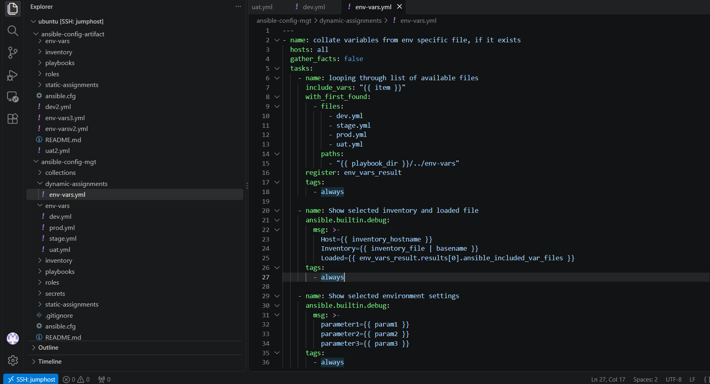

```bash
#verify that the syntax is OK
ansible-playbook -i inventory/dev.yml dynamic-assignments/env-vars.yml --syntax-check
```
Then run the playbook 
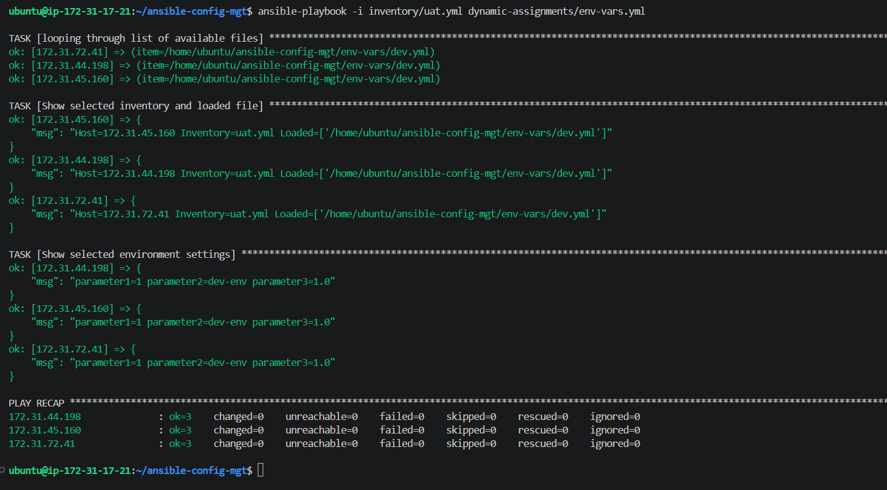

The result was as expected: although the selected inventory was uat.yml, the playbook loaded the variables from dev.yml because **with_first_found** selected the first existing file in the list.

Now, let’s fix the issue by replacing the with_first_found logic with the following playbook:

```yml
---
- name: Load variables matching the selected inventory
  hosts: all
  gather_facts: false

  tasks:
    - name: Validate the inventory filename
      ansible.builtin.assert:
        that:
          - (inventory_file | basename) in ['dev.yml', 'stage.yml', 'uat.yml', 'prod.yml']
        fail_msg: "Select inventory/dev.yml, stage.yml, uat.yml, or prod.yml."

    - name: Load variables for this host's inventory
      ansible.builtin.include_vars:
        file: "{{ playbook_dir }}/../env-vars/{{ inventory_file | basename }}"
      register: env_vars_result

    - name: Show the selected inventory and loaded file
      ansible.builtin.debug:
        msg: >-
          Host={{ inventory_hostname }}
          Inventory={{ inventory_file | basename }}
          Loaded={{ env_vars_result.ansible_included_var_files }}

    - name: Show selected environment settings
      ansible.builtin.debug:
        msg: >-
          Inventory={{ inventory_file | basename }}
          parameter1={{ param1 }}
          parameter2={{ param2 }}
          parameter3={{ param3 }}

```
Let us run the following commands:
```bash
ansible-playbook -i inventory/dev.yml dynamic-assignments/env-vars.yml 
ansible-playbook -i inventory/uat.yml dynamic-assignments/env-vars.yml 
```
We get the following results:

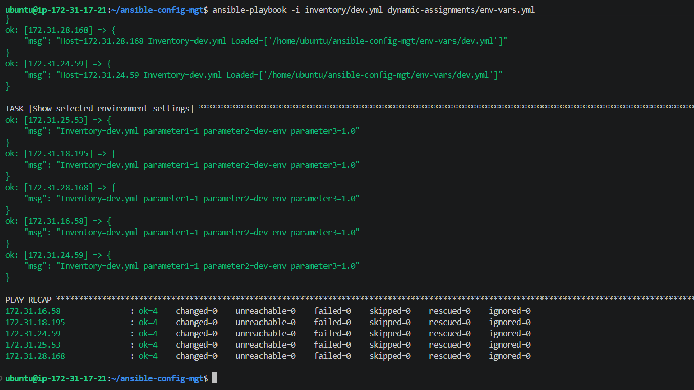

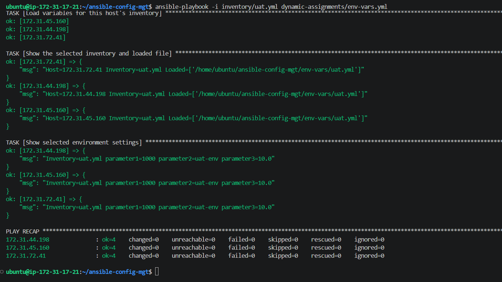

We can see that the env-vars.yml playbook now loads the correct environment-specific variables.

Update playbooks/site.yml with dynamic assignment as bellow:
```yml
---
- name: Include dynamic variables
  import_playbook: ../dynamic-assignments/env-vars.yml
  tags:
    - always

- name: Import common configuration
  import_playbook: ../static-assignments/common.yml

- name: Configure webservers
  import_playbook: ../static-assignments/webservers.yml
```

For now we have build the essential part that make our project load dynamically depending our environnment: dev,stage,uat and prod.


### Community Roles

Code reusability is a cornerstone of modern development practices. The underlying principle is simple: why reinvent the wheel when the community has already developed robust, pre-built roles available via Ansible Galaxy?

#### Download and test Mysql Ansible Role
1. **Explore Community Roles**

The Ansible Galaxy repository hosts a wide range of community-maintained roles. You can browse available roles [here](https://galaxy.ansible.com/ui/).

For this implementation, we will use the MySQL role developed by [geerlingguy](https://galaxy.ansible.com/ui/standalone/roles/geerlingguy/mysql/) , a well-established contributor in the Ansible community..

2. **Create a Feature Branch**

To maintain a clean and structured codebase, create a new Git branch for this feature:
```bash
git remote add origin https://github.com/ilyesbenothmen/ansible-config-mgt.git
git branch roles-feature
git switch roles-feature
```


3. **Install the MySQL Role**

Navigate to the roles directory and install the MySQL role using Ansible Galaxy:

```bash
ansible-galaxy install geerlingguy.mysql
```
```bash
mv geerlingguy.mysql/ mysql
```


4. **Validate the Role on a Test Instance**

Before integrating the role into production infrastructure, validate its functionality on a dedicated test instance. For this lab, we provisioned an Ubuntu 22.04 EC2 instance (IP: 172.31.14.137).

>[!NOTE]
>The geerlingguy.mysql role may encounter compatibility issues with Ubuntu 26.04 due to changes in MySQL's native authentication plugin. For optimal stability, use Ubuntu 22.04 or Ubuntu 24.04, which are certified to work correctly with this role.

5. **Verify Host Connectivity**
Before executing the playbook, verify that Ansible can reach the target host. The following commands leverage **SSH Agent Forwarding** (described in detail in the previous project) to validate connectivity
```bash
# Display inventory structure
ansible-inventory -i inventory/stage.yml --graph
# Inspect host variables
ansible-inventory -i inventory/stage.yml --host testmysql
# Test connectivity with ping module
ansible testmysql -i inventory -m ansible.builtin.ping
```


6. **Configure Role Parameters**

Customize the MySQL role by defining the necessary variables. In this configuration, we specify which hosts are permitted to connect to the database (in this case, the entire VPC CIDR: 172.31.0.0/16).


```bash
cd /home/ubuntu/ansible-config-mgt
mkdir -p secrets
ansible-vault create secrets/mysql.yml
```
Enter a new MySQL password in the editor:
```vim
vault_webaccess_password: "YOUR_PASSWORD"
```
Then add the path to .gitignore:

```bash
printf '\n/secrets/mysql.yml\n' >> .gitignore
```
The best practice is to keep configuration file free of plaintext credentials:
```yml
mysql_users:
  - name: webaccess
    host: "172.31.0.0/255.255.0.0"
    password: "{{ vault_webaccess_password }}"
    priv: "tooling.*:ALL"
```

7. **Integrate the Role into the Playbook**
Add the MySQL role to your main playbook and load the Vault file in the var_files (playbooks/site.yml):

```yml
- name: Set up Mysql
  hosts: database
  become: true
  vars_files:
    - /home/ubuntu/ansible-config-mgt/secrets/mysql.yml
  roles:
    - mysql
```


8. **Execute the Playbook**

Run the playbook to deploy and configure the MySQL database:

```bash
ansible-playbook -i inventory/stage.yml playbooks/site.yml --ask-vault-pass
```


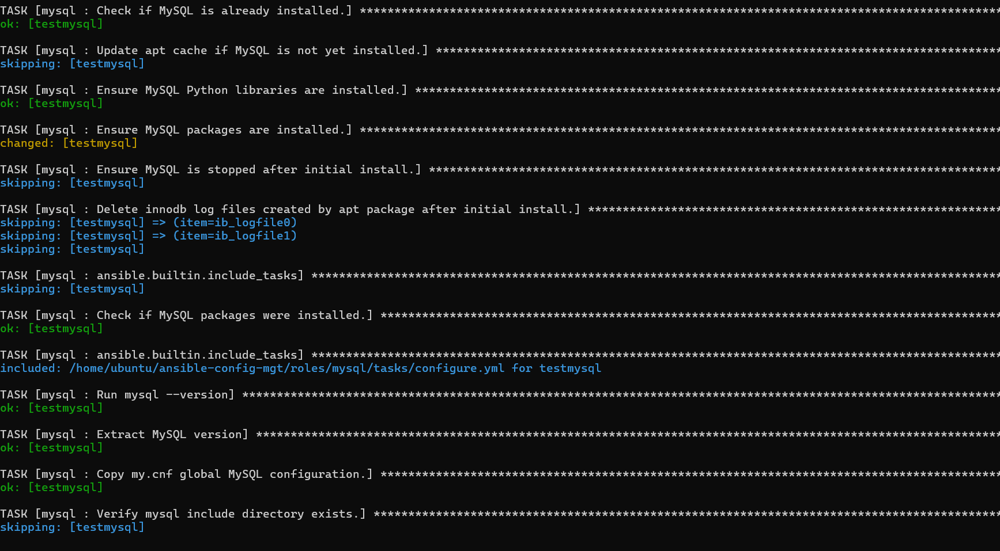


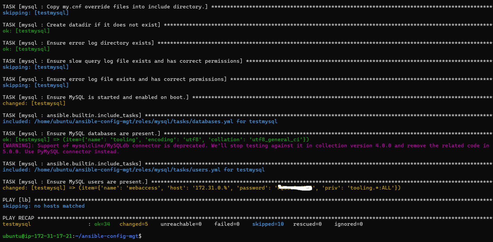

9. **Validate Database Access**

After successful deployment, verify connectivity to the MySQL instance:


```mysql
mysql -h 172.31.72.41 -u webaccess -p tooling
```


10. **Commit and Submit for Review**


Once validated, commit your changes and push them to the remote feature branch:


Finally, create a Pull Request to merge the roles-feature branch into the main branch for code review and integration.


#### Load Balancer roles
We want to be able to choose which Load Balancer to use, Nginx or Apache, so we need to have two roles respectively:

1. Nginx
2. Apache


```yaml
ansible-galaxy role install geerlingguy.apache
mv roles/geerlingguy.apache roles/apache
ansible-galaxy role install geerlingguy.nginx
mv roles/geerlingguy.nginx roles/nginx
```
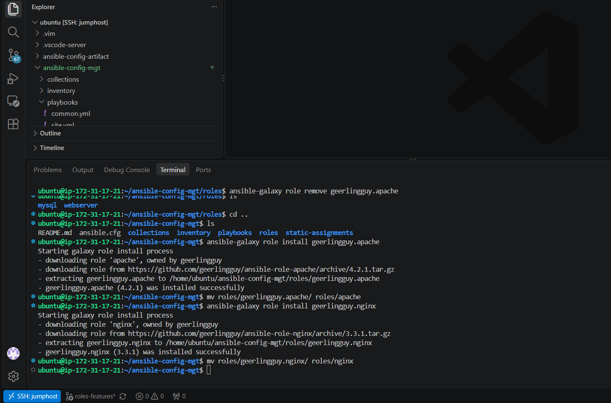

Inside defaults/main.yml define flags to ensure activation and deactivation of the role.

For apache:
```yml
enable_apache_lb: false
load_balancer_is_required: false
```
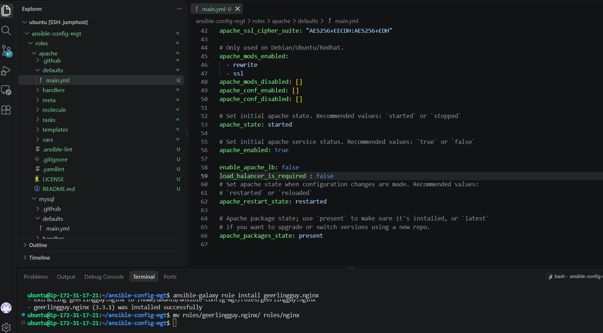

For nginx:
```yml
enable_nginx_lb: false
load_balancer_is_required: false
```
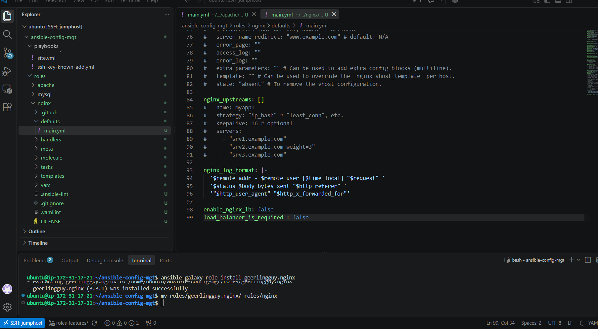

We define the conditions for which we activate a role rather than the other in static-assignments/loadbalancers.yml
```yml
- hosts: lb
  roles:
    - { role: nginx, when: enable_nginx_lb and load_balancer_is_required }
    - { role: apache, when: enable_apache_lb and load_balancer_is_required }
```

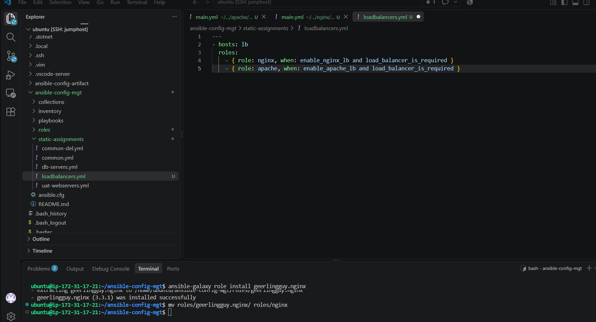

Update playbooks/site.yml to import the loadbalancer role with :

```yml
     - name: Loadbalancers assignment
       hosts: lb
         - import_playbook: ../static-assignments/loadbalancers.yml
        when: load_balancer_is_required 
```

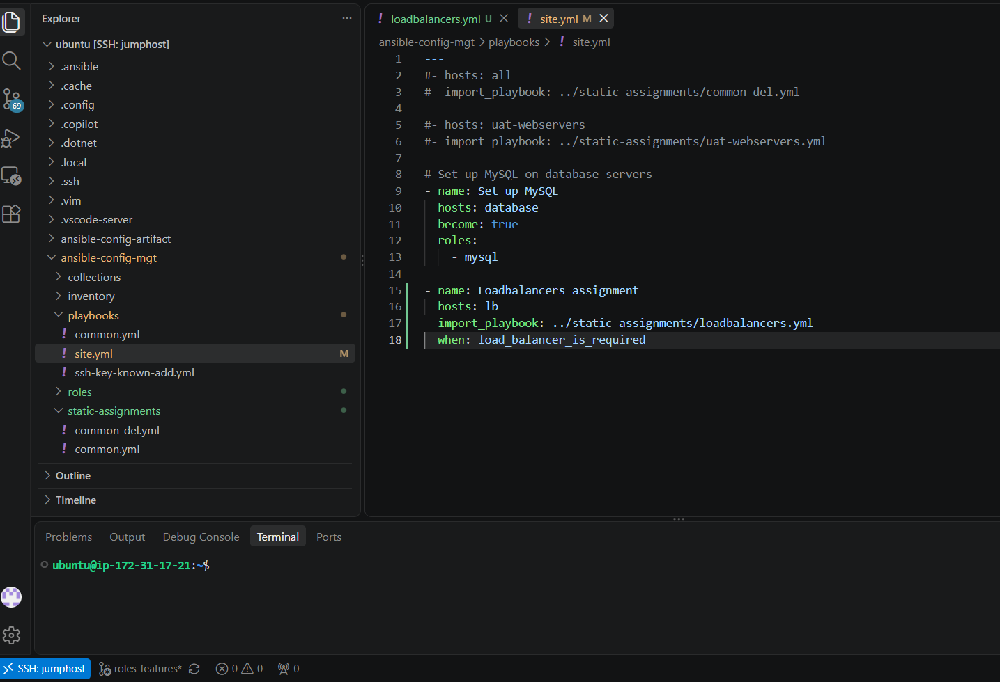

Now we rebase our code with main branch  :
```bash
git switch  main
git fetch origin
git pull --ff-only origin main
```
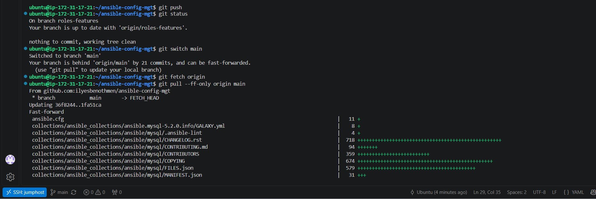

First we test the apache role by setting following flags in env-vars/uat.yml
```yml
enable_nginx_lb: false
enable_apache_lb: true
load_balancer_is_required: true
```
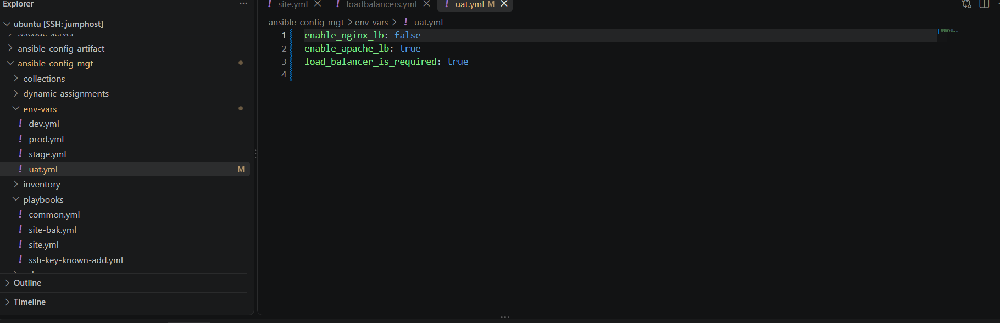

The playbooks/site.yml looks like the following:

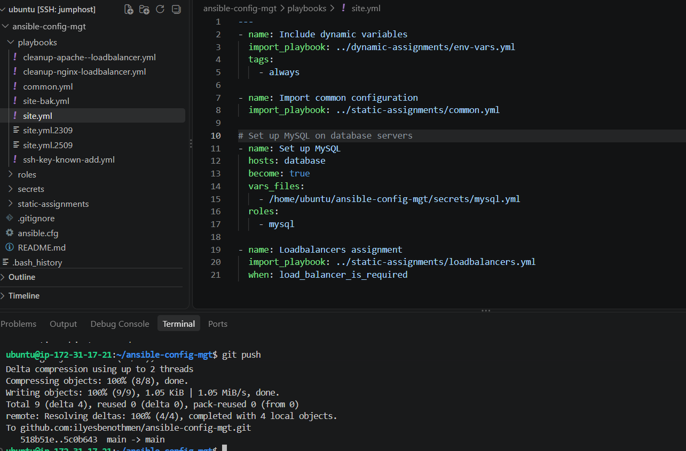

Now we launch the playbooks/site.yml against UAT environment and we didn't started the web server fot the moment.
```bash
ansible-playbook -i inventory/uat.yml playbooks/site.yml
```

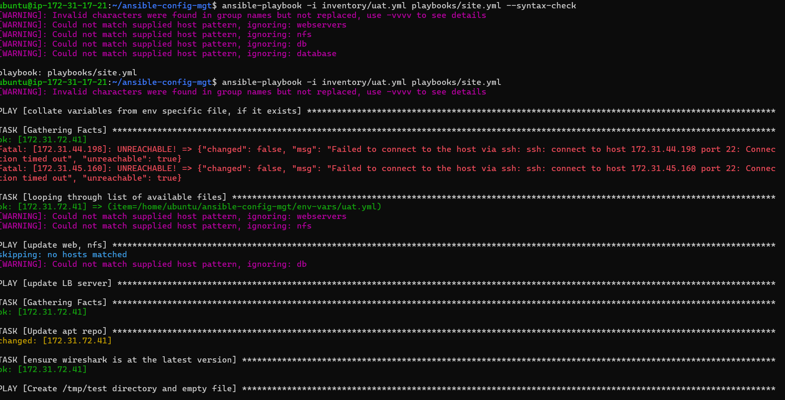

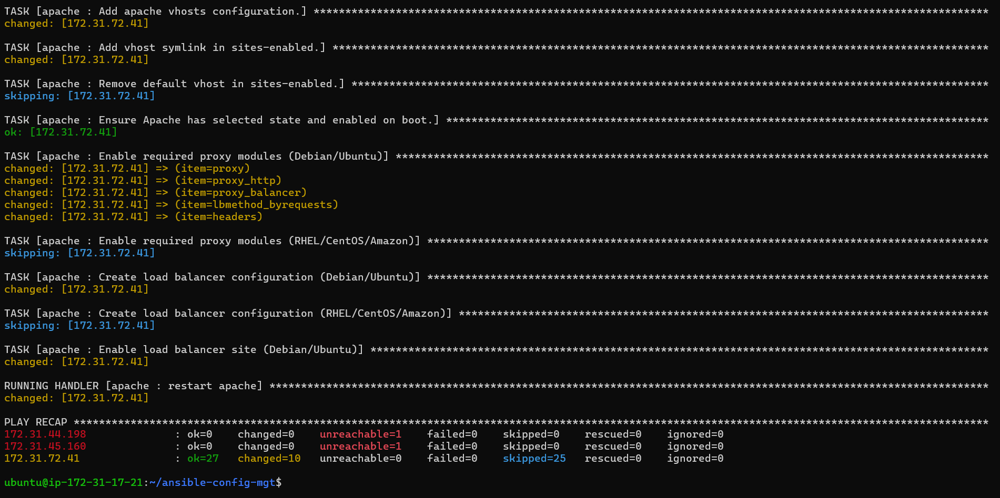

Let us list the available virtual host with :
```bash
apachectl -S
```
We figure out the existance of 3 virtual hosts which will make confusion
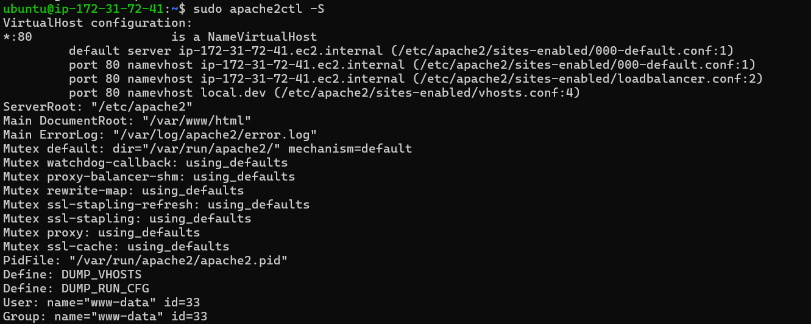

Keep only the loadbalancer virtual host with the following commands:
```bash
sudo systemctl stop apache2
sudo a2dissite 000-default.conf
sudo a2dissite vhosts.conf
ls -la /etc/apache2/sites-enabled
sudo systemctl start apache2
sudo apache2ctl -S
```

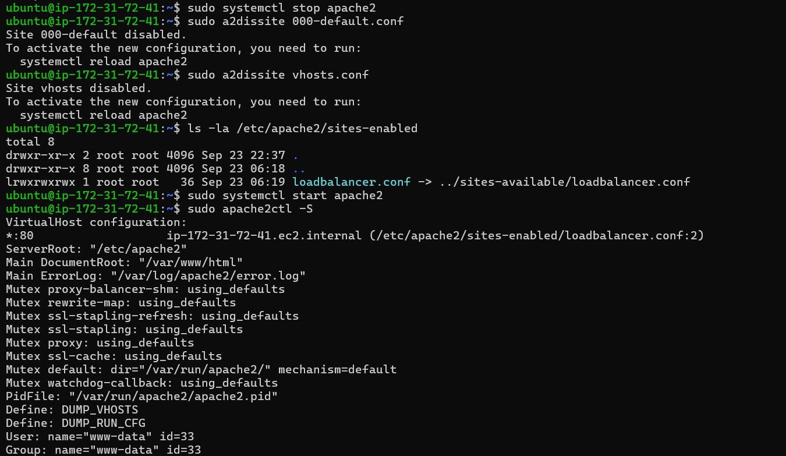

We start the two web servers behind the apache LB and we test the loadbalancing with :

```bash
curl http://172.31.72.41/index.php
```

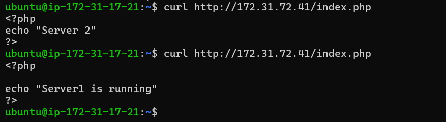

we test the nginx role by setting following flags in env-vars/uat.yml
```yml
enable_nginx_lb: true
enable_apache_lb: false
load_balancer_is_required: true
```

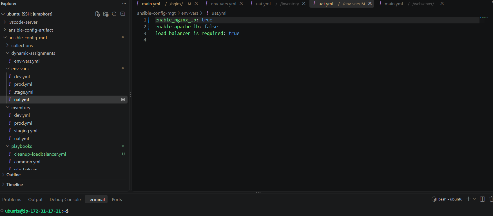

We deploy our nginx lb by running:

```bash
ansible-playbook -i inventory/uat.yml playbooks/site.yml
```
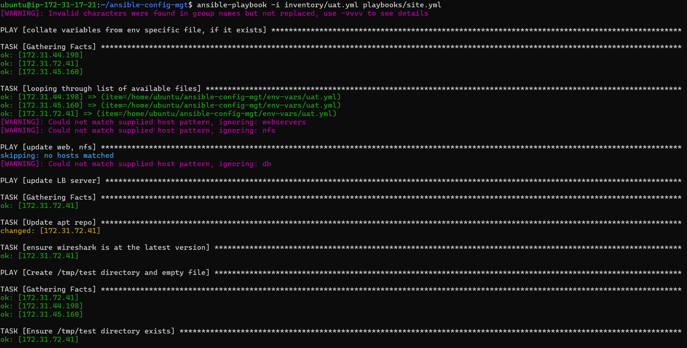

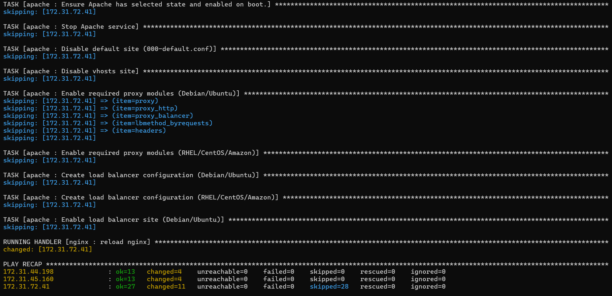

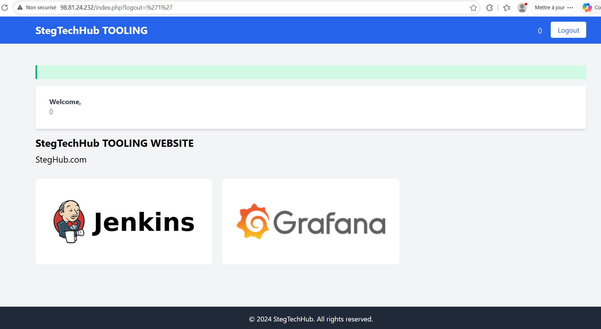

### Conclusion:

In this lab, you configured dynamic inventory assignment and used Ansible roles to deploy Apache web servers, an NGINX load balancer, and a MySQL database server. Organizing each service as a role keeps the automation modular and easier to maintain.
