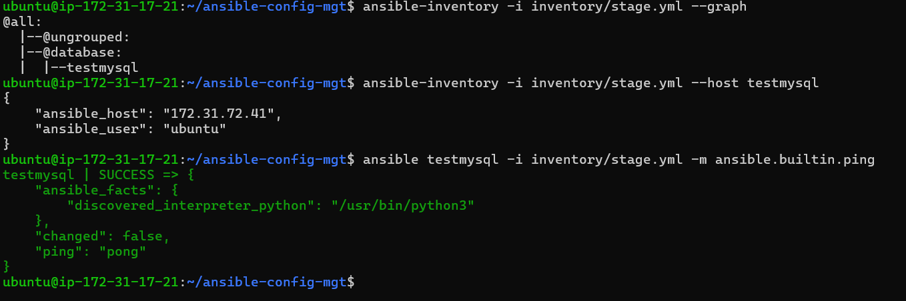
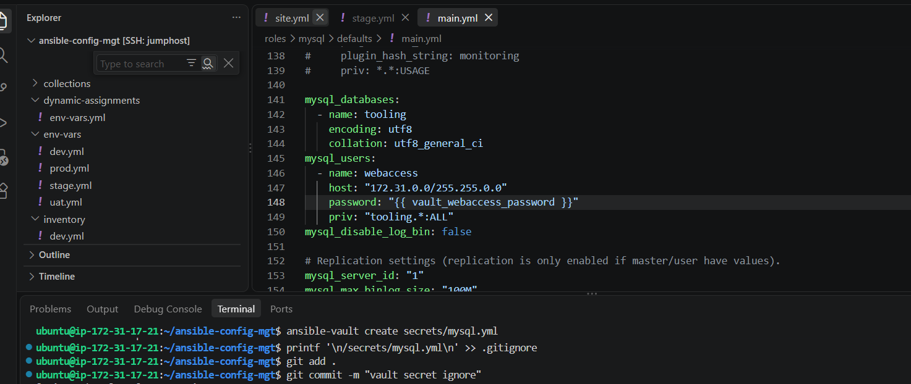
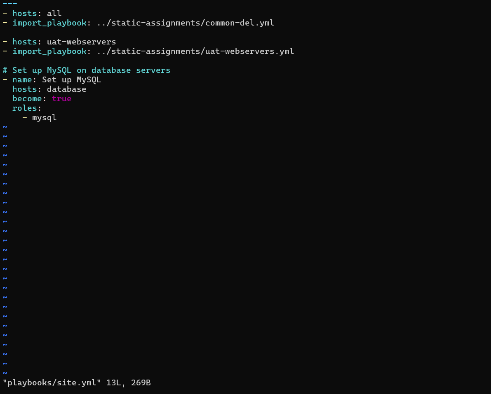
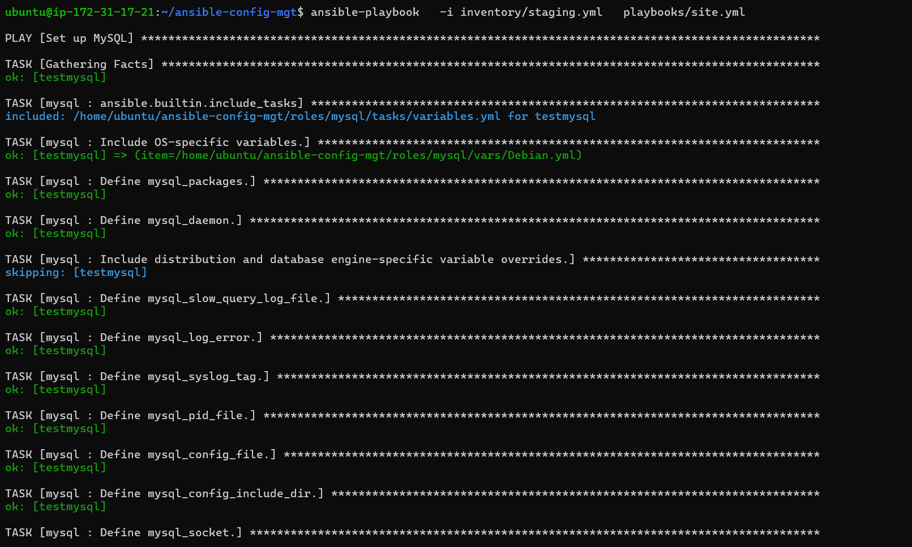
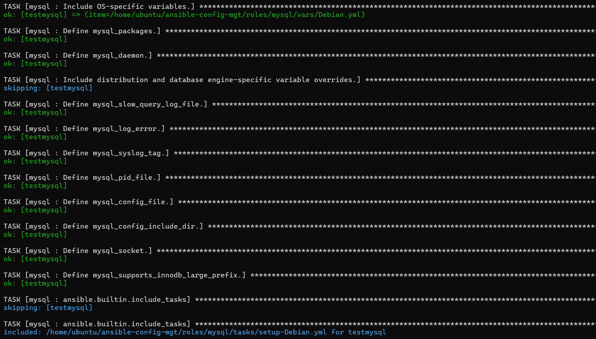
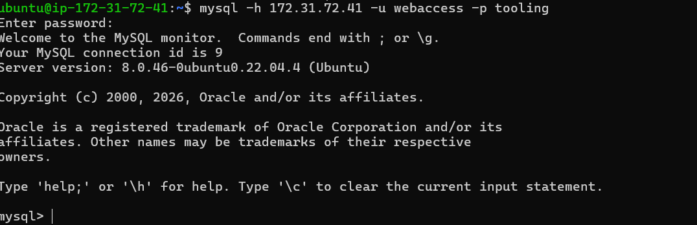
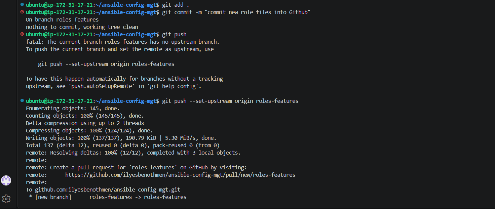
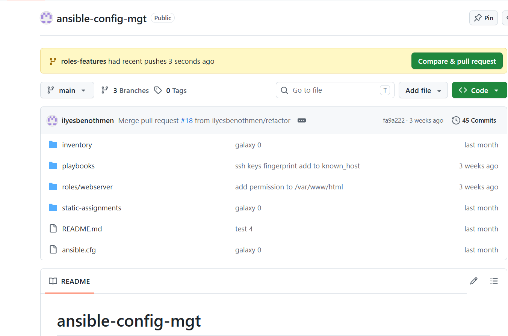

## Ansible Dynamic Assignments (Include) and Community Roles
### Introduction:
Ansible provides built-in modules and features that help DevOps engineers automate infrastructure consistently. Its active community also publishes reusable roles through Ansible Galaxy, enabling teams to standardize configurations and reduce duplicated automation work.

This lab consists of the following parts:

1. Configure dynamic inventory assignment.

2. Use community-maintained Ansible roles to deploy and configure MySQL,Apache and Nginx.

### Introducing Dynamic Assignment Into Our structure:
To take into consideration differents configurations dynamically in ansible, we have to organize our project structure to be ready for this design.
Your layout should now look like this.
> ```
>├── dynamic-assignments
>│   └── env-vars.yml
>├── env-vars
>    └── dev.yml
>    └── stage.yml
>    └── uat.yml
>    └── prod.yml
>├── inventory
>    └── dev
>    └── stage
>    └── uat
>    └── prod
>├── playbooks
>    └── site.yml
>└── static-assignments
>    └── common.yml
>    └── webservers.yml
> ```

First of all we need to start a new branch and call it dynamic-assignments
```git
git checkout -b dynamic-assignments
```
create dynamic-assignments directory and create a config file named env-vars.yml 


insert the following code in env-vars.yml to load dynamically differents environments.

```yaml
---
- name: collate variables from env specific file, if it exists
  hosts: all
  tasks:
    - name: looping through list of available files
      include_vars: "{{ item }}"
      with_first_found:
        - files:
            - dev.yml
            - stage.yml
            - prod.yml
            - uat.yml
          paths:
            - "{{ playbook_dir }}/../env-vars"
      tags:
        - always
```

Update playbooks/site.yml with dynamic assignment as bellow:
```yml
---
- hosts: all
- name: Include dynamic variables 
  tasks:
  import_playbook: ../static-assignments/common.yml 
  include: ../dynamic-assignments/env-vars.yml
  tags:
    - always

-  hosts: webservers
- name: Webserver assignment
  import_playbook: ../static-assignments/webservers.yml
```

For now we have build the essential part that make our project load dynamically depending our environnment: dev,stage,uat and prod.


### Community Roles

Code reusability is a cornerstone of modern development practices. The underlying principle is simple: why reinvent the wheel when the community has already developed robust, pre-built roles available via Ansible Galaxy?

#### Download and test Mysql Ansible Role
1. **Explore Community Roles**

The Ansible Galaxy repository hosts a wide range of community-maintained roles. You can browse available roles [here](https://galaxy.ansible.com/ui/).

For this implementation, we will use the MySQL role developed by [geerlingguy](https://galaxy.ansible.com/ui/standalone/roles/geerlingguy/mysql/) , a well-established contributor in the Ansible community..

2. **Create a Feature Branch**

To maintain a clean and structured codebase, create a new Git branch for this feature:
```bash
git remote add origin https://github.com/ilyesbenothmen/ansible-config-mgt.git
git branch roles-feature
git switch roles-feature
```


3. **Install the MySQL Role**

Navigate to the roles directory and install the MySQL role using Ansible Galaxy:

```bash
ansible-galaxy install geerlingguy.mysql
```
```bash
mv geerlingguy.mysql/ mysql
```


4. **Validate the Role on a Test Instance**

Before integrating the role into production infrastructure, validate its functionality on a dedicated test instance. For this lab, we provisioned an Ubuntu 22.04 EC2 instance (IP: 172.31.14.137).

>[!NOTE]
>The geerlingguy.mysql role may encounter compatibility issues with Ubuntu 26.04 due to changes in MySQL's native authentication plugin. For optimal stability, use Ubuntu 22.04 or Ubuntu 24.04, which are certified to work correctly with this role.

5. **Verify Host Connectivity**
Before executing the playbook, verify that Ansible can reach the target host. The following commands leverage **SSH Agent Forwarding** (described in detail in the previous project) to validate connectivity
```bash
# Display inventory structure
ansible-inventory -i inventory/staging.yml --graph
# Inspect host variables
ansible-inventory -i inventory/staging.yml --host testmysql
# Test connectivity with ping module
ansible testmysql -i inventory -m ansible.buildin.ping
```


6. **Configure Role Parameters**

Customize the MySQL role by defining the necessary variables. In this configuration, we specify which hosts are permitted to connect to the database (in this case, the entire VPC CIDR: 172.31.0.0/16).


7. **Integrate the Role into the Playbook**
Add the MySQL role to your main playbook (playbooks/site.yml):

```yml
- name: Set up Mysql
  hosts: database
  become: true
  roles:
    - mysql
```


8. **Execute the Playbook**

Run the playbook to deploy and configure the MySQL database:

```bash
ansible-playbook -i inventory/staging.yml playbooks/site.yml
```





9. **Validate Database Access**

After successful deployment, verify connectivity to the MySQL instance:


```mysql
mysql -h 172.31.72.41 -u webaccess -p tooling
```


10. **Commit and Submit for Review**


Once validated, commit your changes and push them to the remote feature branch:




Finally, create a Pull Request to merge the roles-feature branch into the main branch for code review and integration.


