##  Tooling Website deployment automation with Continuous Integration .Introduction to Jenhins
### Introduction:

### Step0 preparing prerequisites:

### Step1 Configuring Apache As a LoadBalancer:

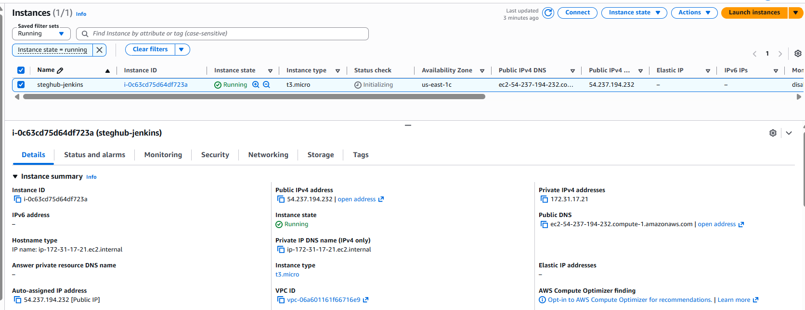
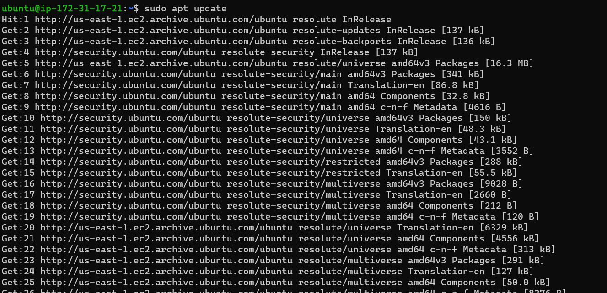

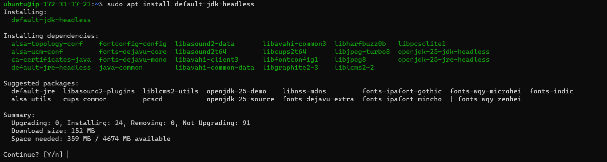

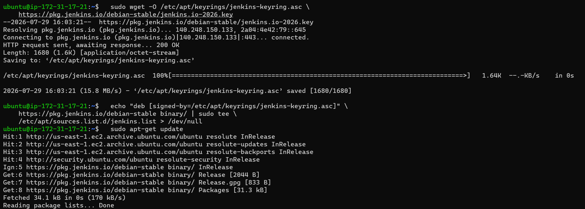

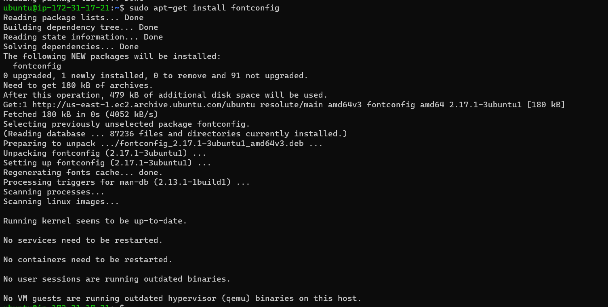

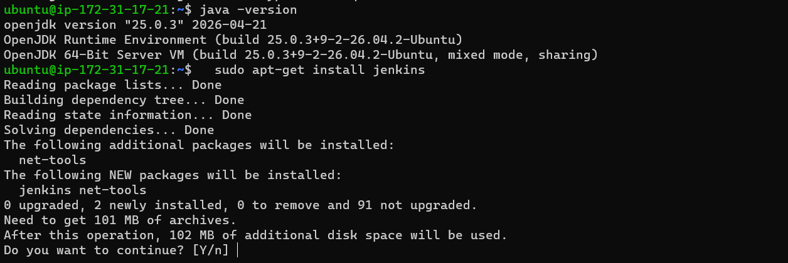
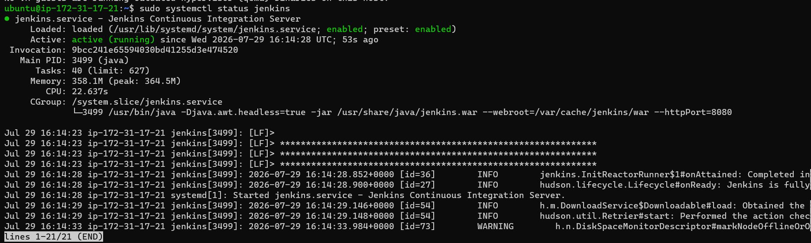

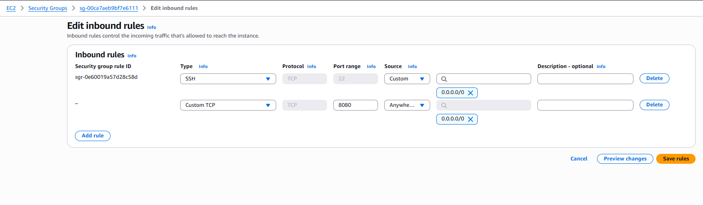

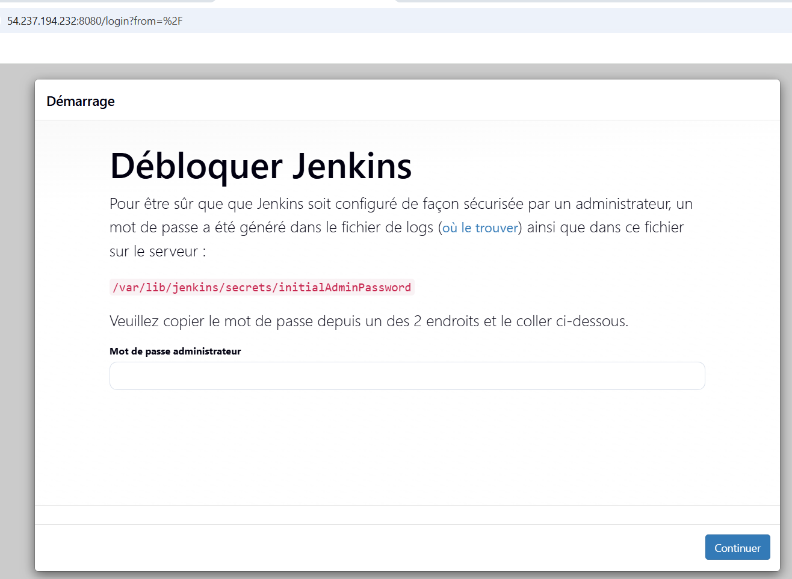

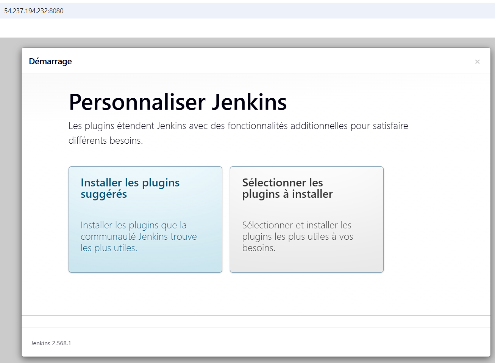

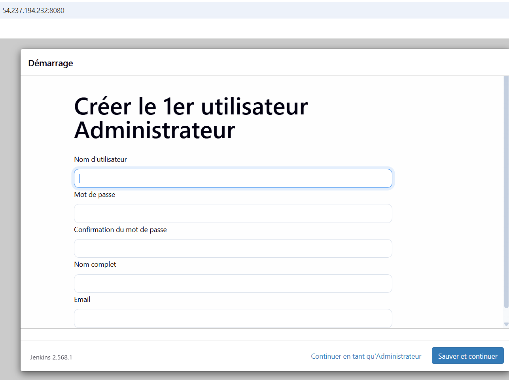

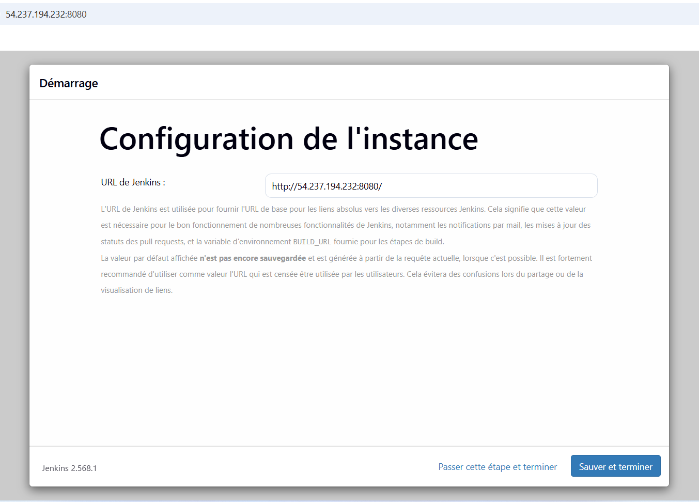

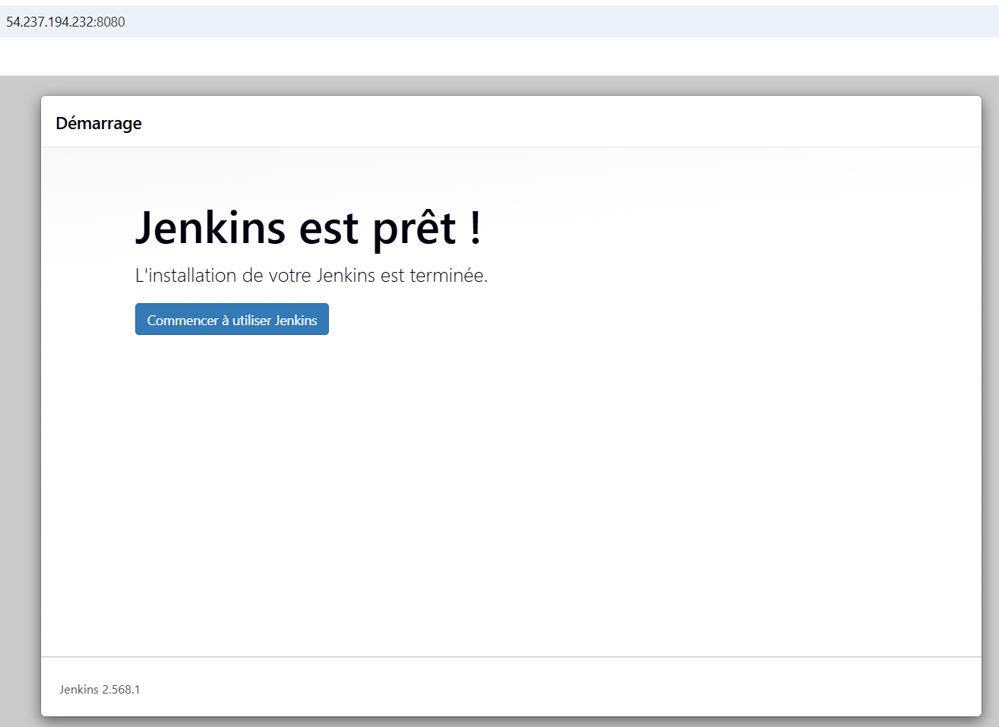

### Step2 Configuring Local DNS Names Resolution

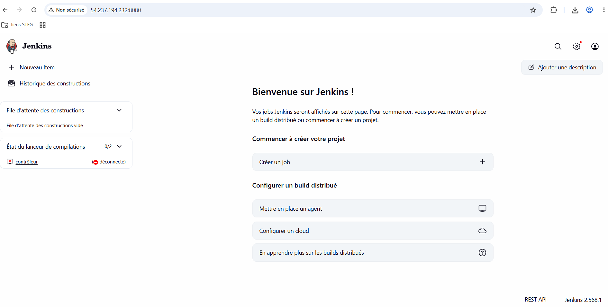

And change 000-default.conf as bellow:

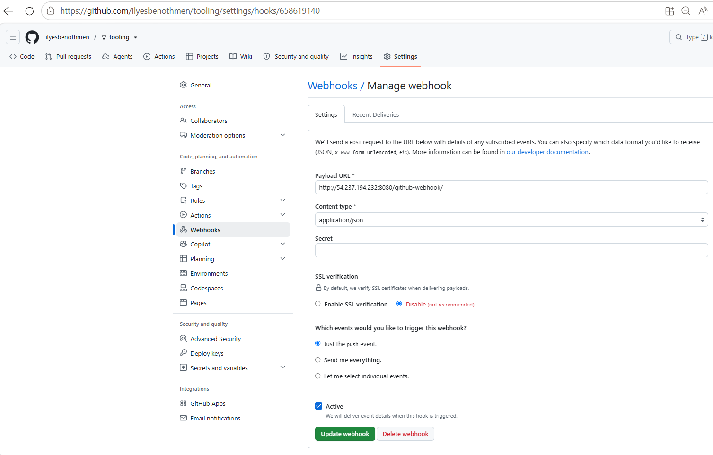

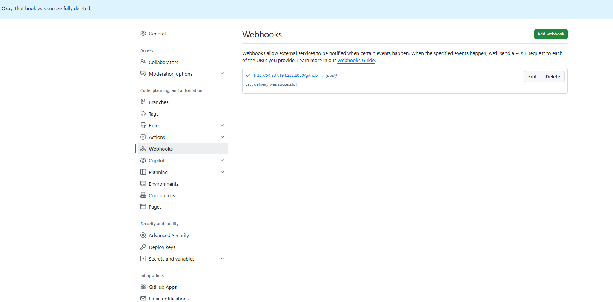

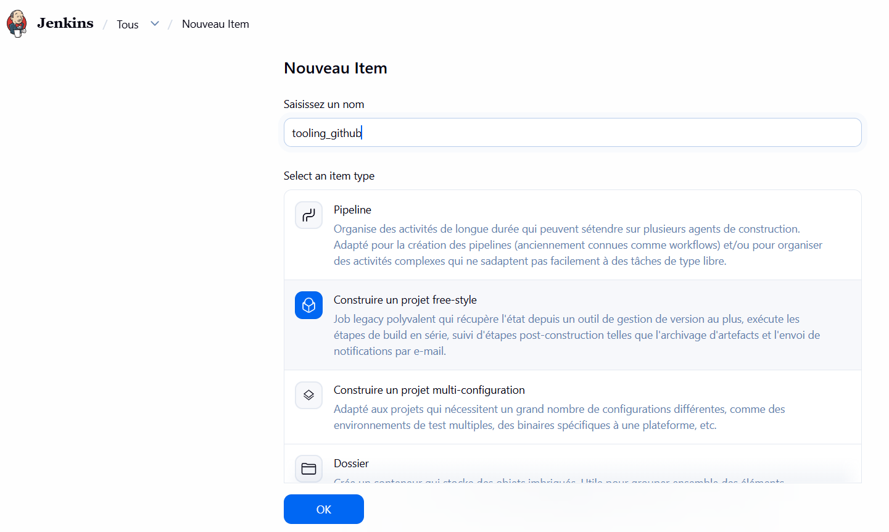

### Conclusion:
