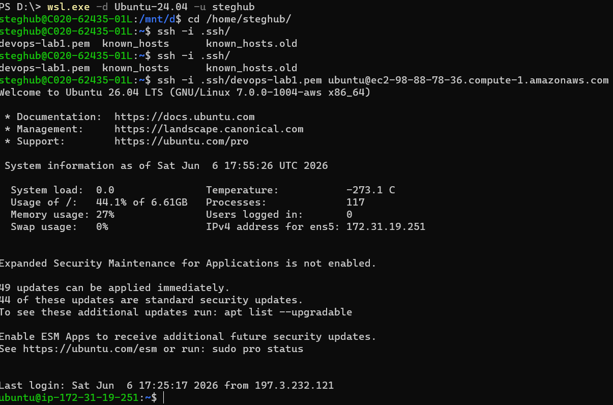
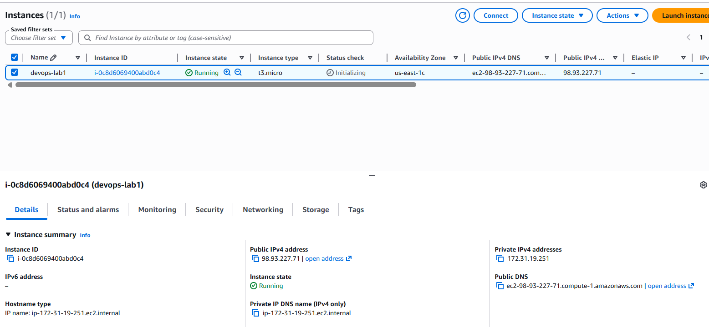
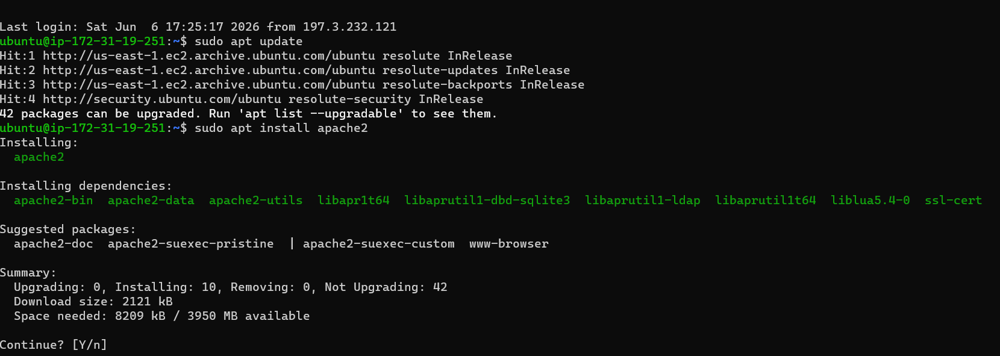

## WEB STACK IMPLEMENTATION (LAMP STACK) IN AWS
### Introduction:
LAMP is an acronym for Linux, Apache, MySQL, and PHP. It is a widely used open‑source software stack for building and hosting dynamic websites and web applications on the internet.
In the following steps, we are going to introduce the deployment of a website from scratch.
### Step0 preparing prerequisites:
To spin up a virtual server in the cloud, we use a free‑tier AWS account. We choose a basic EC2 instance of the t3.micro family running Ubuntu 24.04. After that, we need to download the private key file; in this lab, it is called devops-lab1.pem.



After that, note the instance’s public DNS name.


to connect to the new created instance :

```bash
chmod 0400 .ssh/devops-lab1.pem
ssh -i .ssh/devops-lab1.pem ubuntu@ec2-98-93-227-71.compute-1.amazonaws.com
```
### Step1 install Apache and Update the Firewall
The first rule of thumb for any system administrator is to keep the operating system up to date.

>[!TIP]
>It is important to note that using the root account is not a good practice. Instead, you should use a sudo‑enabled user. In our case, ubuntu will be our privileged user.
```bash
sudo apt update
sudo apt install apache2
```
