## WEB STACK IMPLEMENTATION (LAMP STACK) IN AWS
### Introduction:
LAMP is an acronym for Linux, Apache, MySQL, and PHP. It is a widely used open‑source software stack for building and hosting dynamic websites and web applications on the internet.
In the following steps, we are going to introduce the deployment of a website from scratch.
### Step0 preparing prerequisites:
To spin up a virtual server in the cloud, we use a free‑tier AWS account. We choose a basic EC2 instance of the t3.micro family running Ubuntu 24.04. After that, we need to download the private key file; in this lab, it is called devops-lab1.pem.


After that, note the instance’s public DNS name.


to connect to the new created instance :

```bash
chmod 0400 .ssh/devops-lab1.pem
ssh -i .ssh/devops-lab1.pem ubuntu@ec2-98-93-227-71.compute-1.amazonaws.com
```
### Step1 install Apache and Update the Firewall
The first rule of thumb for any system administrator is to keep the operating system up to date.

>[!TIP]
>It is important to note that using the root account is not a good practice. Instead, you should use a sudo‑enabled user. In our case, ubuntu will be our privileged user.
```bash
sudo apt update
sudo apt install apache2
```


To verify the status of the web server , run :
```bash
    sudo systemctl status apache2
```
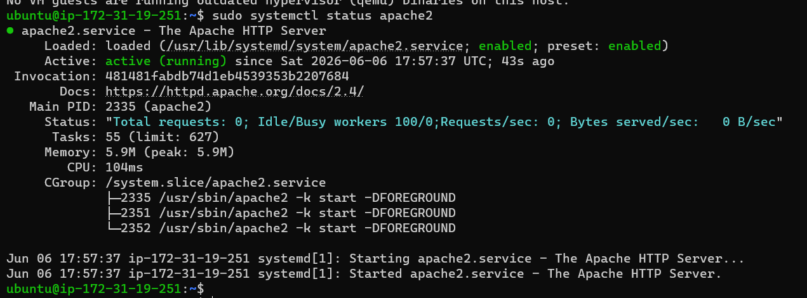
The service is up and running ,you can run the following command :
```bash
    curl http://localhost:80
```
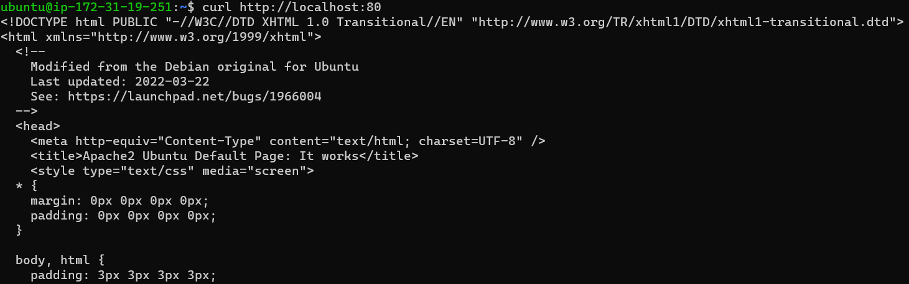
Right now, the service is up and reachable locally, but what if we want to publish it? Easy: we need to create an inbound rule to allow traffic from the internet. In our case, I checked my public IP address and authorized only that address.
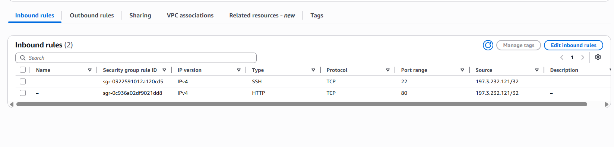
Now, to check that our service is reachable, we first need to determine the public IP. The easiest way is to get it from the instance details, but personally I prefer to use the DNS name.
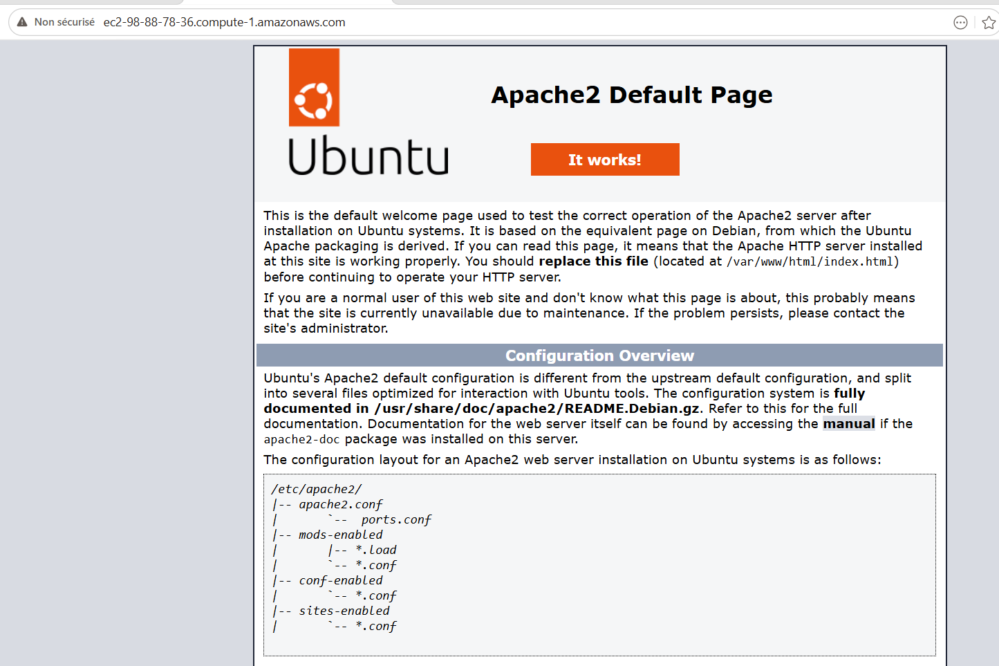
> [!NOTE]
> There is a reliable way to get the public IP address from the EC2 instance metadata service.
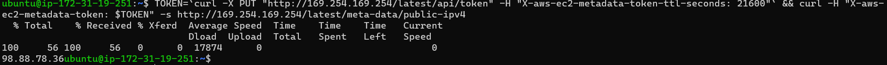

### Step2 Installing Mysql
MySQL is a relational database system that is widely used and commonly paired with PHP and Apache.
In our lab, we are going to install MySQL with its basic features in the recommended way, to ensure a minimum level of security and reachability.
```bash
    sudo apt install mysql-server
```
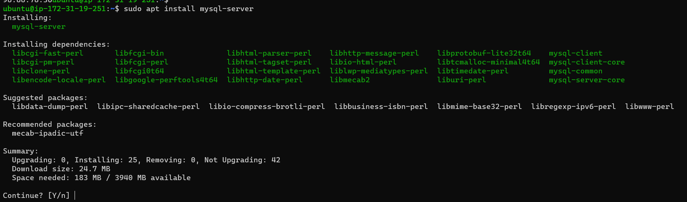

When the installation is finished , log in to mysql by typing:
```bash
    sudo mysql
```
run the following sql:
```sql
    ALTER USER 'root'@'localhost' IDENTIFIED WITH mysql_native_password BY 'Pass@123$';
```
this will connect to mysql server and give a prompt like the following:

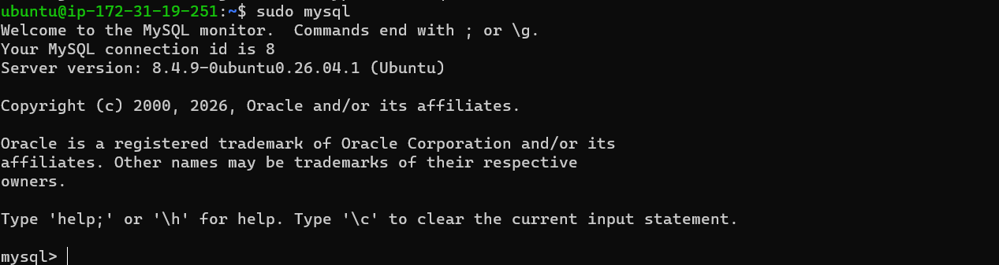

To secure the installation by removing anonymous users and test schemas , run :
```bash
    sudo mysql_secure_installation
```
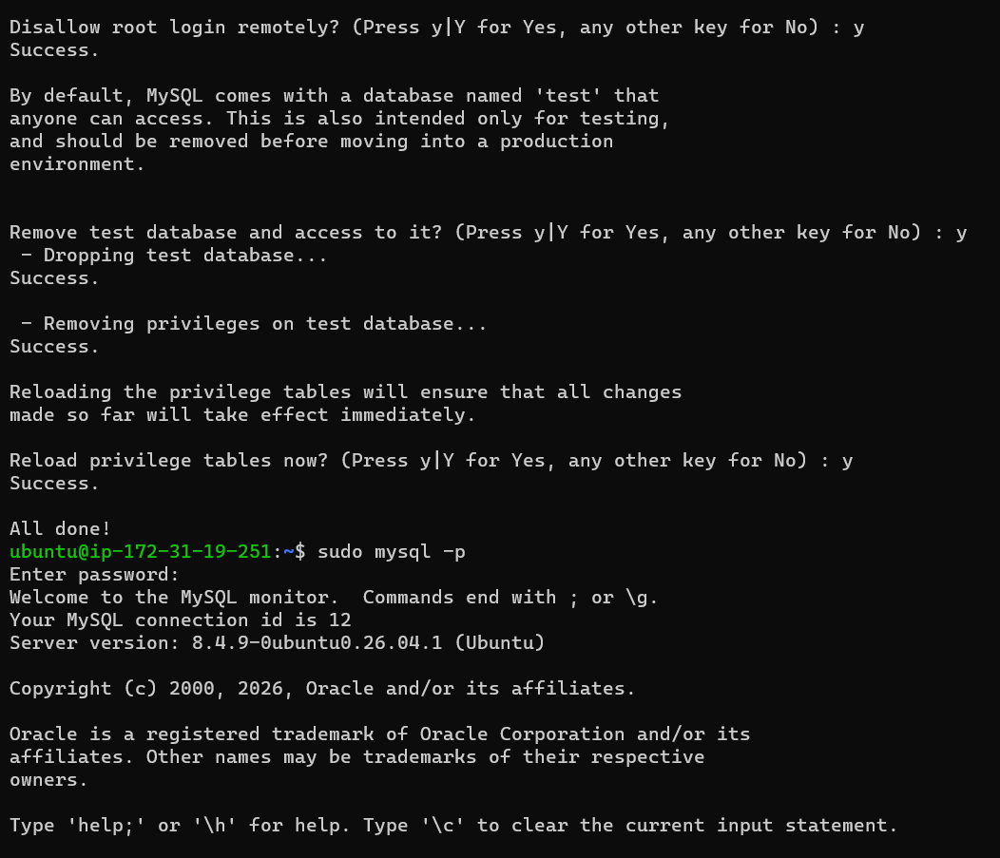


### Step3 Installing PHP

Now we need to install the core PHP packages that will allow us to run server‑side processing.

```bash
    sudo apt install php libapache2-mod-php php-mysql
```
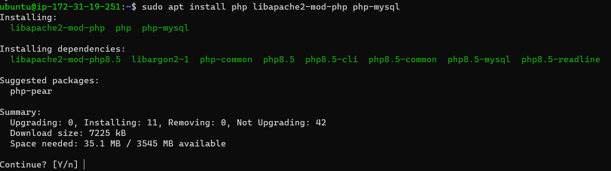
Now check the PHP version

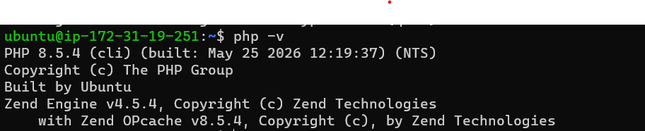

Now we are done with PHP framework !

At this point, the LAMP stack is already installed,
### Component:
- [x] Linux Ubuntu
- [x] Apache
- [x] Mysql
- [x] PHP

>[!Note]
>To host multiple services on the same server, we need to configure virtual hosts (vhosts).

### Step4 Creating a virtual host for your website using Apache

We will create a domain called projectlamp. As you know, the default document root in Apache is /var/www/html. We will keep this default and create a /var/www/projectlamp directory, then assign the required ownership and permissions.
```bash
    sudo mkdir /var/www/projectlamp
    sudo chown -R $USER:$USER /var/www/projectlamp
```
Now we will create a new configuration file in apache by running:
```bash
    sudo vi /etec/apache2/sites-available/projectlamp.conf
```
and paste the following configuration:
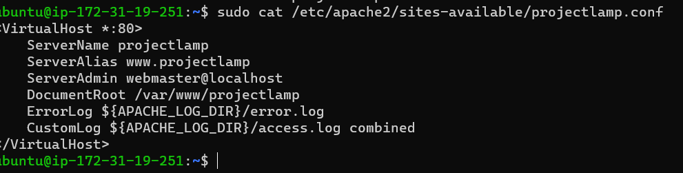

you can use **a2ensite** command to enable the new virtual host, by running

```bash
    sudo a2ensite projectlamp
```
to disable default sites use **a2dissite** command like

```bash
    sudo a2dissite 000-default
```
to check the syntax use :

```bash
    sudo apache2ctl configtest
```
we need to reload the config 

```bash
    sudo systemctl reload apache2.service
```
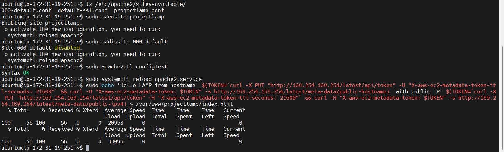

now create an index.php file and test the website

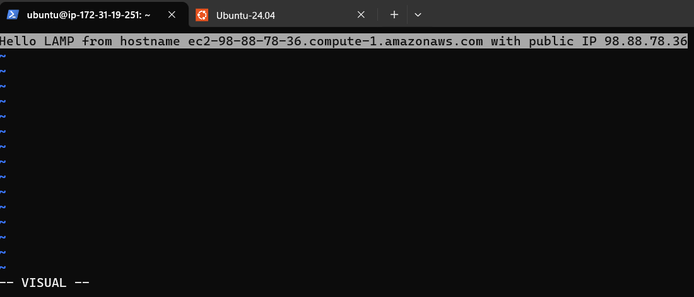

and you get the following rendering:

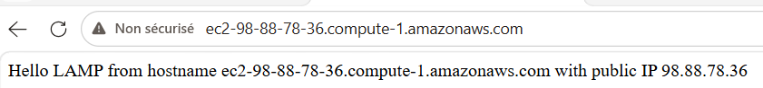

### Step 5 Enable PHP on the website:
With the DirectoryIndex directive in Apache, index.html will take precedence over index.php, which is very useful during maintenance activities. A system administrator can create an index.html file containing an apology or maintenance message, and after the work is completed, simply rename or delete that HTML file.

In order to change that default behaviour , you'll need to edit /etc/apache2/mods-enabled/dir.conf 
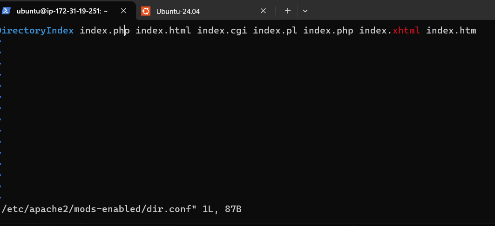

After that, reload Apache so that the changes take effect.
Create a file named index.php and populate it with the following dummy code.
```php
<?php
phpinfo();
>
```
Refresh your browser , and you'll get a page similar to the following:
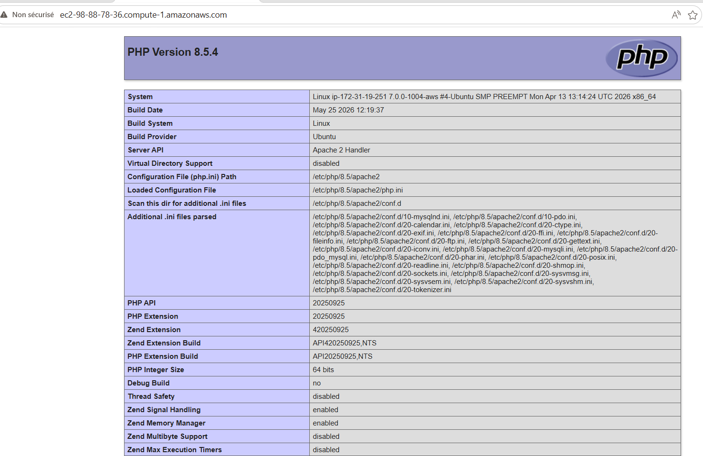
After checking the configuration of your server , it is best to delete the file by running:

```bash
    sudo rm -f /var/www/projectlamp/index.php
```
### Conclusion:

Through this project, we have completed the basic installation process to set up a scalable **LAMP** web server on an **AWS EC2** instance.