## WEB STACK IMPLEMENTATION (LEMP STACK) IN AWS

### Introduction:
LEMP is an acronym for Linux, Nginx, MySQL, and PHP. It is a widely used open-source software stack for building and hosting dynamic websites and web applications on the internet.
In the following steps, we are going to introduce the deployment of a website from scratch using Nginx instead of Apache.

### Step0 preparing prerequisites:
To spin up a virtual server in the cloud, we use a free-tier AWS account. We choose a basic EC2 instance of the t3.micro family running Ubuntu 24.04. After that, we need to download the private key file; in this lab, it is called `steghub-lemp-project2.pem`.

After that, note the instance’s public DNS name.

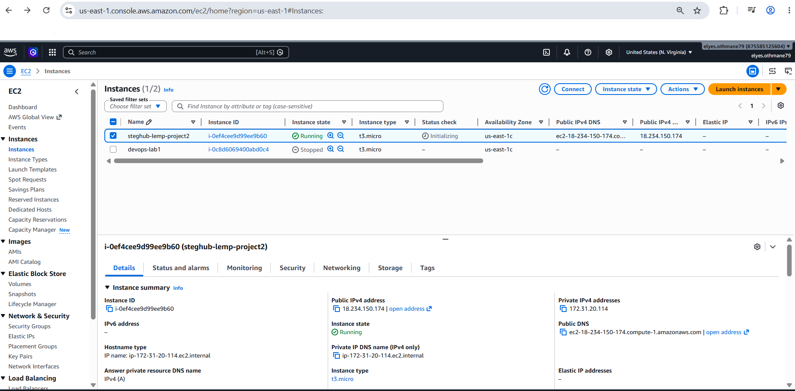

To connect to the newly created instance:

```bash
chmod 400 ../../.ssh/steghub-lemp-project2.pem
ssh -i ../../.ssh/steghub-lemp-project2.pem ubuntu@ec2-98-84-107-0.compute-1.amazonaws.com
```
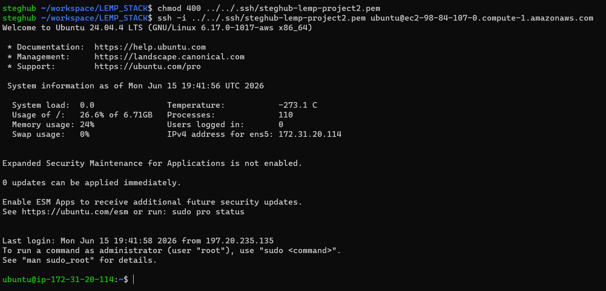

> [!NOTE]
> Ensure that your EC2 instance is running and that your security group allows SSH access on port 22 before attempting to connect.


### Step1 install the Nginx Web Server
The first rule of thumb for any system administrator is to keep the operating system up to date.

> [!TIP]
> It is important to note that using the root account is not a good practice. Instead, you should use a sudo-enabled user. In our case, `ubuntu` will be our privileged user.

```bash
sudo apt update
sudo apt install nginx
```

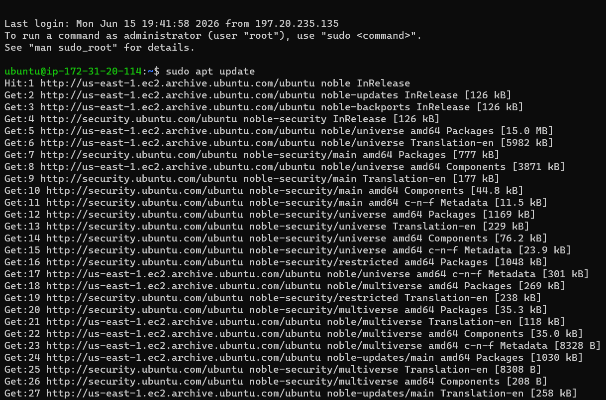
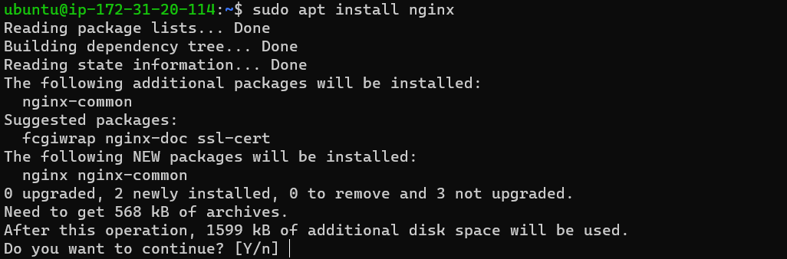

To verify the status of the web server, run:

```bash
sudo systemctl status nginx
```

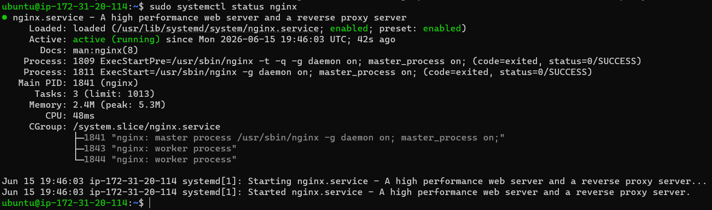

The service is up and running, you can run the following command:

```bash
curl http://localhost:80
```


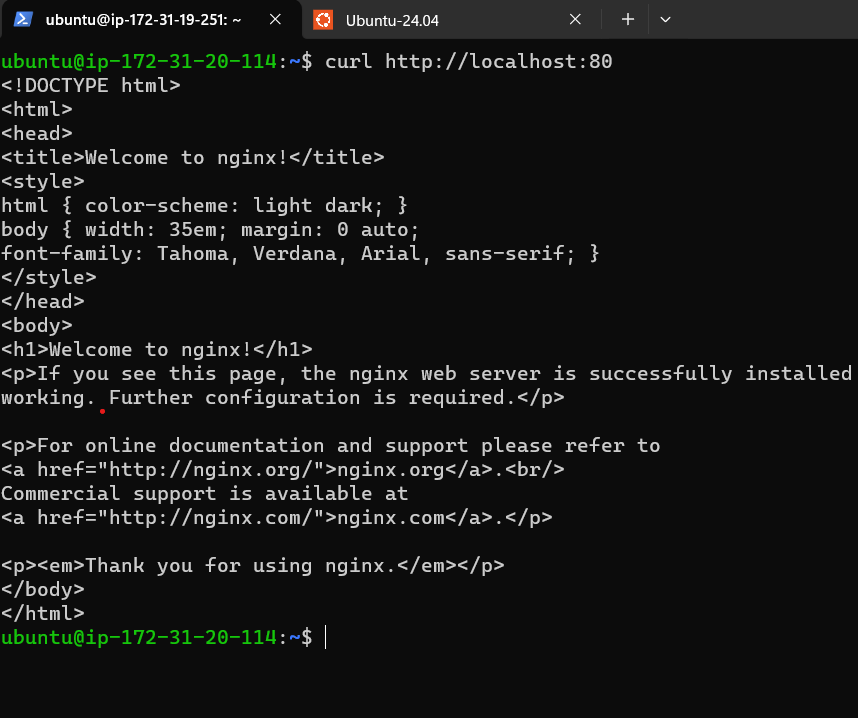

Right now, the service is up and reachable locally, but what if we want to publish it? Easy: we need to create an inbound rule to allow traffic from the internet. In our case, HTTP on port 80 and SSH on port 22 are enabled in the security group.

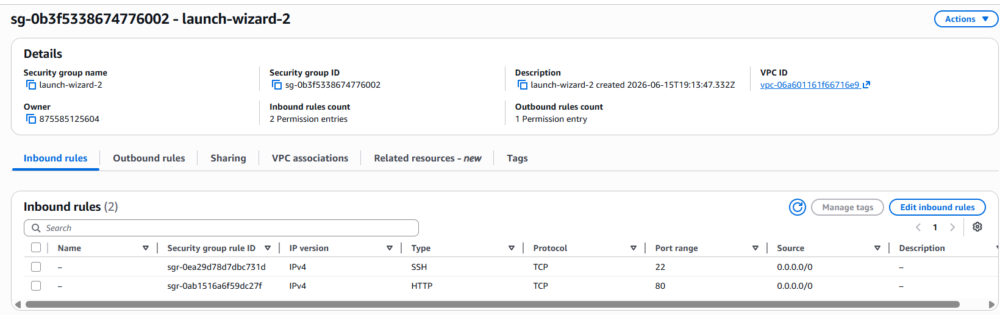

Now, to check that our service is reachable, we first need to determine the public IP. The easiest way is to get it from the instance details, but personally I prefer to use the instance metadata service.

> [!NOTE]
> There is a reliable way to get the public IP address from the EC2 instance metadata service by generating an IMDSv2 token and querying the metadata endpoint.

```bash
TOKEN=$(curl -s -X PUT "http://169.254.169.254/latest/api/token" \
-H "X-aws-ec2-metadata-token-ttl-seconds: 21600")

curl -s -H "X-aws-ec2-metadata-token: $TOKEN" \
http://169.254.169.254/latest/meta-data/public-ipv4
```

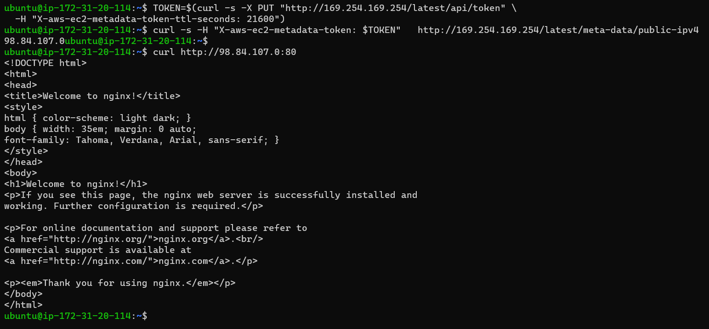

You can also verify the default Nginx page in the browser using the public IP address.

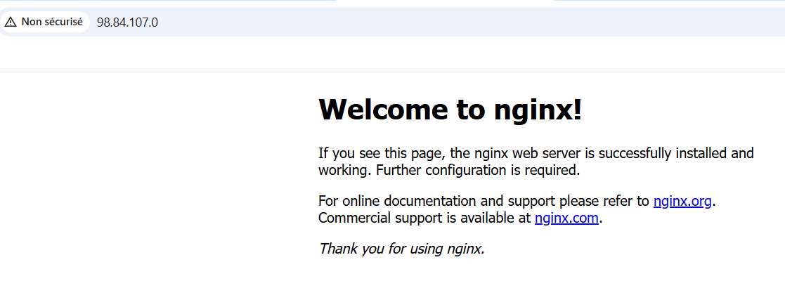

### Step2 Installing Mysql
MySQL is a relational database system that is widely used and commonly paired with PHP and Nginx.
In this lab, we are going to install MySQL with its basic features in the recommended way, to ensure a minimum level of security and reachability.

```bash
sudo apt install mysql-server
```

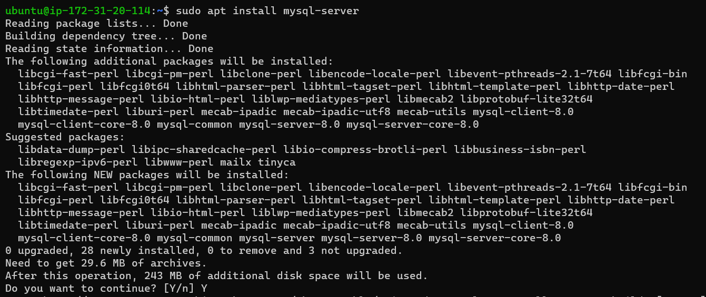

When the installation is finished, log in to MySQL by typing:

```bash
sudo mysql
```

Run the following SQL:

```sql
ALTER USER 'root'@'localhost' IDENTIFIED WITH mysql_native_password BY 'Pass1StegHub.1';
```

This will connect to MySQL server and give a prompt like the following:

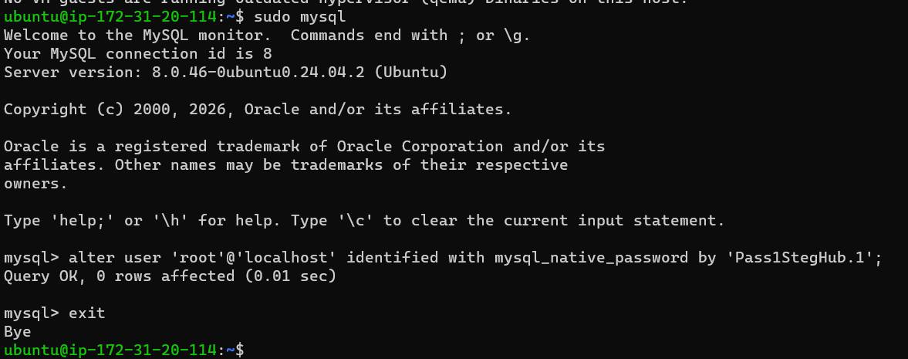

To secure the installation by removing anonymous users and test schemas, run:

```bash
sudo mysql_secure_installation
```

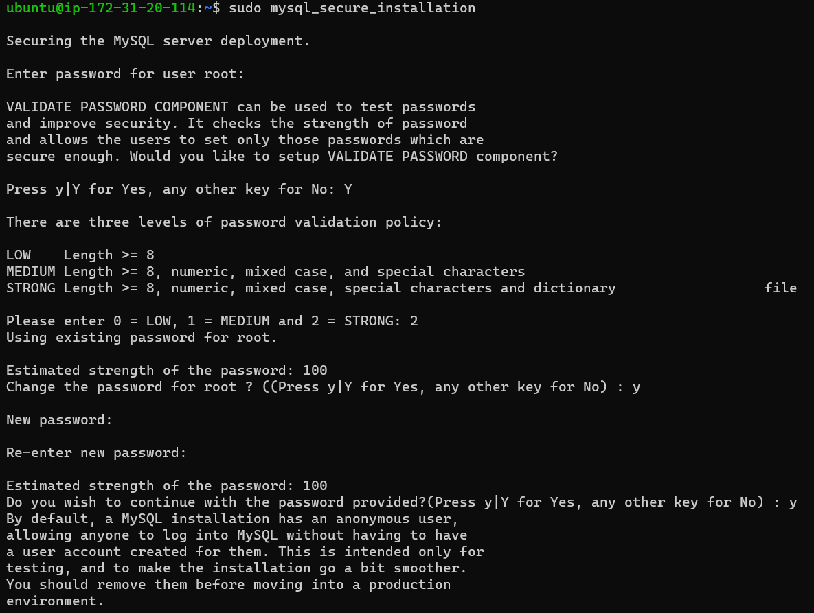

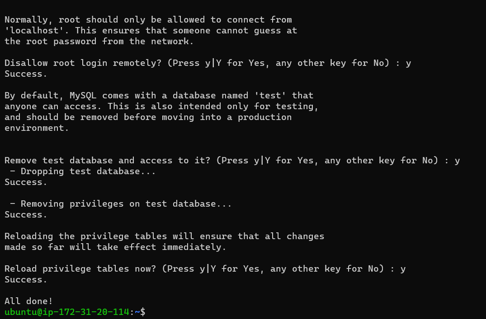

> [!WARNING]
> Never use weak passwords in a real environment. In production, always use a strong password and keep credentials in a secure secret store or environment variables.


### Step3 Installing PHP

Now we need to install the core PHP packages that will allow us to run server-side processing with Nginx.

```bash
sudo apt install php-mysql php-fpm
```

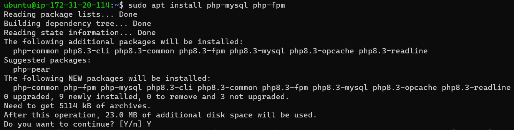

Now we are done with the PHP framework.

At this point, the LEMP stack is already installed.

### Component:
- [x] Linux Ubuntu
- [x] Nginx
- [x] Mysql
- [x] PHP

> [!NOTE]
> To host multiple services on the same server, we need to configure server blocks in Nginx, which are equivalent to virtual hosts in Apache.


### Step 4 -Configuring Nginx to use PHP Processor:

We will create a domain called `projectLEMP`. As you know, the default document root in Nginx points to the default welcome page. We will create a `/var/www/projectLEMP` directory, then assign the required ownership and permissions.

```bash
sudo mkdir /var/www/projectLEMP
sudo chown -R $USER:$USER /var/www/projectLEMP/
```
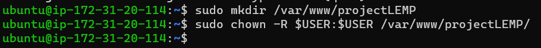
Now we will create a new configuration file in Nginx by running:

```bash
sudo nano /etc/nginx/sites-available/projectLEMP
```

And paste the following configuration:

```nginx
server {
    listen 80;
    server_name projectLEMP www.projectLEMP;
    root /var/www/projectLEMP;

    index index.html index.htm index.php;

    location / {
        try_files $uri $uri/ =404;
    }

    location ~ \.php$ {
        include snippets/fastcgi-php.conf;
        fastcgi_pass unix:/var/run/php/php8.3-fpm.sock;
    }

    location ~ /\.ht {
        deny all;
    }
}
```

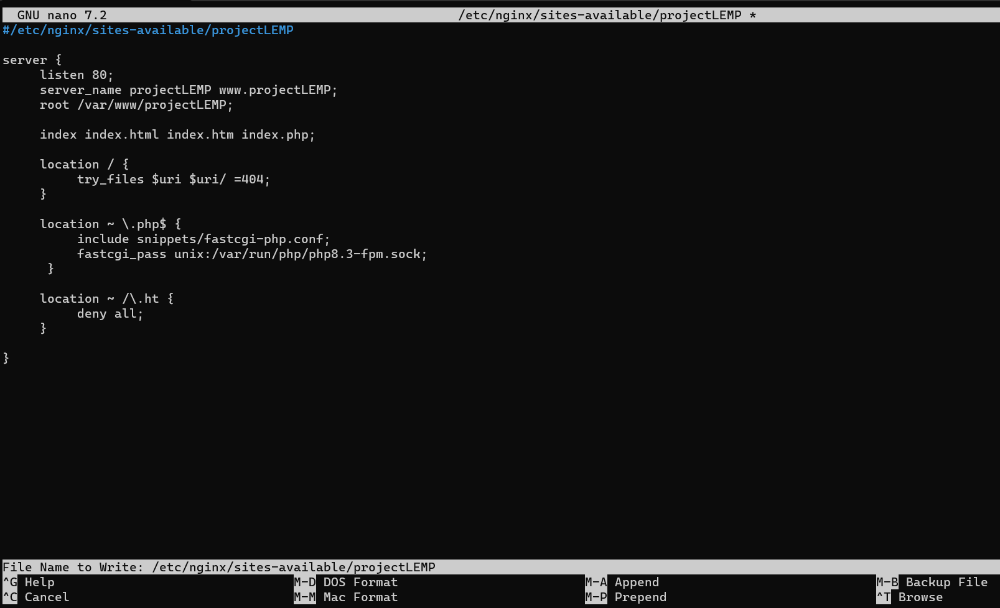

You can use a symbolic link to enable the new server block, by running

```bash
sudo ln -s /etc/nginx/sites-available/projectLEMP /etc/nginx/sites-enabled/
```

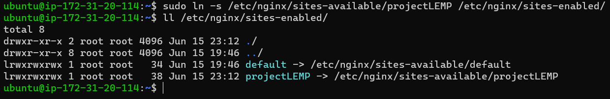

To disable the default site, use:

```bash
sudo unlink /etc/nginx/sites-enabled/default
```

Then reload the Nginx configuration:

```bash
sudo systemctl reload nginx.service
```

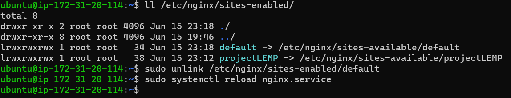

To check the syntax, use:

```bash
sudo nginx -t
```

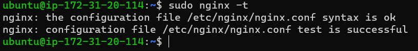

> [!WARNING]
> Be careful when removing the default configuration. Make sure your new server block is valid before disabling the default site, otherwise your web server may stop serving requests correctly.


Now create an `index.html` file and test the website.
A simple way to make the page dynamic is to fetch the public hostname and public IP from the metadata service and write them to the custom index page.

```bash
TOKEN=$(curl -X PUT "http://169.254.169.254/latest/api/token" \
  -H "X-aws-ec2-metadata-token-ttl-seconds: 21600")

PUBLIC_HOSTNAME=$(curl -H "X-aws-ec2-metadata-token: $TOKEN" -s \
  http://169.254.169.254/latest/meta-data/public-hostname)

PUBLIC_IP=$(curl -H "X-aws-ec2-metadata-token: $TOKEN" -s \
  http://169.254.169.254/latest/meta-data/public-ipv4)

echo "Hello LEMP from hostname $PUBLIC_HOSTNAME with public IP $PUBLIC_IP" | sudo tee /var/www/projectLEMP/index.html > /dev/null
```

You can verify the file content by running:

```bash
cat /var/www/projectLEMP/index.html
```
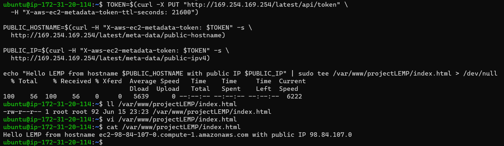
Then test it using:

```bash
curl http://localhost:80
curl http://98.84.107.0:80
curl http://ec2-98-84-107-0.compute-1.amazonaws.com:80
```

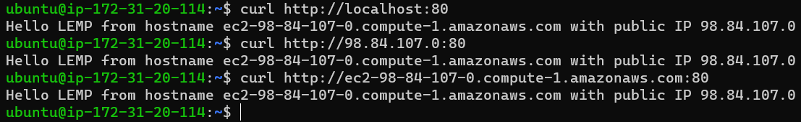


### Step 5- Testing PHP with Nginx

To verify that PHP is correctly processed by Nginx through PHP-FPM, create a file named `info.php` and populate it with the following dummy code.

```php
<?php
phpinfo();
```
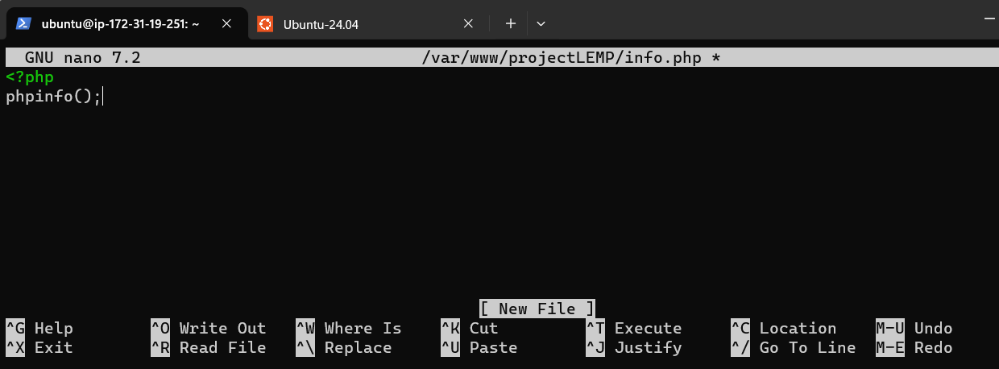
Refresh your browser, and you will get a page similar to the following:

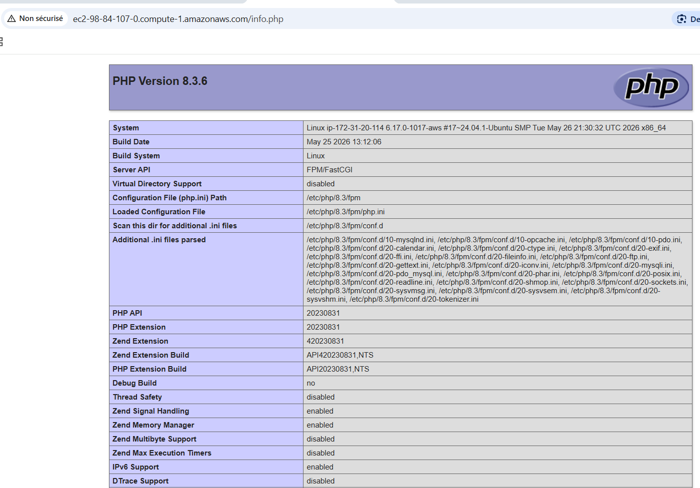

After checking the configuration of your server, it is best to delete the file by running:

```bash
sudo rm -f /var/www/projectLEMP/info.php
```

> [!NOTE]
> The `phpinfo()` page exposes details about your PHP environment. It is useful for testing, but should be removed after verification for security reasons.


### Step6 Retrieving data from MYSQL Database with PHP:

After securing MySQL, it is time to create a database and a dedicated user for the PHP application.

```sql
CREATE DATABASE `example_database`;
CREATE USER 'example_user'@'%' IDENTIFIED WITH mysql_native_password BY 'PassWord.1';
GRANT ALL ON example_database.* TO 'example_user'@'%';
```
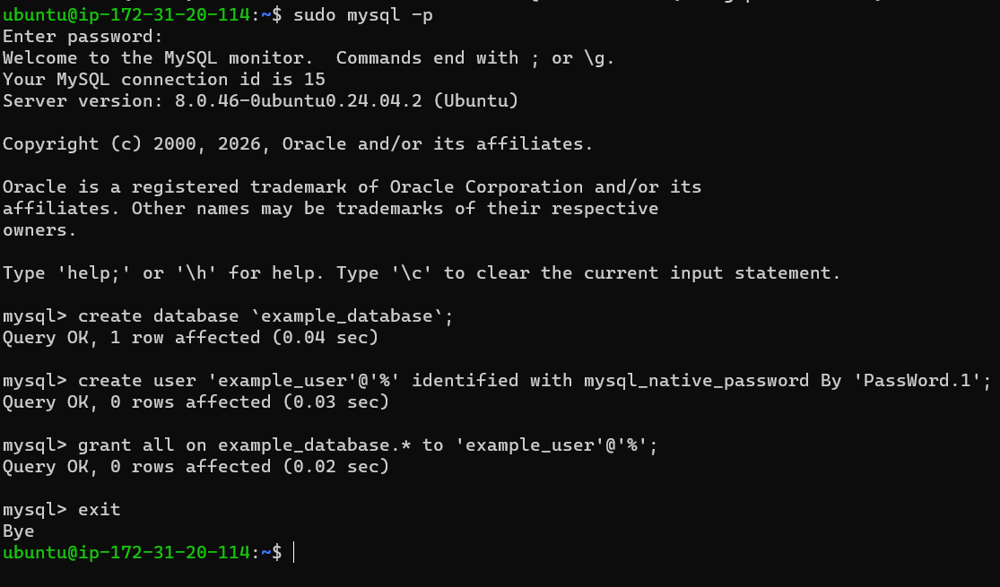
Now test the connection with the created user:

```bash
mysql -u example_user -p
```

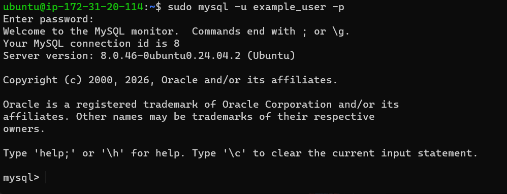

Now we will create a sample table for the PHP application.

```sql
create table example_database.todo_list (
    item_id INT AUTO_INCREMENT,
    content VARCHAR(255),
    PRIMARY KEY(item_id)
);
```
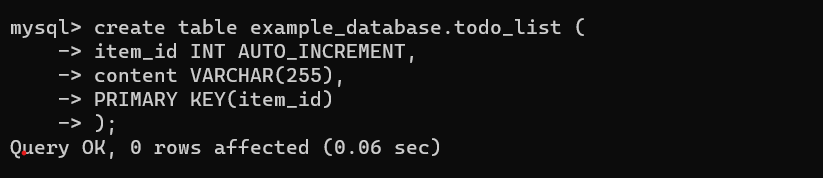

Insert sample values into the table:

```sql
insert into example_database.todo_list (content) values ("My first important item");
insert into example_database.todo_list (content) values ("My second important item");
insert into example_database.todo_list (content) values ("My third important item");
insert into example_database.todo_list (content) values ("My forth important item");
insert into example_database.todo_list (content) values ("My fifth important item");
```
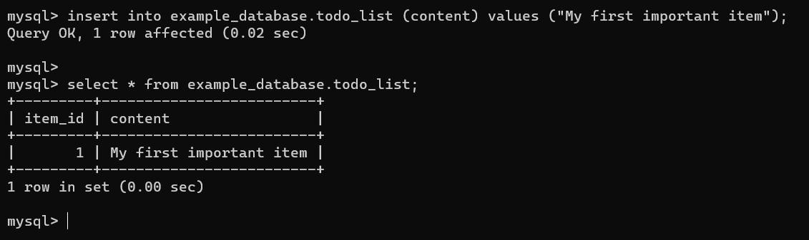
To verify the inserted records, run:

```sql
select * from example_database.todo_list;
```
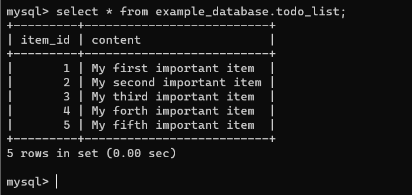

Now create a PHP script named `todo_list.php` inside `/var/www/projectLEMP/`.


Use the following code:

```php
<?php
$user = "example_user";
$password = "PassWord.1";
$database = "example_database";
$table = "todo_list";

try {
    $db = new PDO("mysql:host=localhost;dbname=$database", $user, $password);
    echo "<h2>TODO</h2><ol>";
    foreach($db->query("SELECT content FROM $table") as $row) {
        echo "<li>" . $row['content'] . "</li>";
    }
    echo "</ol>";
} catch (PDOException $e) {
    print "Error!: " . $e->getMessage() . "<br/>";
    die();
}
?>
```

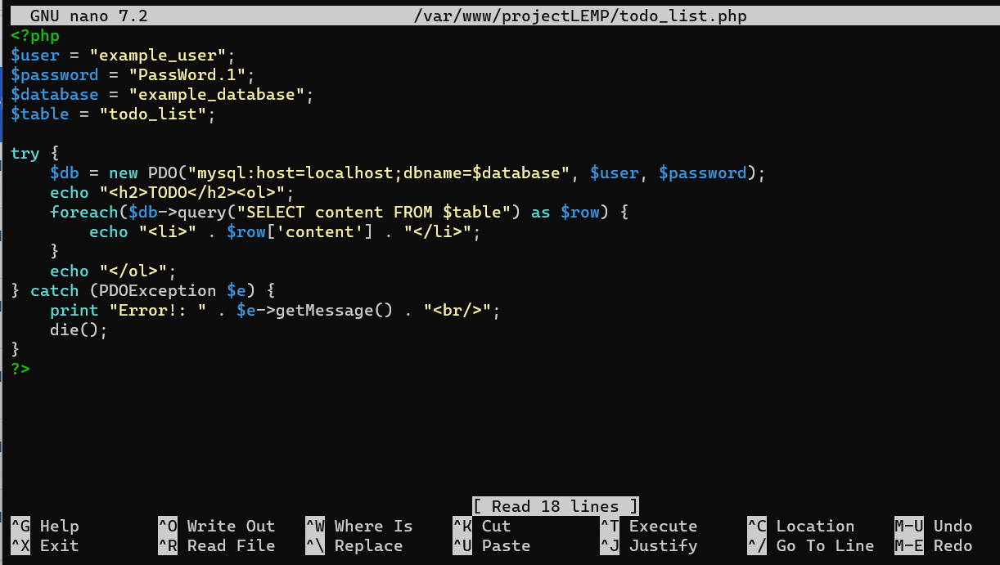


Open the file in the browser, and you should see the TODO list rendered from MySQL:


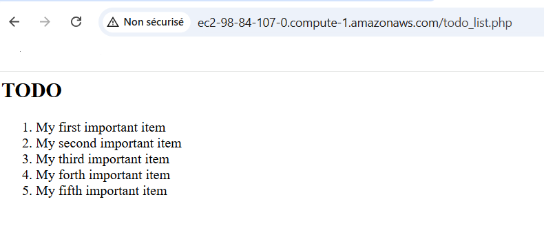

> [!NOTE]
> This final test confirms that Nginx is serving PHP correctly and that PHP can successfully connect to MySQL and fetch records from the database.

### Conclusion:

Through this project, we have completed the basic installation process to set up a scalable **LEMP** web server on an **AWS EC2** instance.

We successfully:
- installed Nginx as the web server,
- installed and secured MySQL,
- configured PHP-FPM for dynamic content,
- created a custom Nginx server block,
- tested static and dynamic web pages,
- integrated PHP with MySQL through a small TODO application.