##  Load Balancer Solution With Apache
### Introduction:
When users access a website or web application, they typically interact with a single domain or subdomain and receive a seamless response. From the user's perspective, the application appears to be hosted on a single server. In reality, however, the service is often delivered by a pool of backend servers working together to ensure high availability, scalability, and fault tolerance. The component responsible for distributing incoming requests across these backend servers is the load balancer.

A load balancer is either a dedicated hardware appliance or a software solution that distributes client requests among multiple backend services. These services may consist of web servers, application servers, database servers, or any other type of workload requiring traffic distribution. By preventing any single server from becoming overloaded, a load balancer improves application performance, resilience, and overall service availability.

There are two common approaches to scaling an infrastructure:

1. **Vertical scaling (Scaling Up)**: Increasing the capacity of an existing server by adding resources such as CPU cores, memory, or storage.

2. **Horizontal scaling (Scaling Out)**: Increasing the application's capacity by deploying additional server instances and distributing the workload among them.

A load balancer plays a key role in horizontal scaling by efficiently routing requests according to a configurable balancing strategy. Common algorithms include : **Round Robin**, **Least Connections**, **Weighted Distribution**, and **Traffic-Based balancing**. The choice of algorithm depends on the application's requirements, server capabilities, and expected workload.

In this lab, we will implement a software load balancer using Apache HTTP Server (mod_proxy_balancer). The load balancer will be deployed on an Ubuntu EC2 instance hosted in AWS and configured to distribute HTTP requests across two backend web servers located within the same Virtual Private Cloud (VPC). This architecture demonstrates a typical enterprise deployment pattern that improves both availability and scalability while maintaining a single entry point for client requests.

The following diagram illustrates the architecture we are going to implement, with a particular focus on the load balancer layer(highlighted with a red rectangle). The other layers of this architecture were already implemented in the previous labs.

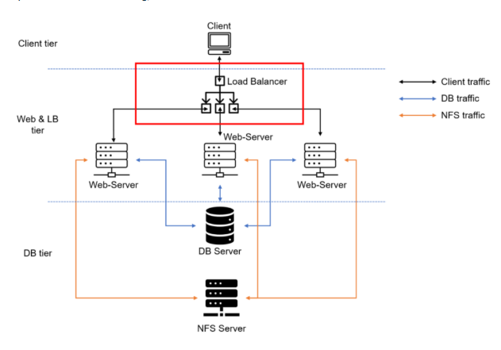

### Step0 preparing prerequisites:

For the purpose of this lab, we will use the following components:
1. two RHEL8 Web servers
2. One Mysql DB Server running on Ubuntu
3. One RHEL8 NFS Server

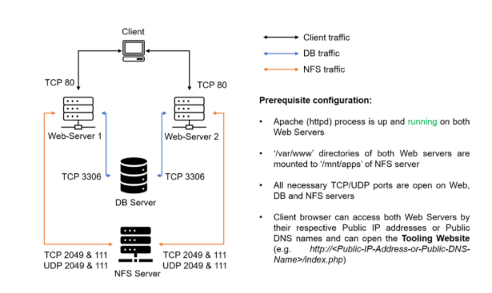

### Step1 Configuring Apache As a LoadBalancer:
As a first step, we will deploy an Ubuntu Server instance that will serve as the software-based load balancer.

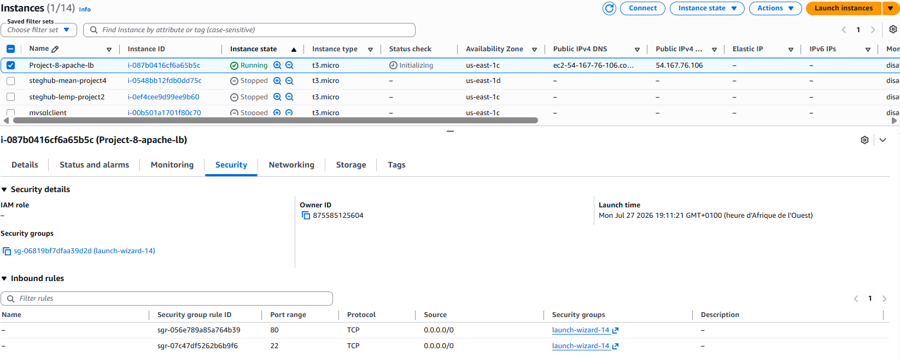
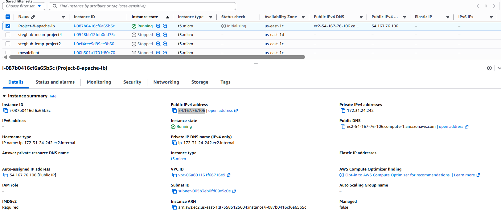

Next, update the local package index(Repository metadata) using the following command:
```bash
sudo apt update
```

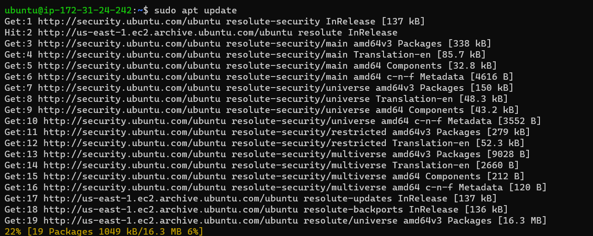


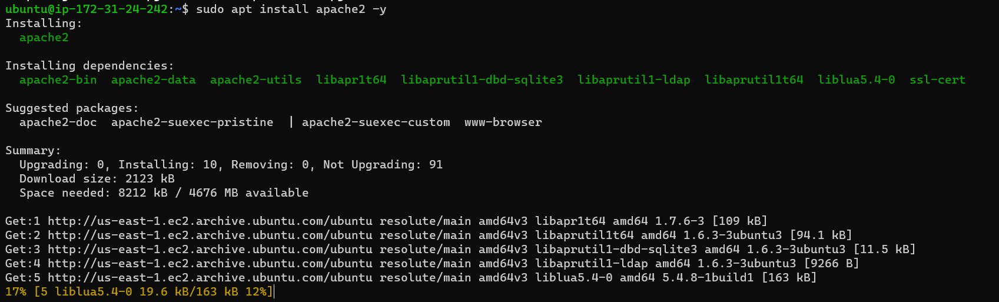
The next step consists of installing the Apache2 web server, its required dependencies, and the libxml2-dev development package by executing the following commands:
```bash
sudo apt install apache2 -y
sudo apt-get install libxml2-dev
```
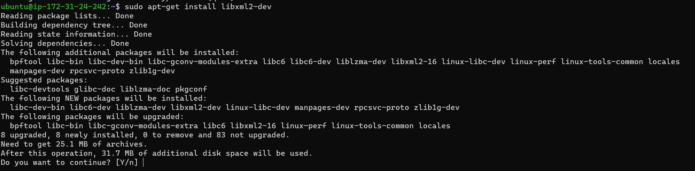

After that ,We need to enable the following modules :
```bash
sudo a2enmod rewrite
sudo a2enmod proxy
sudo a2enmod proxy_balancer
sudo a2enmod proxy_http
sudo a2enmod headers
sudo a2enmod lbmethod_bytraffic
sudo systemctl restart apache2
```
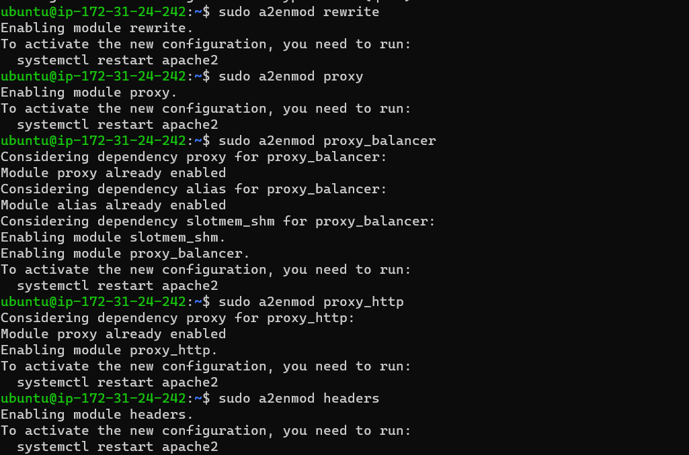
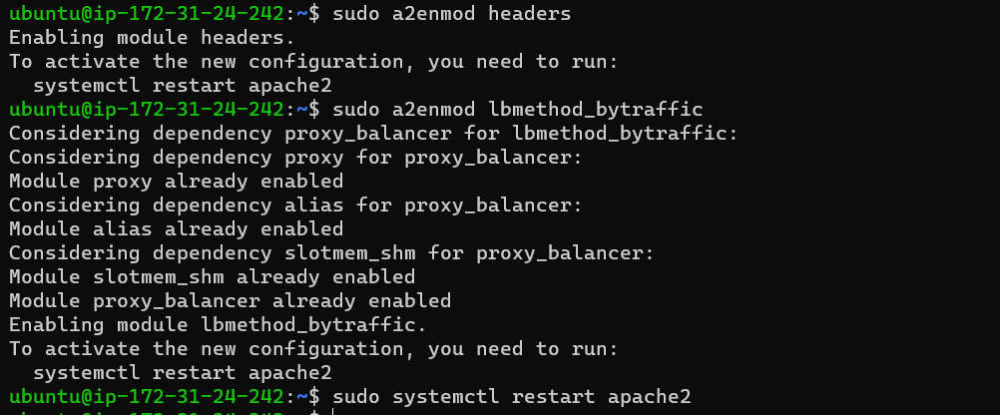
Make sure that apache2 is up and running
```bash
sudo systemctl status apache2
```
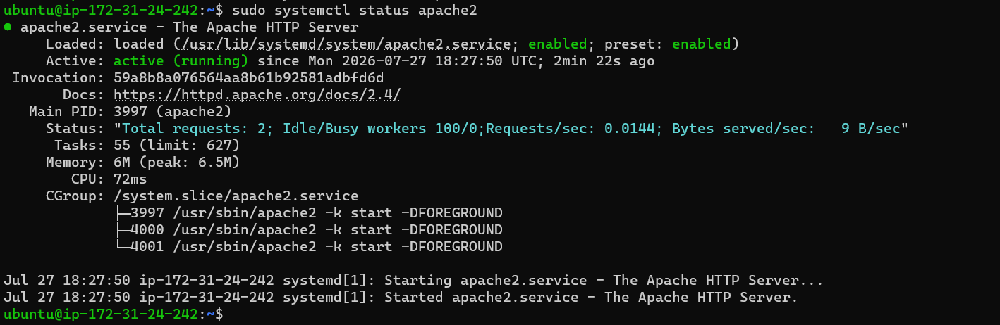

The next step focuses on the core load balancer configuration, which is managed through the main Apache virtual host configuration file: /etc/apache2/sites-available/000-default.conf.
```bash
<Proxy "balancer://mycluster">
BalancerMember http://172.31.18.195:80 \
loadfactor=5 timeout=1
BalancerMember http://172.31.28.168:80 \
loadfactor=5 timeout=1
ProxySet lbmethod=bytraffic
# ProxySet lbmethod=byrequests
</Proxy>

ProxyPreserveHost On
ProxyPass / balancer://mycluster/
ProxyPassReverse / balancer://mycluster/
</VirtualHost>
```

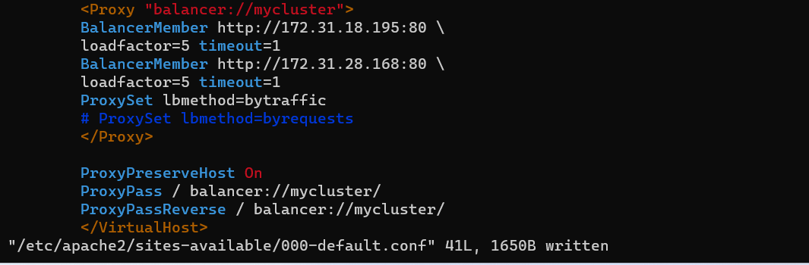


Initially, the two web servers use a shared /var/log/httpd directory hosted on the NFS server. To ensure server independence, we will reconfigure each web server to use its own local log directory."
```bash
sudo systemctl stop httpd
sudo umount /var/log/httpd
```

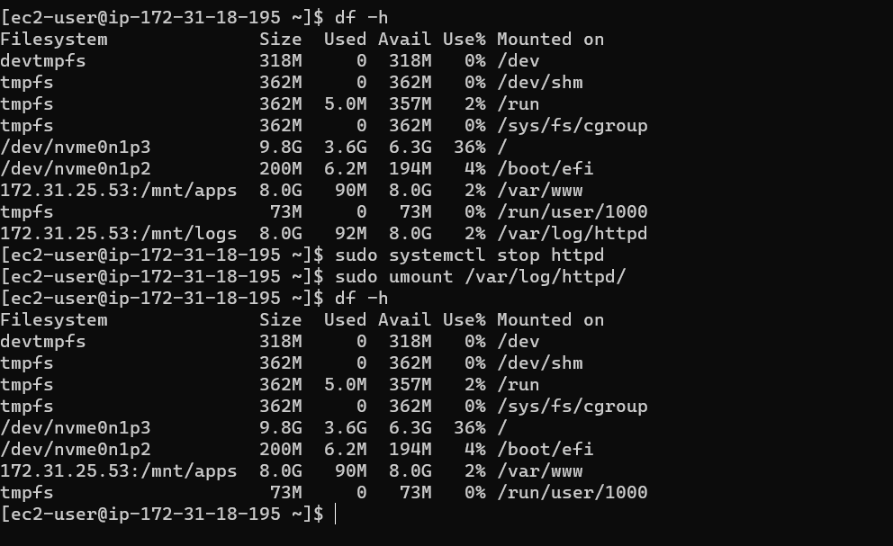


The next step is to access the web application through the public IP address of each web server and analyze the corresponding /var/log/httpd/access_log entries to validate request handling.

```bash
tail -f /var/log/httpd/access_log
```

This is the Output of the first server
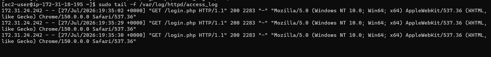
This is the Output of the second web server
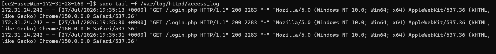

The main observation is that the generated access log entries are evenly distributed between the two web servers. This distribution confirms the expected behavior of the load balancer and matches the configured loadfactor=5 parameter.

### Step2 Configuring Local DNS Names Resolution
In a real-world environment, remembering and managing individual IP addresses for every web server can be tedious and error-prone. This is where the Domain Name System (DNS) comes into play, providing a mechanism to translate human-readable domain names into IP addresses.

For this lab environment, and to keep the configuration simple, we will use the /etc/hosts file as a static local name resolution mechanism instead of deploying a dedicated DNS server. Add the required hostname-to-IP address mappings as follows:
```bash
172.31.18.195   web1 
172.31.28.168   web2
```
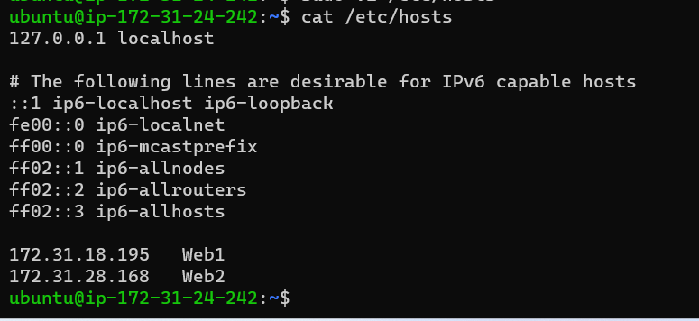

And change 000-default.conf as bellow:

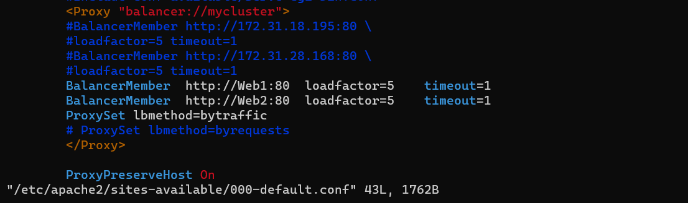

To validate hostname resolution and web server accessibility, execute the following curl commands. The expected output should confirm that both web servers are reachable and responding correctly:
```bash
curl http://web1/
curl http://web2/
```

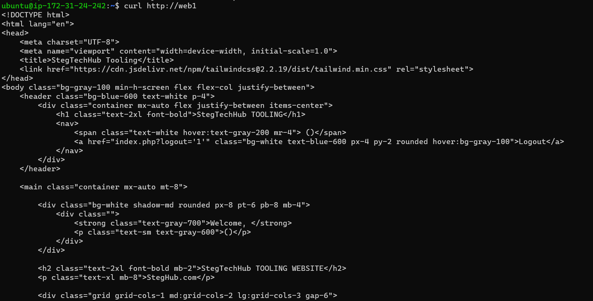

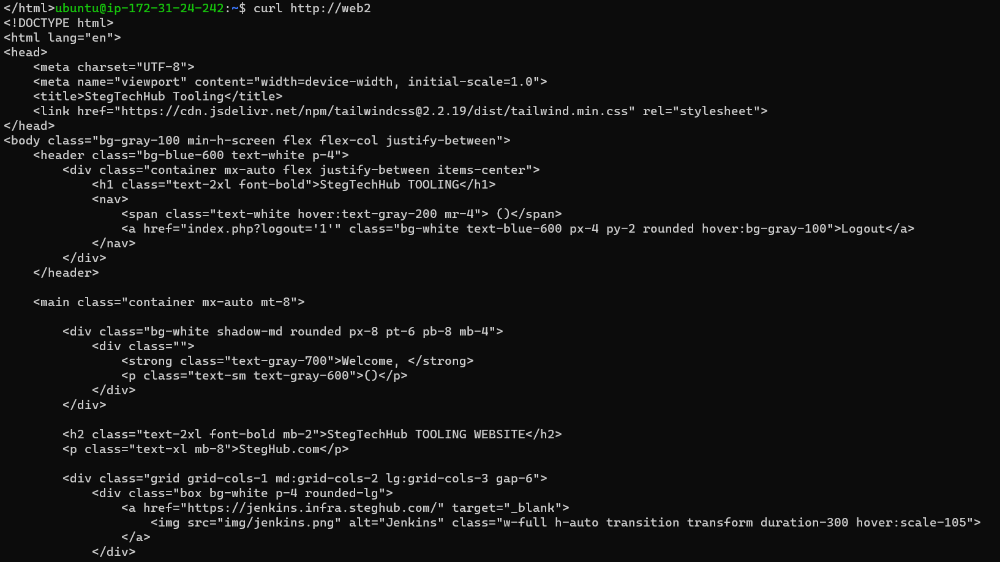


### Conclusion:
The Apache Server **mod_proxy_balancer** module delivers essential load-balancing capabilities, such as session persistence (sticky sessions) and multiple traffic distribution algorithms similar to those available in commercial load-balancing products. Adopting open-source technologies with the appropriate expertise can enable organizations to build enterprise-level Information Systems while optimizing investment costs.
