## MEAN Web Stack Implementation Documentation
### Overview
This project documents the implementation of a MEAN web stack environment for a Book application hosted on an Ubuntu-based AWS EC2 instance. 
The MEAN stack combines MongoDB, Express.js, Angular, and Node.js to support full-stack JavaScript development. In this lab, the documented steps focus on preparing the server and backend workspace as the foundation for building and deploying the application.
### Objective
The objective of this lab was to prepare a working MEAN stack development environment on a remote Linux server and begin the setup of a Book application project. This included connecting securely to the EC2 instance, updating system packages, installing Node.js and npm, confirming the installed versions, and initializing the Node.js project directory,configuring a mongodb as a local systemd service then developping an Angular js frontend code.
### Technologies Used
AWS EC2 instance running Ubuntu 26.04 LTS.

- Linux terminal commands for server administration.

- Node.js runtime environment.

- npm package manager.

- NodeSource repository for installing the current Node.js release.

- MongoDB as a systemd database service used by the application.

- Angular based user interface for interacting with the frontend.
### Step0 preparing prerequisites:
First of all , we are going to spin up an EC2 instance running on AWS.
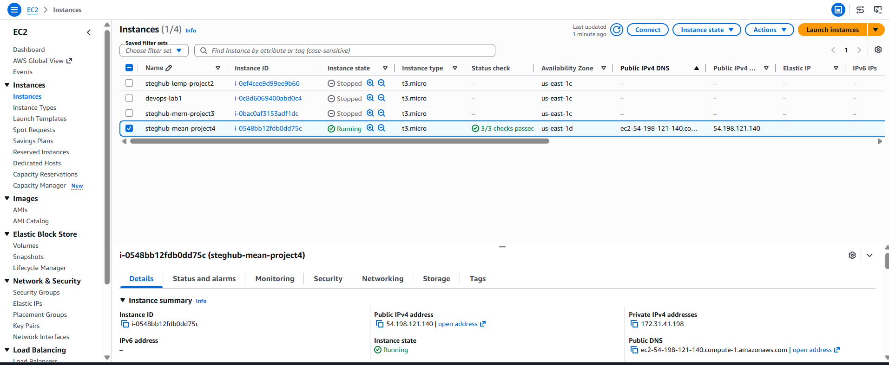
After that we need to implement inbound rules to allow connection from the internet

The implementation began with secure access to the remote Ubuntu EC2 instance using an SSH private key. File permissions were first adjusted on the .pem key file, after which the connection to the server was established successfully.

```bash
chmod 600 steghub-mean-project4.pem
ssh -i steghub-mean-project4.pem ubuntu@54.198.121.140
```
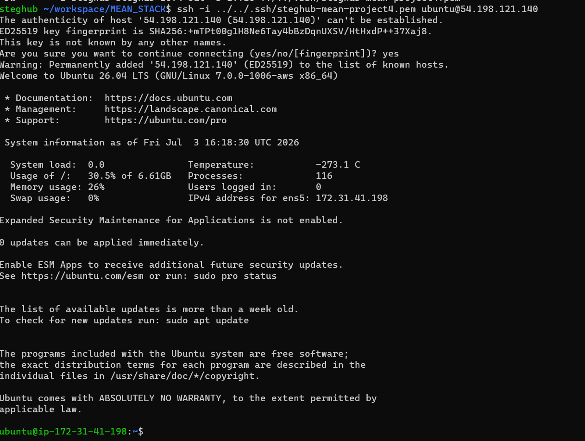

### Step1 Install NodeJS
Node.js is a Javascripy runtime , in our case  Node.js is used to set up the Express routes and AngularJS controllers

First of all , as usual update Ubuntu
```bash
sudo apt update
sudo apt upgrade
```
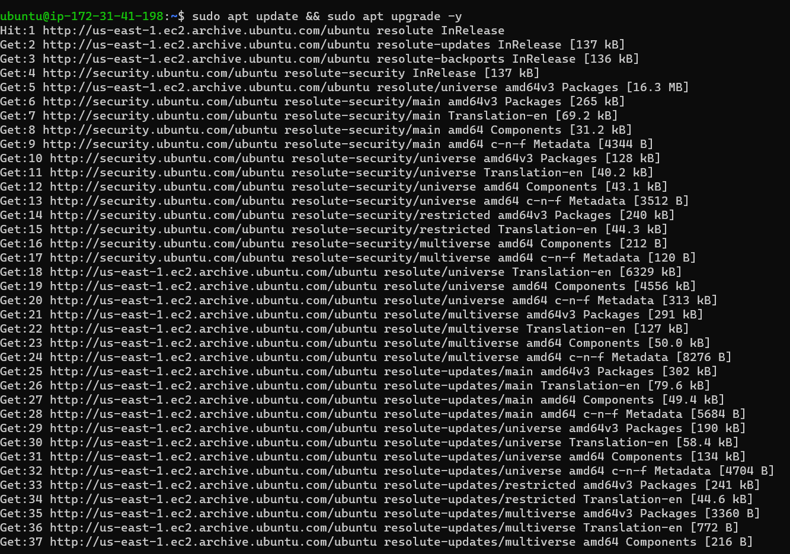

We need now to add artifactes

```bash
sudo apt -y install curl dirmngr apt-transport-https lsb-release ca-certificates
curl -sL https://deb.nodesource.com/setup_22.x |sudo -E bash -
sudo apt install -y nodejs
```
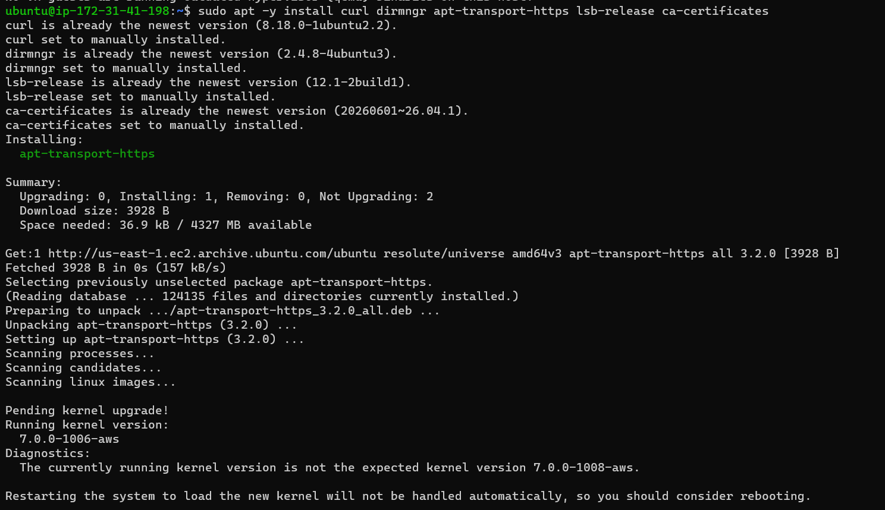
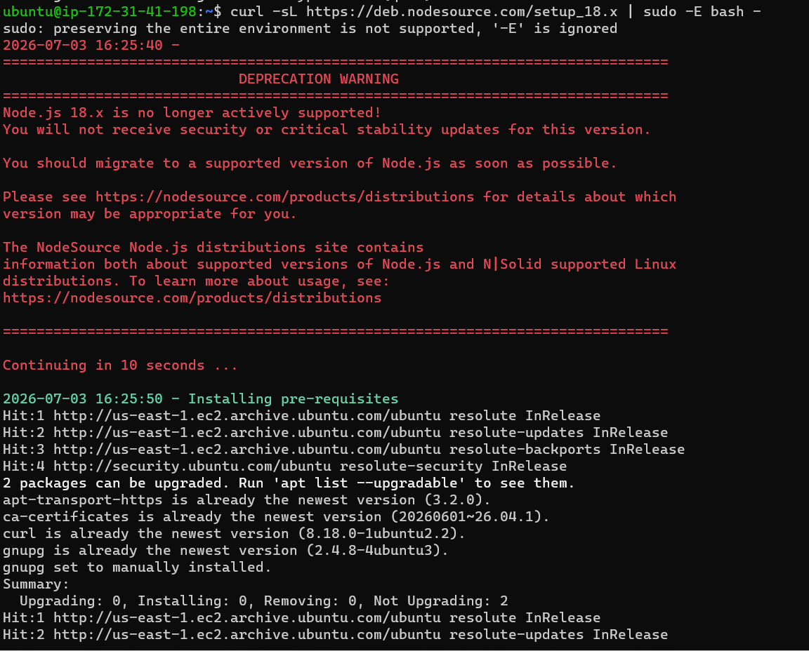
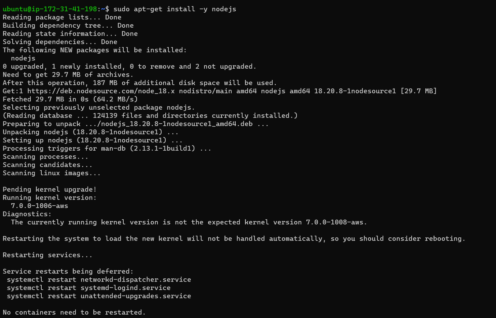

### Step2 Install MongoDB
MongoDB stores data in JSON-like documents. we are adding book records to MongoDB that contain book name,isbn number,author and number of pages
* Download the MongoDB public GPG key
```bash
sudo apt-get install gnupg curl 
curl -fsSL https://www.mongodb.org/static/pgp/server-7.0.asc | \
sudo pgp -o /usr/share/keyrings/mongodb-server-7.0.gpg \
--dearmor
```
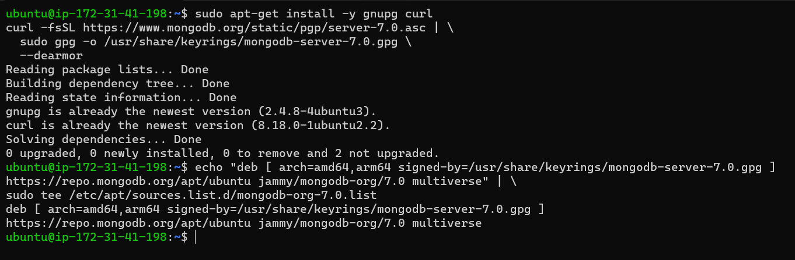
* Add the MongoDB repository
```bash
echo "deb [ arch=amd64,arm64  signed-by=/usr/share/keyrings/mongodb-server-7.0.pgp ] https://repo.mongodb.org/apt/ubuntu jammy/mongodb-org/7.0 multiverse" | \ sudo tee /etc/apt/sources.list.d/mongodb-org-7.0.list
```
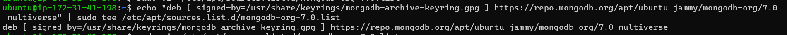
* Install MongoDB
```bash
sudo apt-get install -y mongodb-org
```
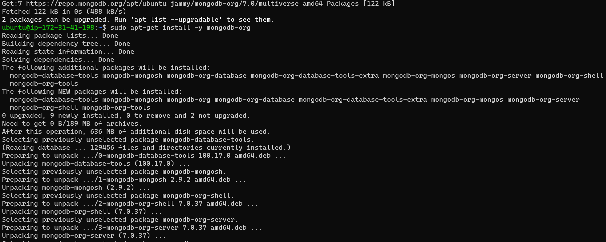
Start the server
```bash
sudo systemctl start mongodb
```
* Verify that mongodb is up and running

```bash
systemctl status mongod
```
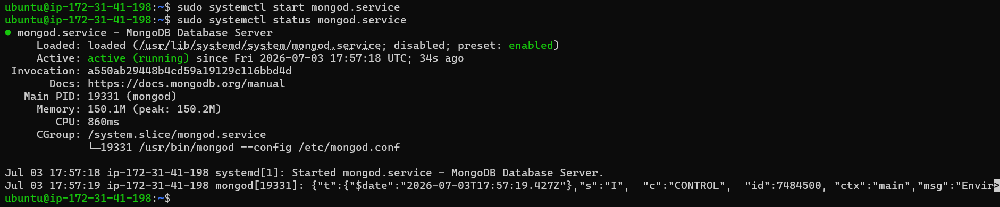

* Install Node package manager
```bash
sudo apt install -y npm
```
* Install body-parser package to parse JSON files:
```bash
sudo npm install body-parser
```
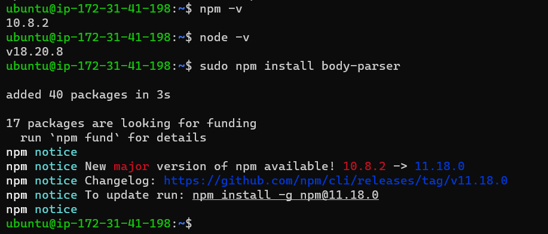
* Create a Books directory and initialize an npm project inside it
```bash
mkdir Books && cd Books
npm init
```
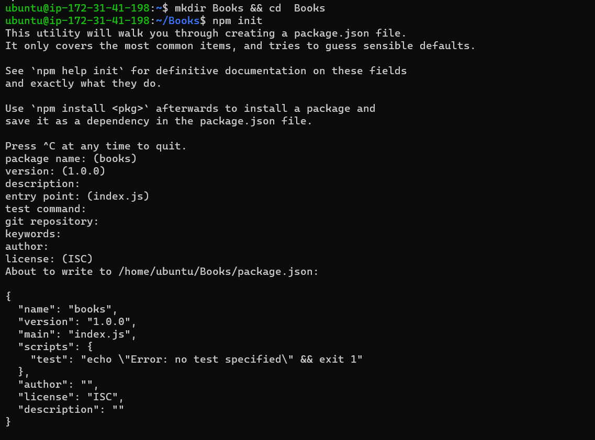
* Add a file named server.js
Copy and paste the following JS code inside server.js
```JS
const express = require('express');
const bodyParser = require('body-parser');
const mongoose = require('mongoose'); // Make sure mongoose is installed and required
const path = require('path'); // To handle static file serving
const app = express();

// Connect to MongoDB
mongoose.connect('mongodb://localhost:27017/test', { useNewUrlParser: true, useUnifiedTopology: true })
  .then(() => console.log('MongoDB connected'))
  .catch(err => console.error('MongoDB connection error:', err));

// Middleware
app.use(bodyParser.json());
app.use(express.static(path.join(__dirname, 'public')));

// Routes
require('./apps/routes')(app);

// Start the server
app.set('port', 3300);
app.listen(app.get('port'), () => {
  console.log('Server up: http://localhost:' + app.get('port'));
});
```
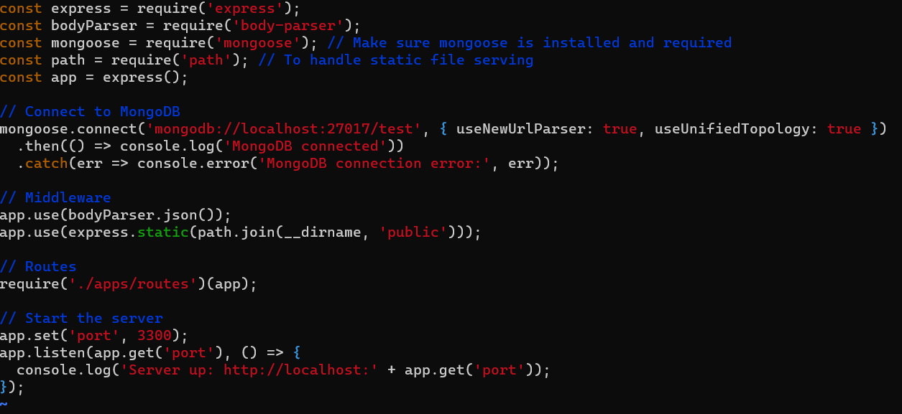

### Step 3 - Install Express and set up routes to the server
Express is a minimal node.js framework that we will use to communicate with mongodb through mongoose

* Install mongoose and express


```bash
sudo npm install express mongoose
```
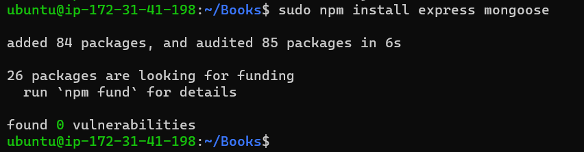
* create a folder named apps inside Books and create a file named routes.js

```js
const Book = require('./models/book');
const path = require('path');

module.exports = function(app) {
  // Get all books
  app.get('/book', async (req, res) => {
    try {
      const books = await Book.find({});
      res.json(books);
    } catch (err) {
      console.error(err);
      res.status(500).json({ error: 'Internal Server Error' });
    }
  });

  // Add a new book
  app.post('/book', async (req, res) => {
    try {
      const book = new Book({
        name: req.body.name,
        isbn: req.body.isbn,
        author: req.body.author,
        pages: req.body.pages
      });
      const result = await book.save();
      res.json({
        message: "Successfully added book",
        book: result
      });
    } catch (err) {
      console.error(err);
      res.status(500).json({ error: 'Internal Server Error' });
    }
  });

  // Update a book
  app.put('/book/:isbn', async (req, res) => {
    try {
      const updatedBook = await Book.findOneAndUpdate(
        { isbn: req.params.isbn },
        req.body,
        { new: true }
      );
      if (!updatedBook) {
        return res.status(404).json({ error: 'Book not found' });
      }
      res.json({
        message: "Successfully updated the book",
        book: updatedBook
      });
    } catch (err) {
      console.error(err);
      res.status(500).json({ error: 'Internal Server Error' });
    }
  });

  // Delete a book
  app.delete('/book/:isbn', async (req, res) => {
    try {
      const result = await Book.findOneAndRemove({ isbn: req.params.isbn });
      if (!result) {
        return res.status(404).json({ error: 'Book not found' });
      }
      res.json({
        message: "Successfully deleted the book",
        book: result
      });
    } catch (err) {
      console.error(err);
      res.status(500).json({ error: 'Internal Server Error' });
    }
  });

  // Serve static files
  app.get('*', (req, res) => {
    res.sendFile(path.join(__dirname, '../public', 'index.html'));
  });
};

```
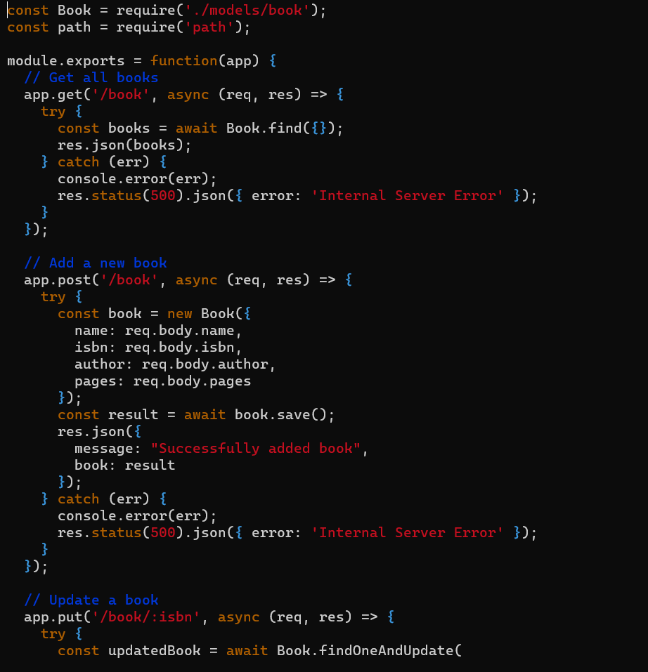

* inside apps create a folder named models , inside which create a file named book.js and copy the following code

```js
const mongoose = require('mongoose');

const bookSchema = new mongoose.Schema({
  name: { type: String, required: true },
  isbn: { type: String, required: true, unique: true },
  author: { type: String, required: true },
  pages: { type: Number, required: true }
});

module.exports = mongoose.model('Book', bookSchema);
```
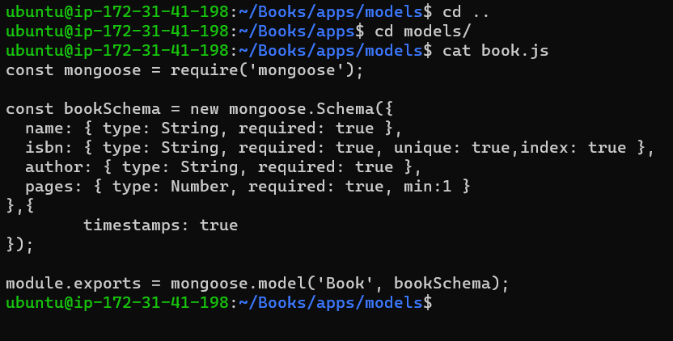

### Step 4 - Access the routes with AngularJS
In this tutorial AngularJS will connect to express to retrieve data from mongodb and render it on the web

* Change to Books directory and create a directory called public
```bash
cd ../..
```
* inside public , create script.js file 
inside which paste the following code:

```js
var app = angular.module('myApp', []);

app.controller('myCtrl', function($scope, $http) {
  // Get all books
  function getAllBooks() {
    $http({
      method: 'GET',
      url: '/book'
    }).then(function successCallback(response) {
      $scope.books = response.data;
    }, function errorCallback(response) {
      console.log('Error: ' + response.data);
    });
  }

  // Initial load of books
  getAllBooks();

  // Add a new book
  $scope.add_book = function() {
    var body = {
      name: $scope.Name,
      isbn: $scope.Isbn,
      author: $scope.Author,
      pages: $scope.Pages
    };
    $http({
      method: 'POST',
      url: '/book',
      data: body
    }).then(function successCallback(response) {
      console.log(response.data);
      getAllBooks();  // Refresh the book list
      // Clear the input fields
      $scope.Name = '';
      $scope.Isbn = '';
      $scope.Author = '';
      $scope.Pages = '';
    }, function errorCallback(response) {
      console.log('Error: ' + response.data);
    });
  };

  // Update a book
  $scope.update_book = function(book) {
    var body = {
      name: book.name,
      isbn: book.isbn,
      author: book.author,
      pages: book.pages
    };
    $http({
      method: 'PUT',
      url: '/book/' + book.isbn,
      data: body
    }).then(function successCallback(response) {
      console.log(response.data);
      getAllBooks();  // Refresh the book list
    }, function errorCallback(response) {
      console.log('Error: ' + response.data);
    });
  };

  // Delete a book
  $scope.delete_book = function(isbn) {
    $http({
      method: 'DELETE',
      url: '/book/' + isbn
    }).then(function successCallback(response) {
      console.log(response.data);
      getAllBooks();  // Refresh the book list
    }, function errorCallback(response) {
      console.log('Error: ' + response.data);
    });
  };
});
```

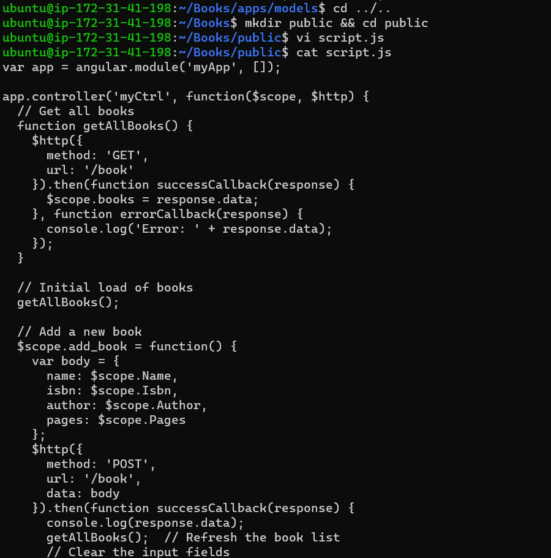

* create index.html and copy/paste the following code
```html
<!DOCTYPE html>
<html ng-app="myApp" ng-controller="myCtrl">
<head>
  <script src="https://ajax.googleapis.com/ajax/libs/angularjs/1.6.4/angular.min.js"></script>
  <script src="script.js"></script>
  <style>
    /* Add your custom CSS styles here */
  </style>
</head>
<body>
  <div>
    <table>
      <tr>
        <td>Name:</td>
        <td><input type="text" ng-model="Name"></td>
      </tr>
      <tr>
        <td>Isbn:</td>
        <td><input type="text" ng-model="Isbn"></td>
      </tr>
      <tr>
        <td>Author:</td>
        <td><input type="text" ng-model="Author"></td>
      </tr>
      <tr>
        <td>Pages:</td>
        <td><input type="number" ng-model="Pages"></td>
      </tr>
    </table>
    <button ng-click="add_book()">Add</button>
    <div ng-if="successMessage">{{ successMessage }}</div>
    <div ng-if="errorMessage">{{ errorMessage }}</div>
  </div>
  <hr>
  <div>
    <table>
      <tr>
        <th>Name</th>
        <th>Isbn</th>
        <th>Author</th>
        <th>Page</th>
        <th>Action</th>
      </tr>
      <tr ng-repeat="book in books">
        <td>{{ book.name }}</td>
        <td>{{ book.isbn }}</td>
        <td>{{ book.author }}</td>
        <td>{{ book.pages }}</td>
        <td><button ng-click="del_book(book)">Delete</button></td>
      </tr>
    </table>
  </div>
</body>
</html>
```
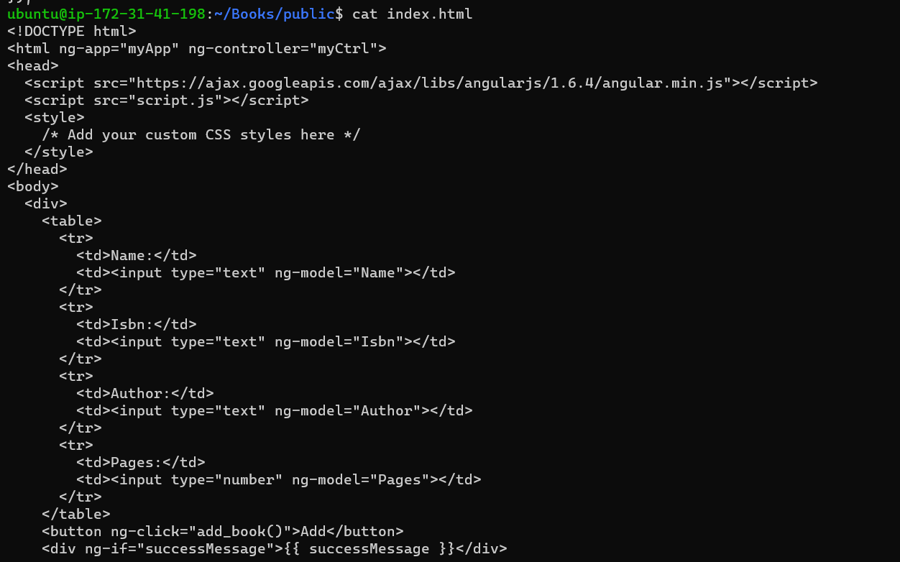
* Now return back to Books and run 
```bash
node server.js
```

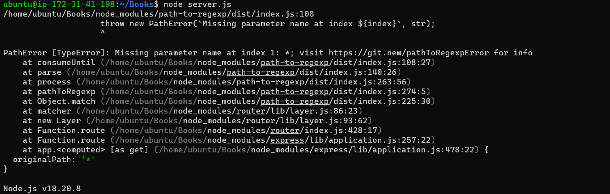
No way , the program isn't working !
After googling , as a devops engineer the easiest way isn't to touch the code but rather search for system solution
```bash
sudo npm install express@4.21.2
```

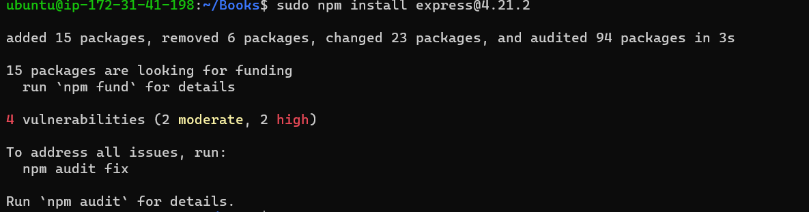
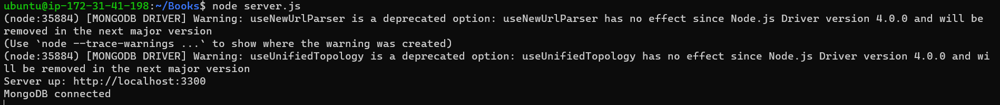
looks like the problem is fixed !
The server is now up and running, Connection to it is via port 3300. 

The Book Register web application is reachable from the internet using your favorite web browser.(Don't miss to allow 3300 port from 0.0.0.0/0 !)

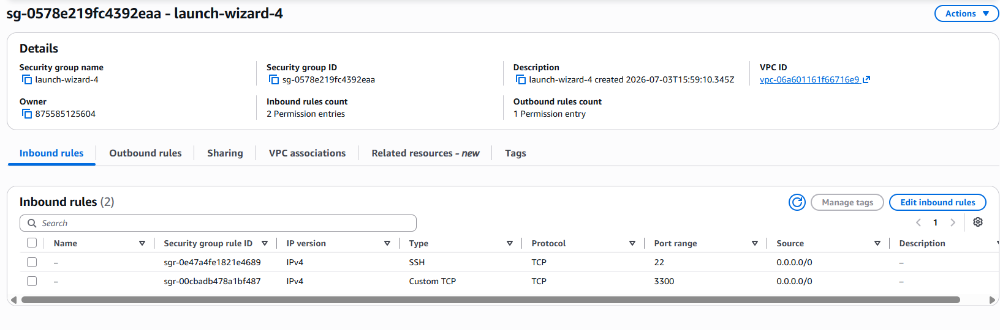
simply type:http://public-ip:3300/

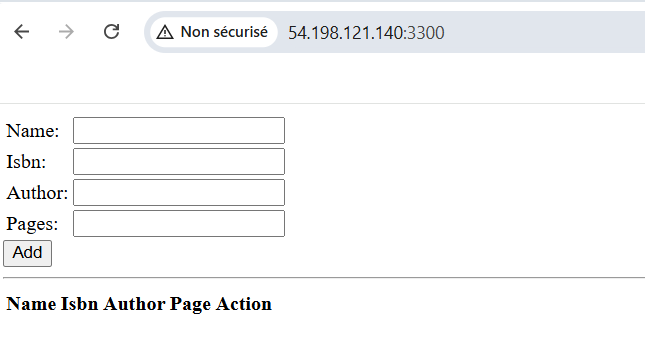
Let us add some dummies records
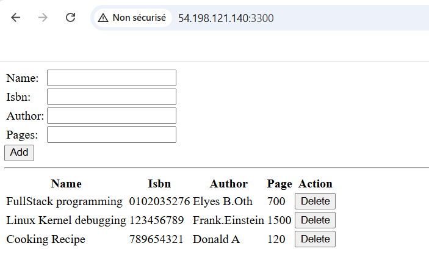
Let us list available records
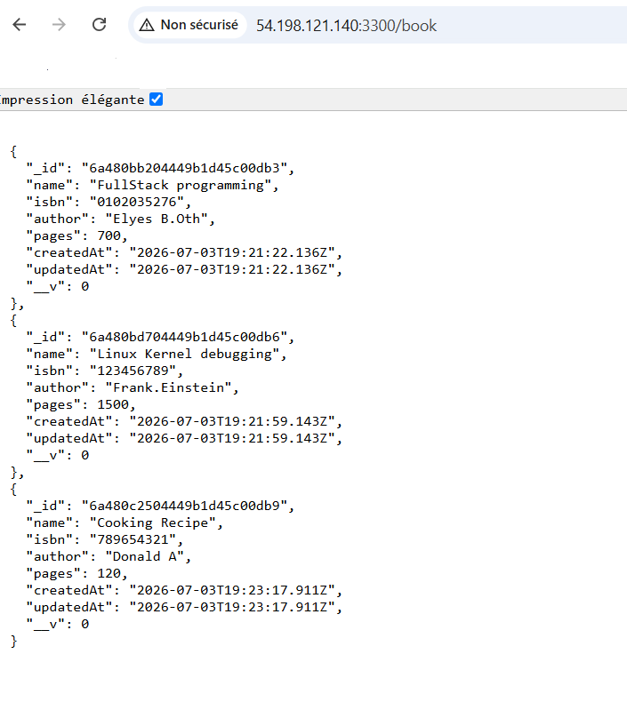

Now , we are done and we have a MEAN stack that run smoothly on AWS !

### Conclusion

The MEAN stack uses MongoDB, Express.js, AngularJS (or Angular), and Node.js—provides a solid set of technologies for building modern web applications.
These technologies together allow developpers to streamline web developpment using Javascript programming language.
JavaScript was initially a web development language for the browser, and with frameworks like Angular and runtimes like Node.js it has become a versatile language that can be confidently used across the full stack.
