## Mysql client-server architecture 

### Overview
This project documents the implementation of a client–server architecture. MySQL Server is a good example of such an architecture, where clients connect to a central database server to perform queries and updates.

### Step1 create and configure two linux-based virtual servers (EC2 instance in AWS):
After creating servers on AWS , download keys to secure the connection. Create mysqlclient.pem and mysqlclient.pem and set 600 permissions.
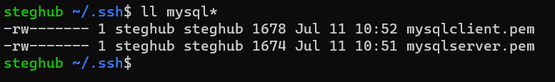
From windows terminal connect to the mysql server 
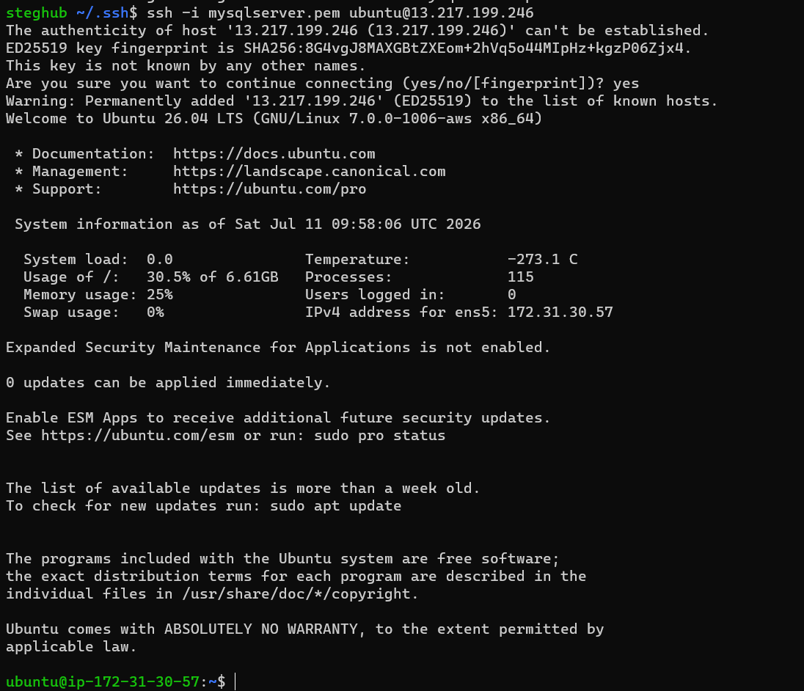
After that update the meta data of the OS
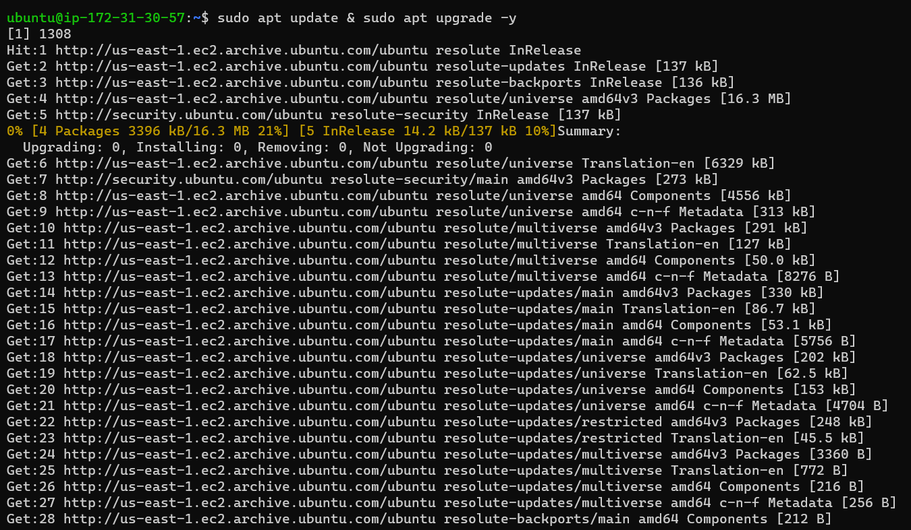

### Step2 install mysql server on the the first linux server
Install mysql-server package with
```bash
sudo apt install mysql-server
```
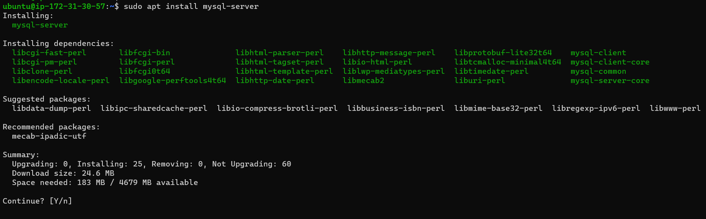
Open /etc/mysql/mysql.conf.d/mysqld.conf and replace bind-address 127.0.0.1 by bind-address 0.0.0.0
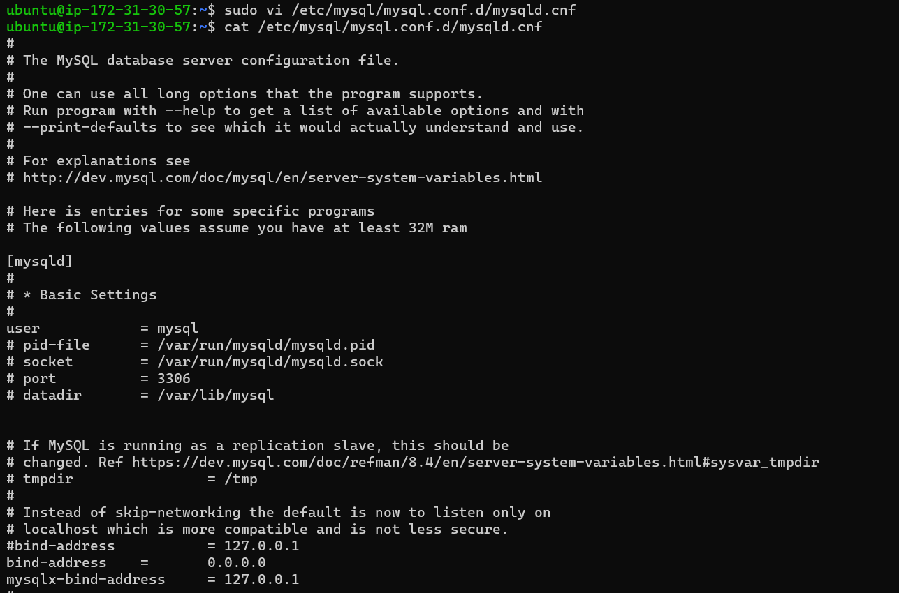
For the changes to take effect :
```bash
sudo systemctl enable mysql
sudo systemctl start mysql
```
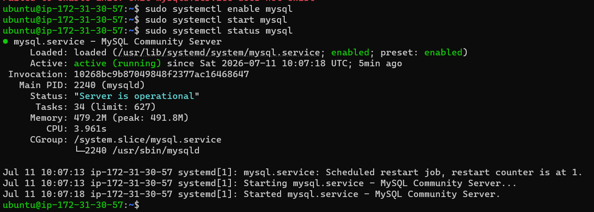
### Step2 Install mysql client on the second linux 
Connect to the second server using the mysqlclient.pem we have downloaded previously
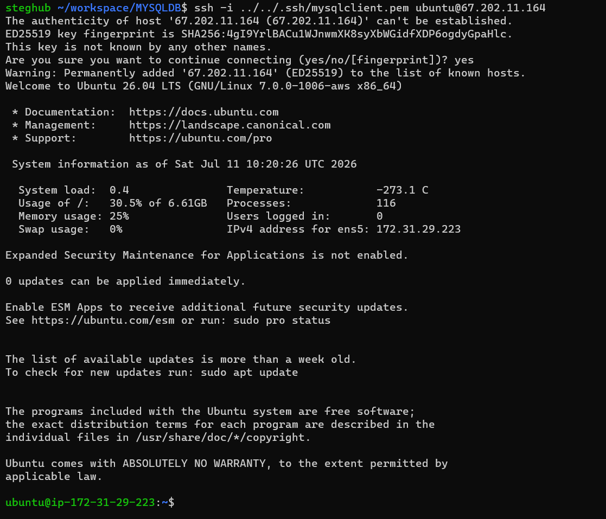
install mysql-client with
```bash
sudo apt install mysql-client
```
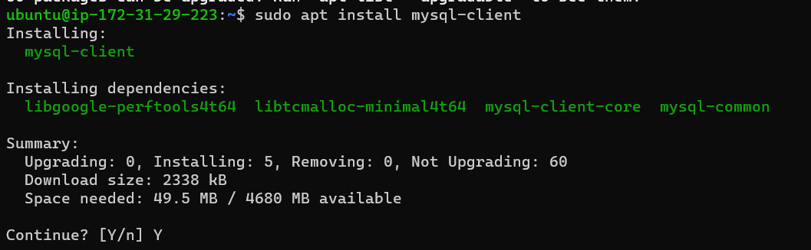

### Step 3 configure inbound rule on the first server to allow access on port 
On the mysql server , add a new inbound rule and allow communication on port 3306
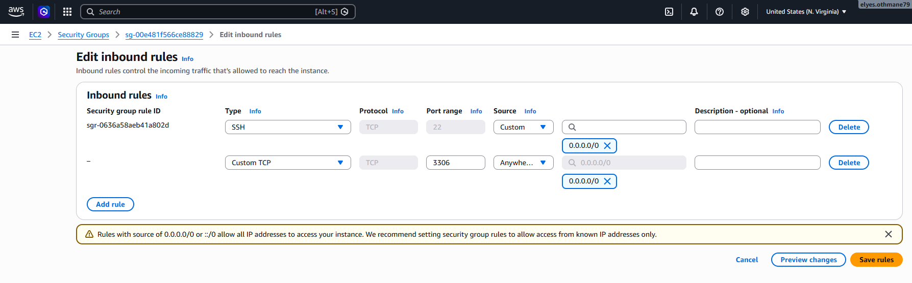

### Step 4 Configure mysql server to allow remote connection
there is a binary named mysql_secure_installation that allow us to secure the mysql server installation. execute it with:
```bash
sudo mysql_secure_installation
```
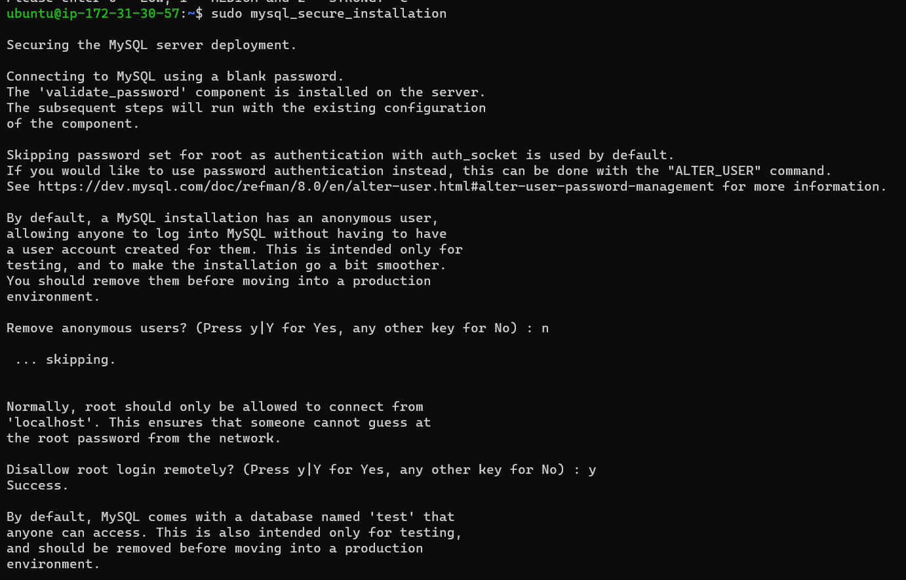
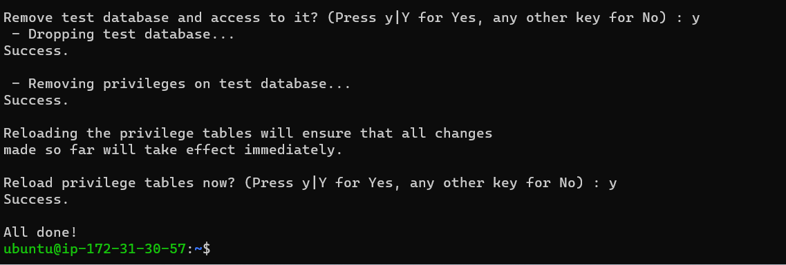
to connect to mysql locally , type:
```bash
sudo mysql
```
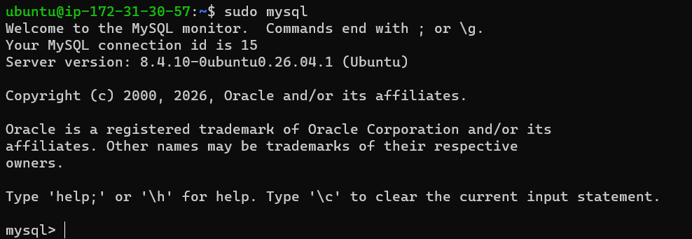
```mysql
Create user 'client'@'%' identified by "Pass"
create database test_db;
grant all on test_db.* to 'client'@'%' with grant option;
flush privileges;
```
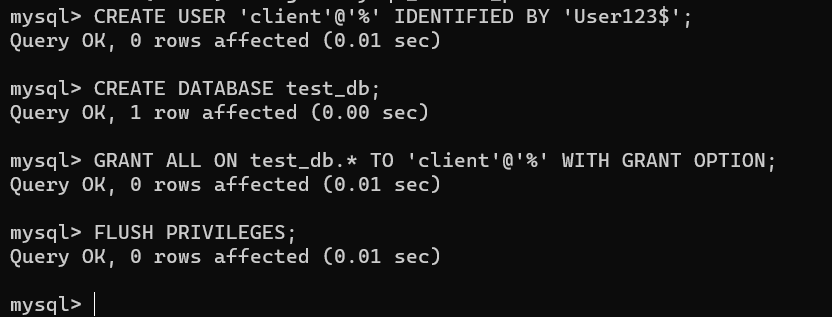
### Step 5 Connect to mysql server from client linux server
Connect to the remote mysql server by issuing :
```bash
mysql -u client -h 172.31030.57 -p
```
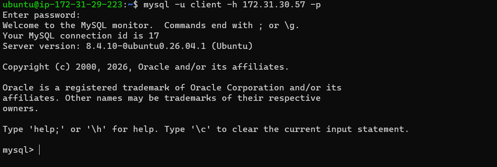
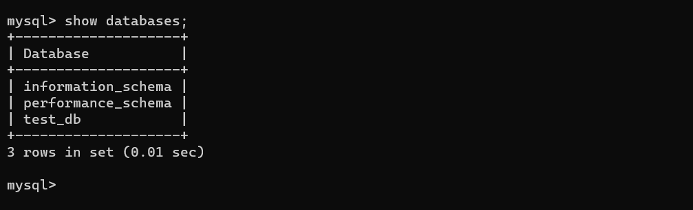
### Step 6 Perform sql queries
Let us manipulate CRUD sql instructions:
- 1 creation of a table test with
```sql
create table test (id int auto_increment,content varchar(255), primary key(id));
insert into test(content) values ("My first content");
insert into test(content) values ("My second content");
```
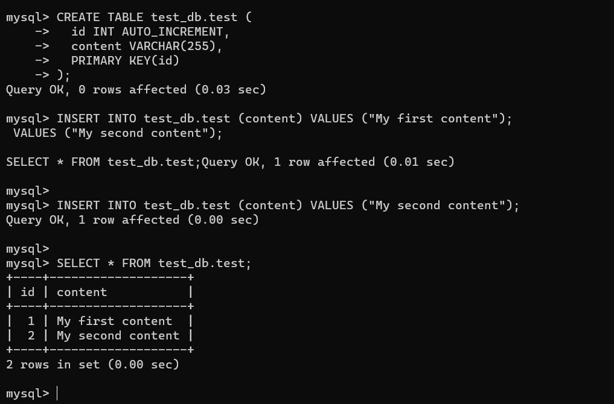
To query content of a table:
```sql
select * from test;
```
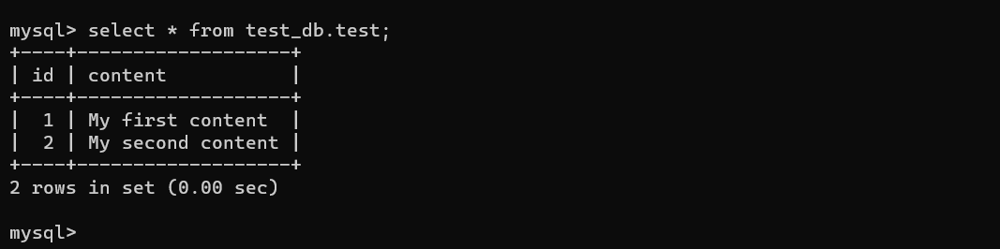
### Conculsion:
Through this lab , we have installed , configured and manipulated an  RDBMS system  (Relational DataBase Management System) that implement a client-server architecure. 