## Devops Tooling Website Solution
### Introduction:
Implementing DevOps best practices—such as automation and CI/CD pipelines—requires robust tooling. To achieve this, we are leveraging a well-established set of open-source solutions. In our lab, we will centralize and share these tools via an internal website, reflecting standard industry practices and promoting a strong corporate culture of knowledge sharing. We will build this resilient website using the following technologies:

### Component:
- [x] Infrastructure: AWS
- [x] WebServer Linux: Red Hat Enterprise Linux 8
- [x] Database Server: Ubuntu 24.04 + MySQL
- [x] Storage Server: Red Hat Enterprise Linux 8 + NFS Server
- [x] Programming Language: PHP
- [x] Code Repository: GitHub

The target architecture we plan to implement is as follows:

### Step1 prepare NFS Server:
Create an EC2 instance named steghub-nfs-server and download the associated .pem key pair file.


Create three 10 GB EBS volumes in the same Availability Zone (AZ) as the EC2 instance.


Attach the EBS volumes to the EC2 instance


Select the EC2 instance and verify that the three newly attached EBS volumes are mapped.


Connect to the NFS server and use the lsblk command to verify the attached disks and partitions.


Using fdisk command partition nvme1n1 nvme2n1 and nvme3n1 with a primary partition for each disk


For each newly created partition, set the partition type to Linux LVM (8e), then write the partition table and exit by typing w.

We are using LVM2 to manage storage in the Linux system , which give us scalability and reliability.
First of all  , we need to create a PV ( Pyisical Volume) with pvcreate
```bash
pvcreate /dev/nvme1np1
```
which will result in a new PV that can be integrate a part of a VG ( Volume Group )

Repeat the same procedure for the remaining of partitions and check with pvs


Integrate the PV under the same VG named vgdata with
```bash

sudo vgcreate vgdata /dev/nvme1n1p1 /dev/nvme2n1p1 /dev/nvme3n1p1 

```


Now it is time to create our (LVs) Logical Volumes in the same VG 
```bash
sudo lvcreate -n lv-apps -L 8G vgdata 
sudo lvcreate -n lv-logs -L 8G vgdata 
sudo lvcreate -n lv-opt -L 8G vgdata 
```


Create the filesystems. In this lab, we will use XFS, a modern filesystem that supports online resizing and management operations.
```bash
sudo mkfs.xfs /dev/vgdata/lv-apps
sudo mkfs.xfs /dev/vgdata/lv-logs
sudo mkfs.xfs /dev/vgdata/lv-opt
```


To create and populate the log partition (/var/log), we will first create a temporary directory to store the existing log files before moving them to the new filesystem.


Now we mount /mnt/log to the new created logical volume and we restore log files.


Mount the remaining LVs to their mountpoints ( /mnt/logs , /mnt/opt and /mnt/apps)


The filesystem preparation is now complete. We will proceed with the package installation phase.
>[!TIP]
>Before starting any major package installation, it is a best practice to check for available updates and ensure that the system is up to date.
```bash
sudo yum -y update
```


Install the nfs-utils package, which provides the NFS server components and the required utilities for managing NFS shares.


start and enable nfs-server for the next reboot to start automatically
```bash
sudo systemctl start nfs-server-utils
sudo systemctl enable nfs-server-utils
sudo systemctl status nfs-server-utils
```


Create the mount points /mnt/{apps,logs,opt} and assign ownership to the nobody user with full access permissions. For this lab, we will use permissions 777, although this is not recommended in a production environment for security and compliance reasons.

The rationale behind using the nobody user is that Linux systems manage file ownership using user IDs (UIDs). The nobody account is a commonly available system user with a consistent UID mapping across many Unix/Linux systems, making it suitable for shared access scenarios such as NFS exports.


To make the NFS shares available to our web servers, we need to export them with the following options: rw, sync, no_all_squash, and no_root_squash.

To make the configuration persistent, add the export definitions to /etc/exports.

Apply the changes using the exportfs command.
For the purpose of this lab, we will use the same network for all web server clients. Make sure to note the IPv4 CIDR value ( 172.31.16.0/20).

insert the following line to /etc/fstab:
```vi
/mnt/apps 172.31.16.0/20(rw,sync,no_all_squash,no_root_squash)
/mnt/logs 172.31.16.0/20(rw,sync,no_all_squash,no_root_squash)
/mnt/opt 172.31.16.0/20(rw,sync,no_all_squash,no_root_squash)
```
>[!TIP]
>Ensure that there is no space between the IP address and the parentheses.
To make the NFS shares available, apply the configuration changes by running the exportfs command.
```bash
sudo exportfs -arv
```

the exports file should be like below , no space between IP and flags
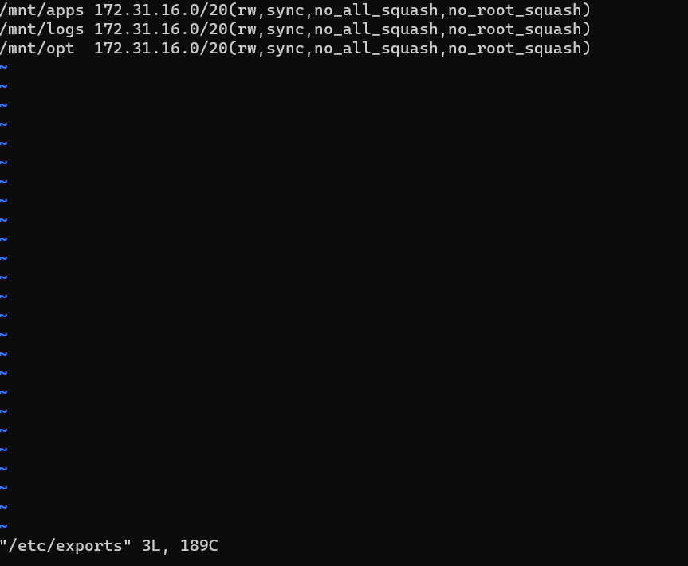

Chek which ports are used for nfs service with rpcinfo or netstat
```bash
sudo rpcinfo -p |grep nfs 
```


Add inbound security rules to allow ports 2049 and 111 for both TCP and UDP protocols, as shown below.


### Step2 Configure the Database Server
Create an EC2 instance named steghub-mysql-server and download the associated .pem key pair file.

As ususal connect to the instance and refresh OS packages

Install mysql-server with 

```bash
sudo install mysql-server
```


Configure the MySQL service to listen on all network interfaces by setting the bind address to 0.0.0.0. This change must be applied in the /etc/mysql/mysql.conf.d/mysqld.cnf configuration file.

To interact with the database server we need a client tool like mysql-client
```bash
sudo apt install mysql-client
```

Add an inbound security rule to allow TCP traffic on port 3306 from the previously defined network 172.31.16.0/20.

We will now secure our MySQL installation by running the mysql_secure_installation script.

Connect to the local MySQL instance. Create the tooling database, then create a user named webaccess that is allowed to connect from the 172.31.0.0 network and grant it all privileges.


### Step 3 Prepare the Web Servers
To serve the share from nfs server we need to install nfs-utils andnfs4-acl-tools
```bash
yum install nfs-utils ,nfs4-acl-tools
```
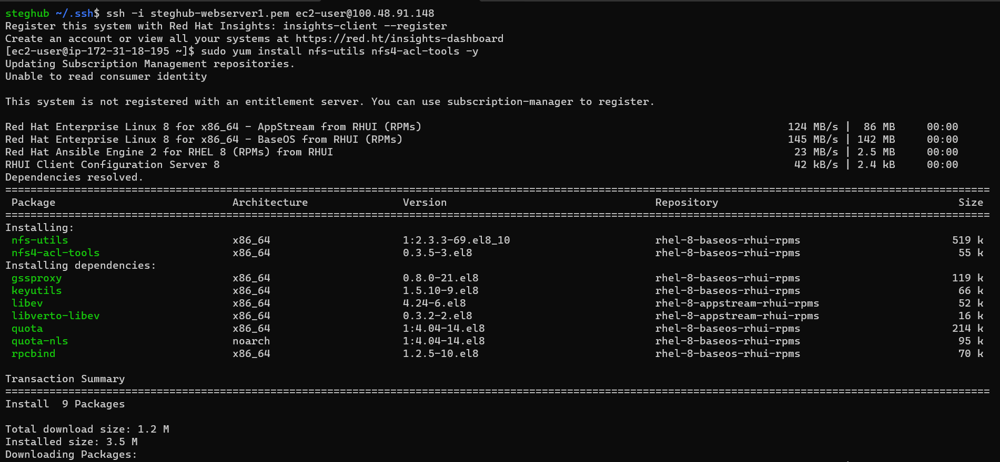
Create a mount point and use the mount command to verify that the NFS share is reachable by mounting it temporarily.
```bash
 sudo mkdir /var/wwww
 sudo mount -t nfs -o rw,nosuid 172.31.25.53
```

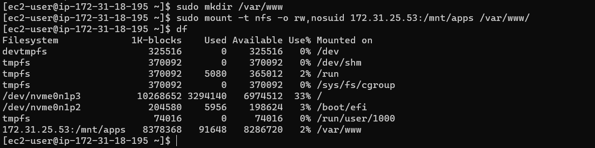
Make the montage peristant by editing the /etc/fstab

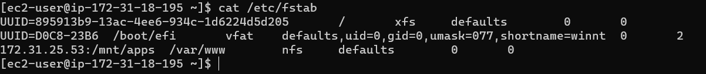

Now install httpd with
```bash
sudo yum install httpd -y
```
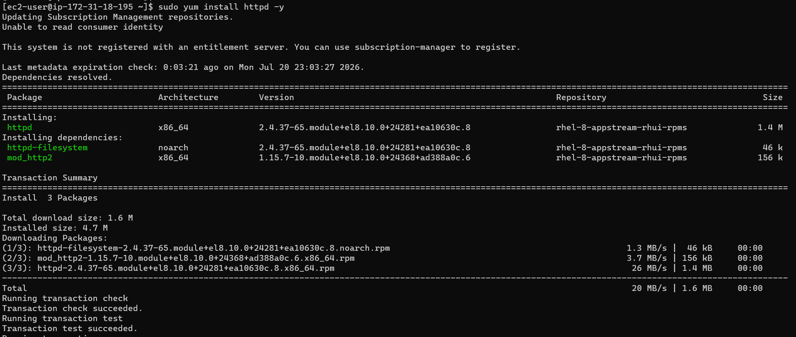

Installs the EPEL (Extra Packages for Enterprise Linux) repository, which provides additional packages not included in RHEL.
```bash
sudo dnf install https://dl.fedoraproject.org/pub/epel/epel-release-latest-8.noarch.rpm
```

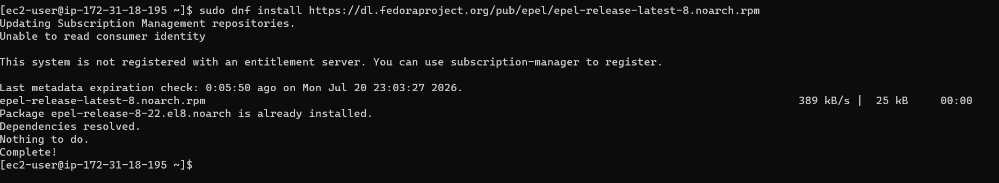

Installs dnf-utils, a collection of utilities that extend DNF functionality (e.g., config-manager).
then Installs the Remi repository, which provides newer versions of PHP and related packages.

```bash
sudo dnf install dnf-utils
sudo dnf install http://rpms.remirepo.net/enterprise/remi-release-8.rpm

```
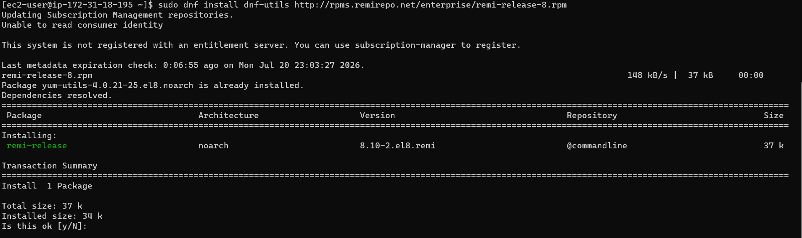


Enables the PHP 7.4 module stream from the Remi repository.
```bash
sudo dnf module enable php:remi-7.4

```

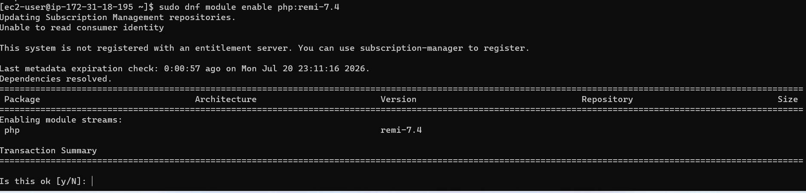

Resets the PHP module to its default state, removing any previously enabled PHP stream.
```bash
sudo dnf module reset php
```
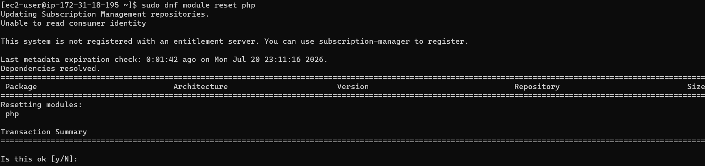

Installs PHP 7.4 and commonly used extensions: OPcache (performance), GD (image processing), cURL (HTTP requests), and MySQL Native Driver (MySQL connectivity).
```bash
sudo dnf install php php-opcache php-gd php-curl php-mysqlnd
```

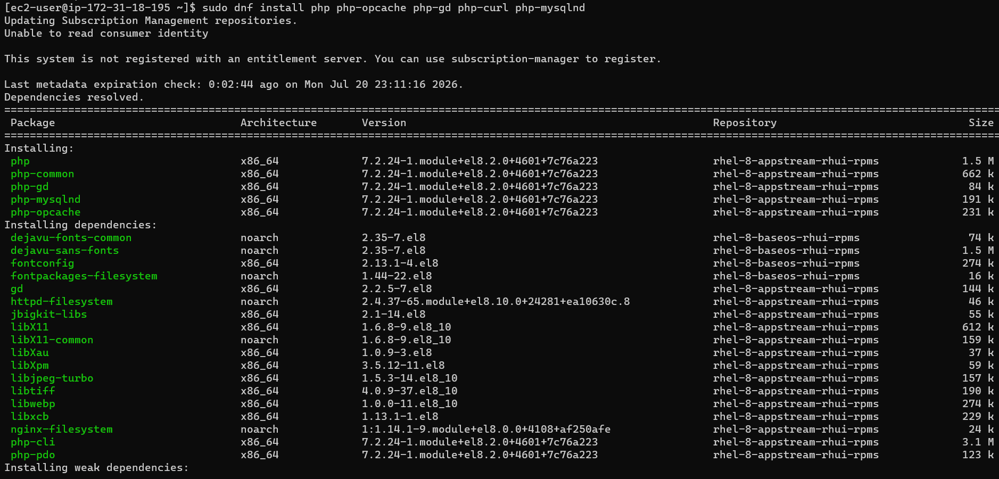

Starts the PHP FastCGI Process Manager (PHP-FPM) service immediately.
Configures PHP-FPM to start automatically at system boot.
```bash
sudo systemctl start php-fpm
sudo systemctl enable php-fpm
sudo setsebool -P httpd_execmem 1
```
Permanently allows Apache (httpd) to execute writable memory under SELinux. This is sometimes required by certain PHP extensions or applications but should only be enabled if necessary, as it relaxes SELinux security.

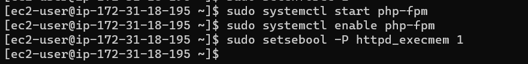

Mount the filesystems on /mnt/{apps,opt,logs} and configure them to be automatically mounted at boot time.

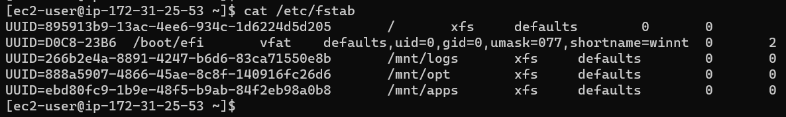
Verify that the share has read/write permissions and that clients can successfully write to it.
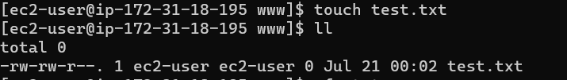

For users familiar with virtual machine cloning, AWS offers a similar mechanism using Amazon Machine Images (AMIs). We will now create the two remaining EC2 instances from the AMI. It is similar to capturing the configuration and state of a running instance, then using that image later to launch new instances.
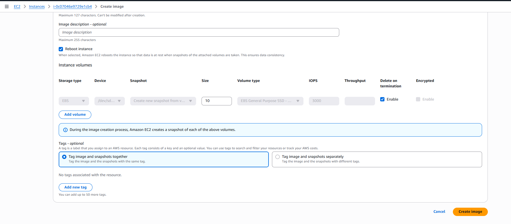
Select the image and press on Launch instance from AMI to create the remaining instances, and pay attention to use the same network and Availability zone (AZ) for ease of use and to avoid trouble for the share we have prepared .
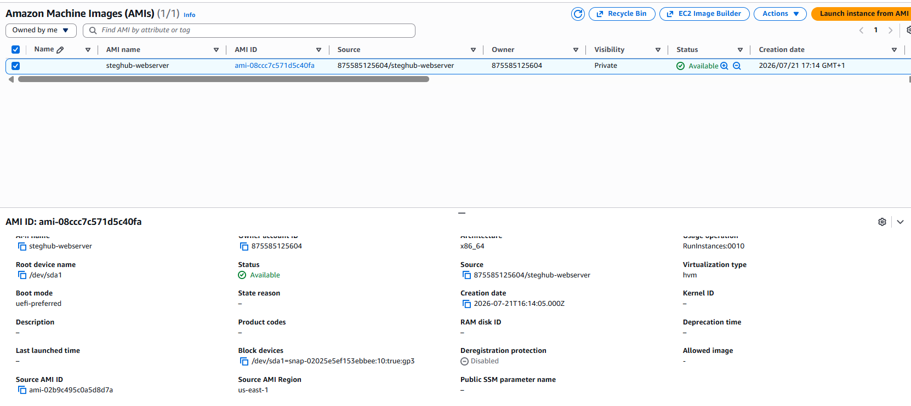
After creating webservers we need to create a fork of tooling website on github.


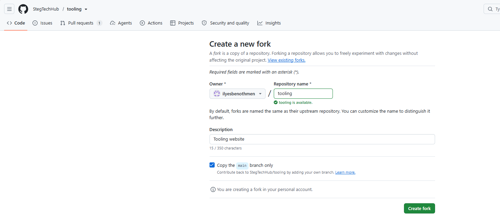
Install git command with 
```bash
sudo dnf install git
```
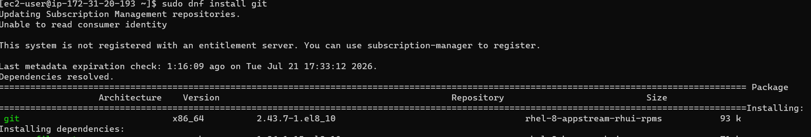
Now, I need to create a new SSH key in my GitHub account for one of the web servers, for example steghub-webserver3. The same procedure applies to webserver1 or webserver2, but only one server is required.
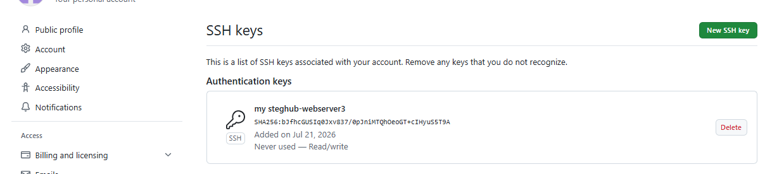
Generate keys with an empty passphrase

Displays the generated public key that must be copied to GitHub.

Verifies that SSH authentication with GitHub is working correctly.
> [!NOTE]
>-T option of ssh disables remote command execution; only tests authentication.
```bash
ssh-keygen -t ed25519
eval "$(ssh-agent -s)"
cat ~/.ssh/id_ed25519.pub
ssh -T  git@github.com
git clone git@github.com:ilyesbenothmen/tooling.git
```
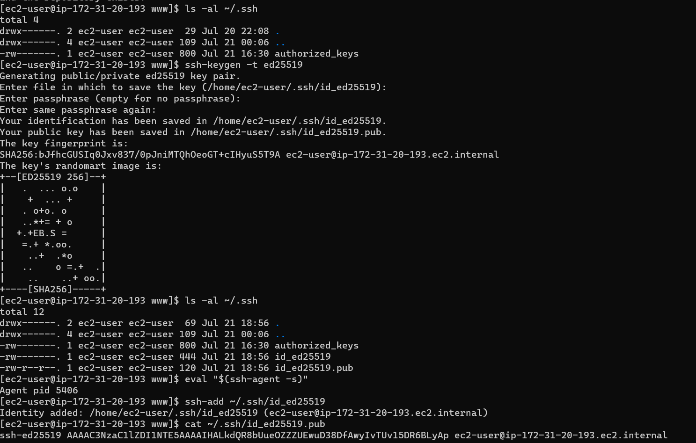

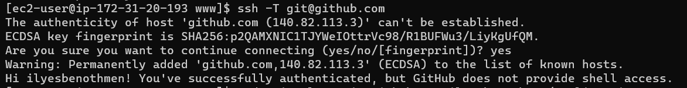


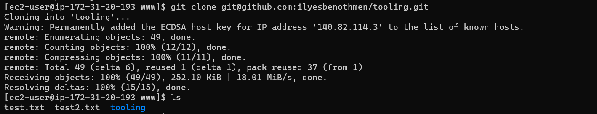
Add an inbound security group rule to allow HTTP traffic on port 80 for each web server, as shown below.

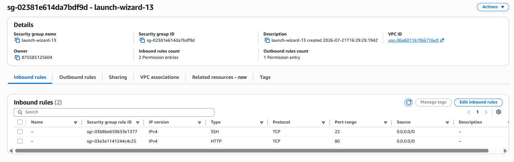


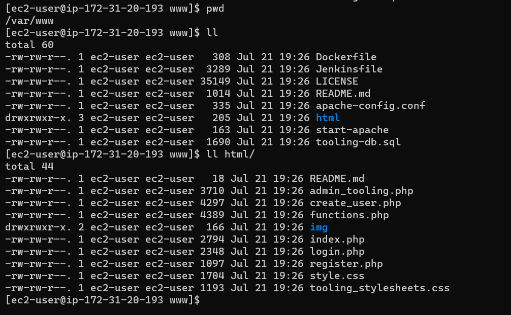

Connect again to mysql database server :
Create a MySQL user account named myuser that is allowed to connect from any IP address (%) and grant it administrative privileges.
```sql
CREATE USER 'myuser'@'%' IDENTIFIED BY 'password';
GRANT ALL PRIVILEGES ON *.* TO 'myuser'@'%' WITH GRANT OPTION;
FLUSH PRIVILEGES;
```
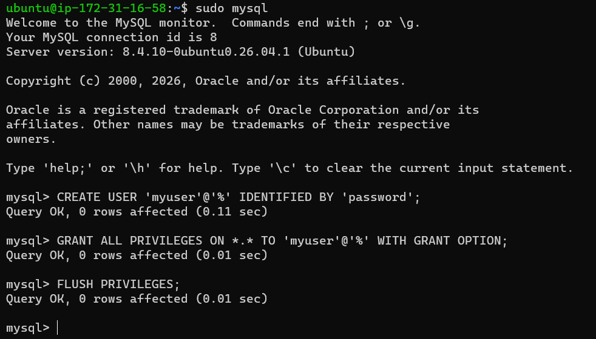

install a mysql client like mariadb on a webserver with
```bash
sudo yum install mariadb
```
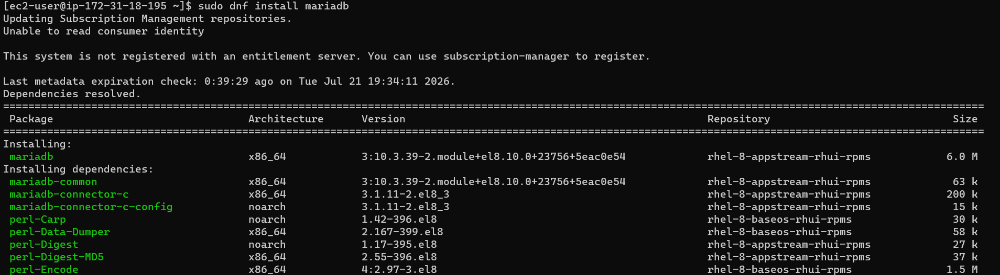

Access the web server and verify that the graphical user interface (GUI) is displayed correctly.

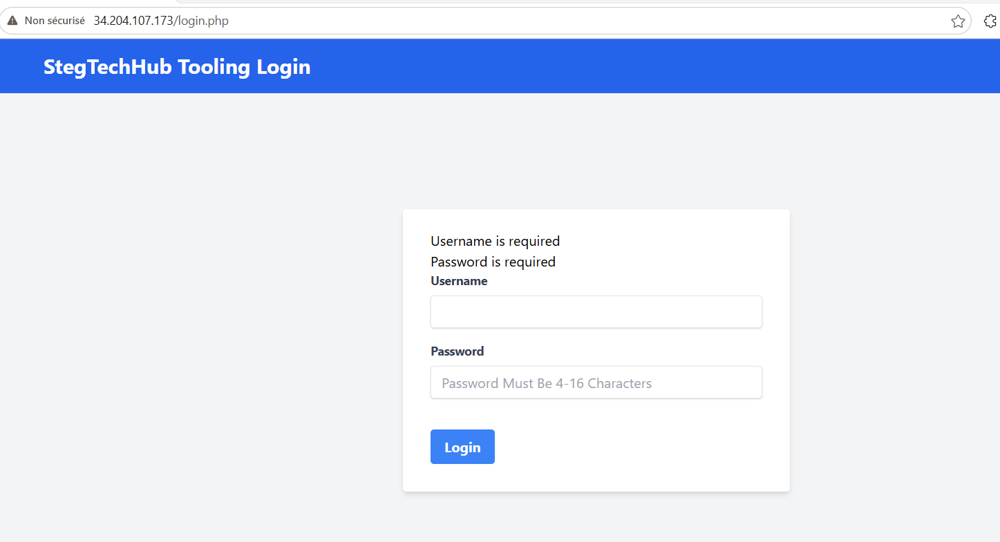


Run the tooling-db.sql script on the remote mysql server with:
```sql

mysql -u myuser -ppassword -h 172.31.16.58 -D tooling < tooling-db.sql

```


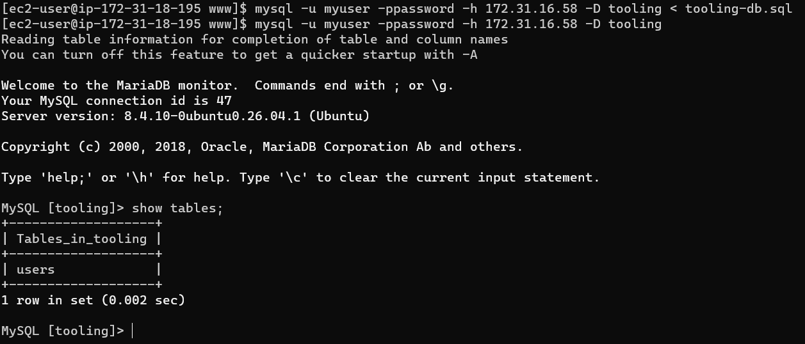
Create a database user named myuser with administrative privileges on the tooling database. This user is intended to manage database operations within tooling and is not a generic user account.
```sql
INSERT INTO `users` (`id`, `username`, `password`, `email`, `user_type`, `status`)
VALUES (1, 'myuser', '5f4dcc3b5aa765d61d8327deb882cf99', 'user@mail.com', 'admin', 1);

```
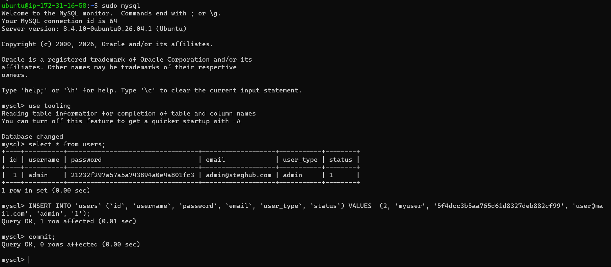
Now login to any of our webservers and use admin/admin
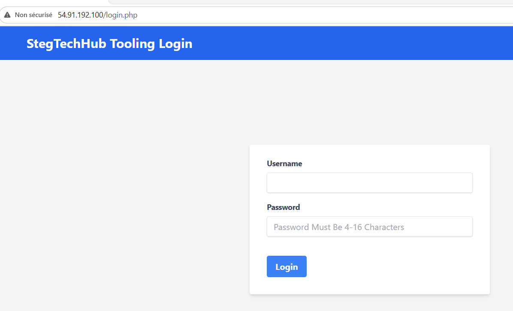
the following screen is displayed
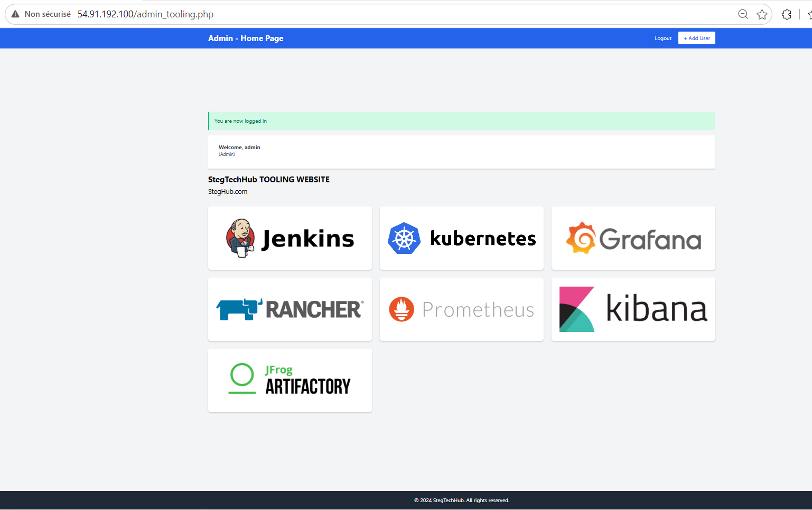
as admin let us create a non admin user named test/test123
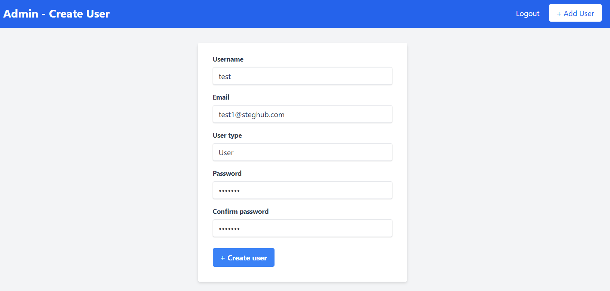
connect with test user
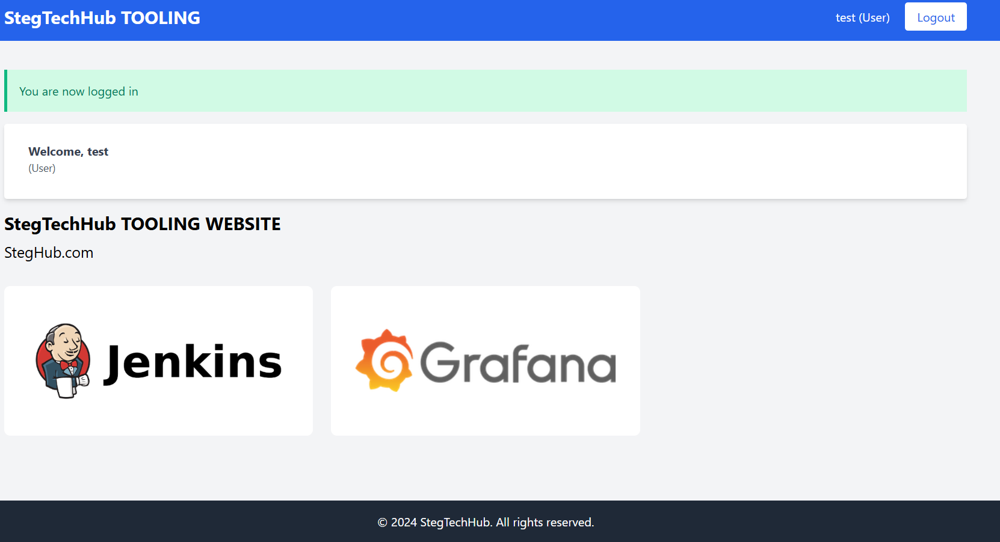

### Error encountered:
*  RHEL: 8.10 
*  PHP: 7.2.24 (very old) 
*  MySQL Server: 8.4.10 (Ubuntu 26.04) 
*  Result: Authentication fails because the client is too old for MySQL 8.4.
*  Solution : Upgrade PHP to the version 8.2
```bash
sudo dnf module list php
sudo dnf module reset php
sudo dnf module enable php:8.2
sudo dnf distro-sync
sudo dnf install php php-cli php-common php-mysqlnd php-fpm
sudo systemctl restart httpd
sudo systemctl restart php-fpm
```
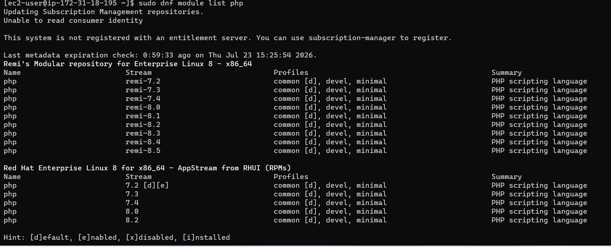
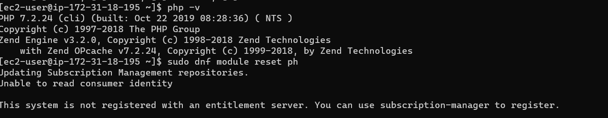
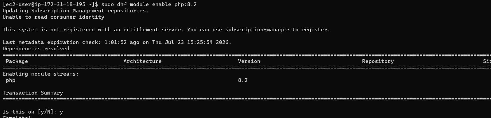
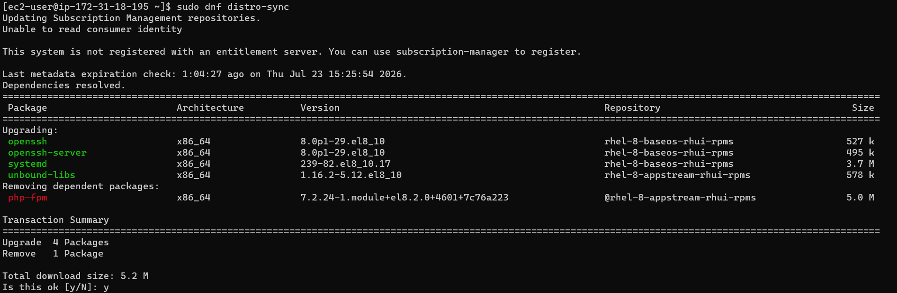
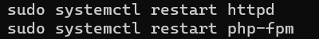
### Conclusion:

During this lab, we implemented an enterprise-like application deployment, covering the complete infrastructure setup and configuration process. Each step was thoroughly documented and illustrated, including the implementation details on both RHEL and Ubuntu platforms. AWS was used as the cloud infrastructure provider to host and manage the required resources.

This lab provided hands-on experience with deploying a multi-tier application architecture, configuring Linux-based systems, managing cloud resources, and applying real-world system administration practices.