## Devops Tooling Website Solution
### Introduction:
Implementing DevOps best practices—such as automation and CI/CD pipelines—requires robust tooling. To achieve this, we are leveraging a well-established set of open-source solutions. In our lab, we will centralize and share these tools via an internal website, reflecting standard industry practices and promoting a strong corporate culture of knowledge sharing. We will build this resilient website using the following technologies:

### Component:
- [x] Infrastructure: AWS
- [x] WebServer Linux: Red Hat Enterprise Linux 8
- [x] Database Server: Ubuntu 24.04 + MySQL
- [x] Storage Server: Red Hat Enterprise Linux 8 + NFS Server
- [x] Programming Language: PHP
- [x] Code Repository: GitHub

The target architecture we plan to implement is as follows:
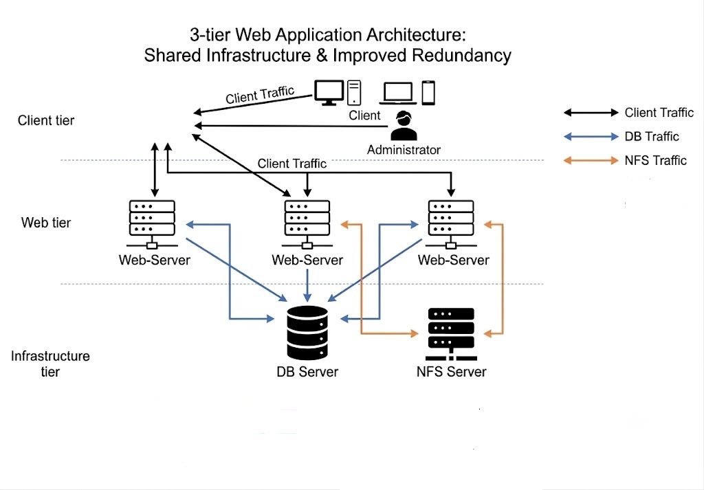
### Step1 prepare NFS Server:
Create an EC2 instance named steghub-nfs-server and download the associated .pem key pair file.

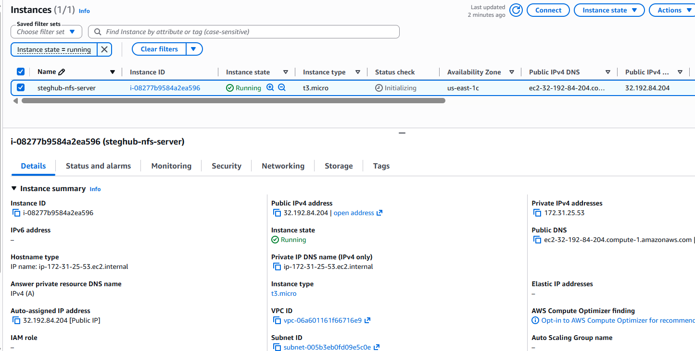
Create three 10 GB EBS volumes in the same Availability Zone (AZ) as the EC2 instance.

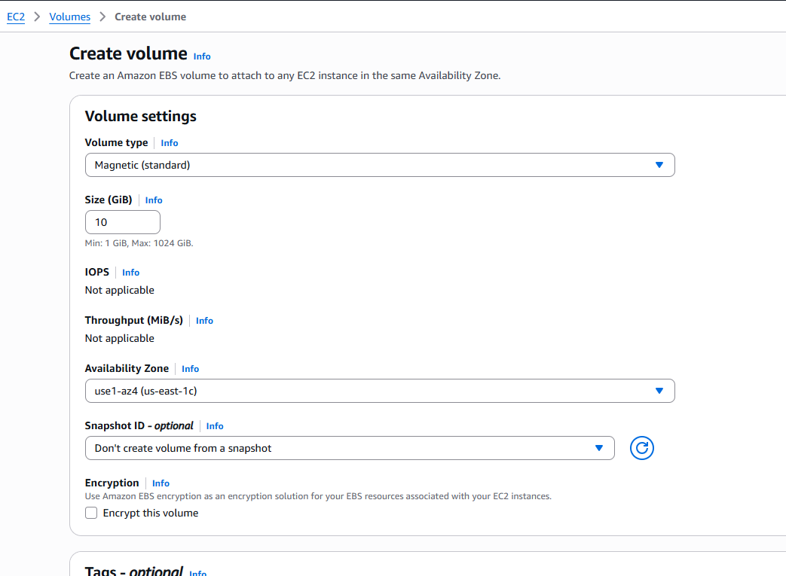

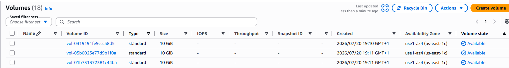
Attach the EBS volumes to the EC2 instance

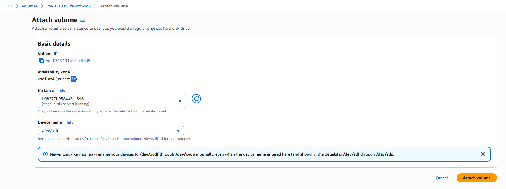
Select the EC2 instance and verify that the three newly attached EBS volumes are mapped.

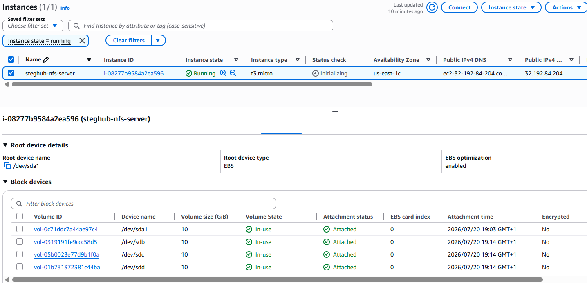

Connect to the NFS server and use the lsblk command to verify the attached disks and partitions.

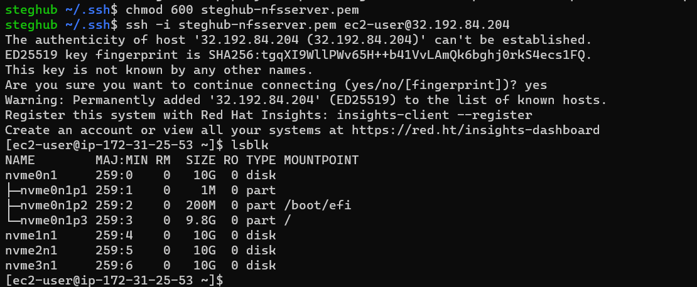
Using fdisk command partition nvme1n1 nvme2n1 and nvme3n1 with a primary partition for each disk
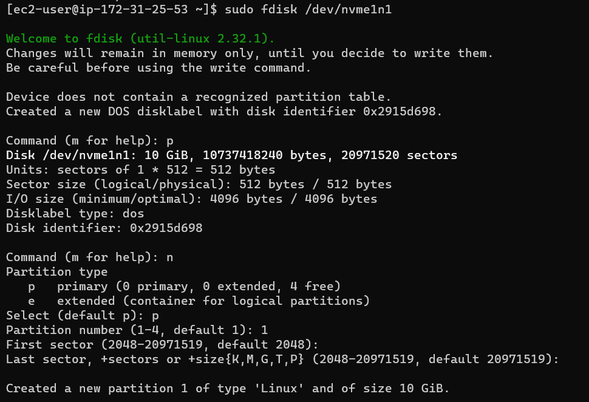
For each newly created partition, set the partition type to Linux LVM (8e), then write the partition table and exit by typing w.
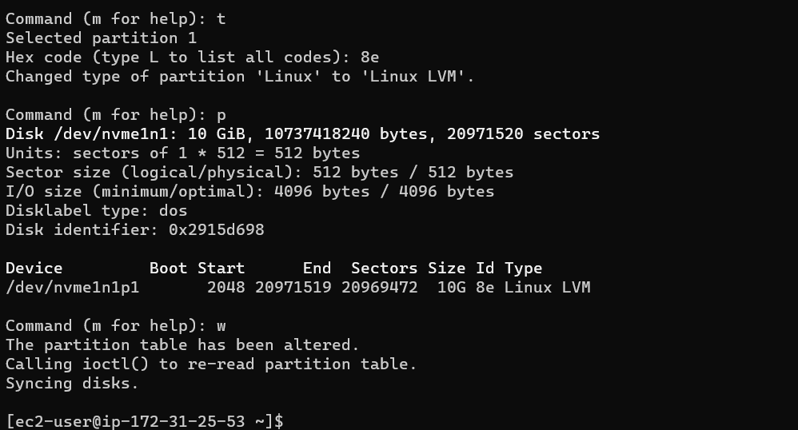
We are using LVM2 to manage storage in the Linux system , which give us scalability and reliability.
First of all  , we need to create a PV ( Pyisical Volume) with pvcreate
```bash
pvcreate /dev/nvme1np1
```
which will result in a new PV that can be integrate a part of a VG ( Volume Group )
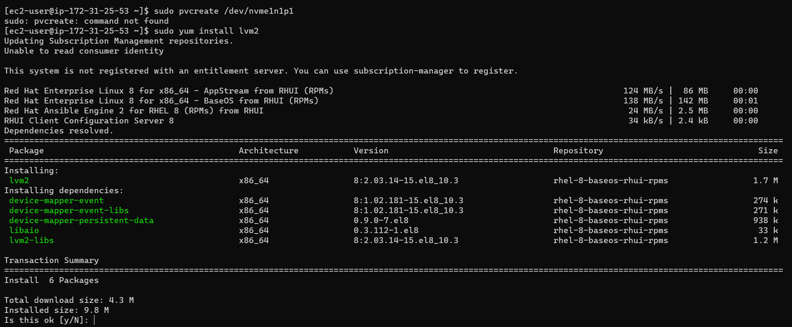
Repeat the same procedure for the remaining of partitions and check with pvs
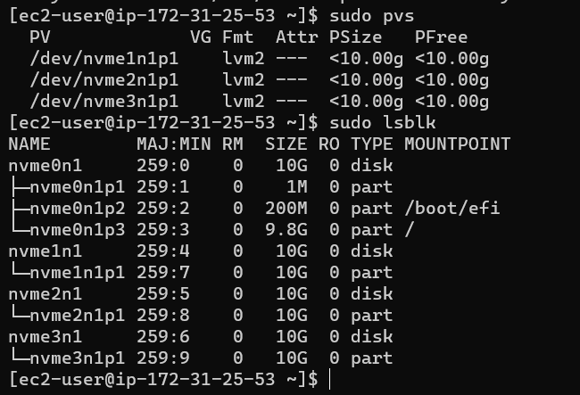

Integrate the PV under the same VG named vgdata with
```bash

sudo vgcreate vgdata /dev/nvme1n1p1 /dev/nvme2n1p1 /dev/nvme3n1p1 

```

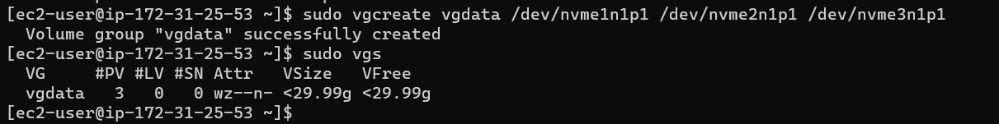

Now it is time to create our (LVs) Logical Volumes in the same VG 
```bash
sudo lvcreate -n lv-apps -L 8G vgdata 
sudo lvcreate -n lv-logs -L 8G vgdata 
sudo lvcreate -n lv-opt -L 8G vgdata 
```
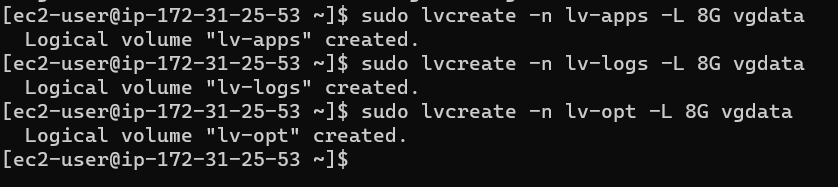

Create the filesystems. In this lab, we will use XFS, a modern filesystem that supports online resizing and management operations.
```bash
sudo mkfs.xfs /dev/vgdata/lv-apps
sudo mkfs.xfs /dev/vgdata/lv-logs
sudo mkfs.xfs /dev/vgdata/lv-opt
```

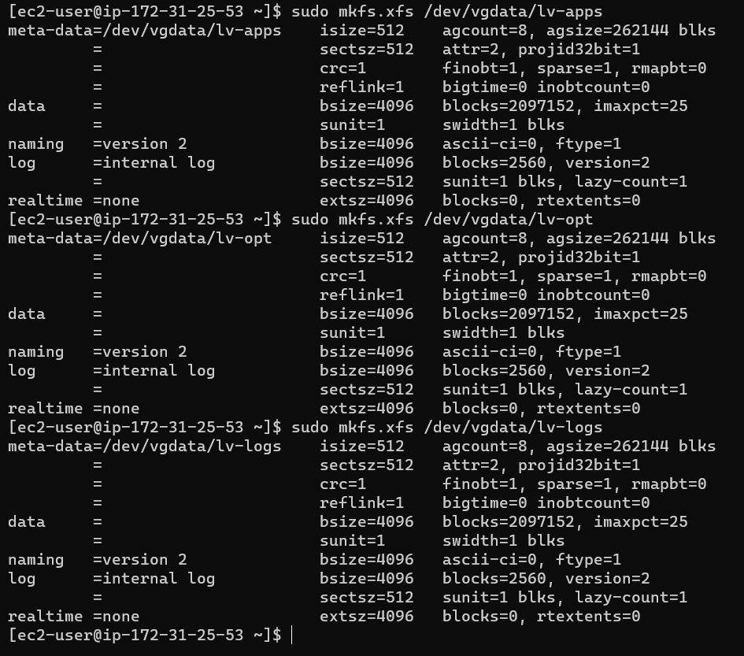
To create and populate the log partition (/var/log), we will first create a temporary directory to store the existing log files before moving them to the new filesystem.

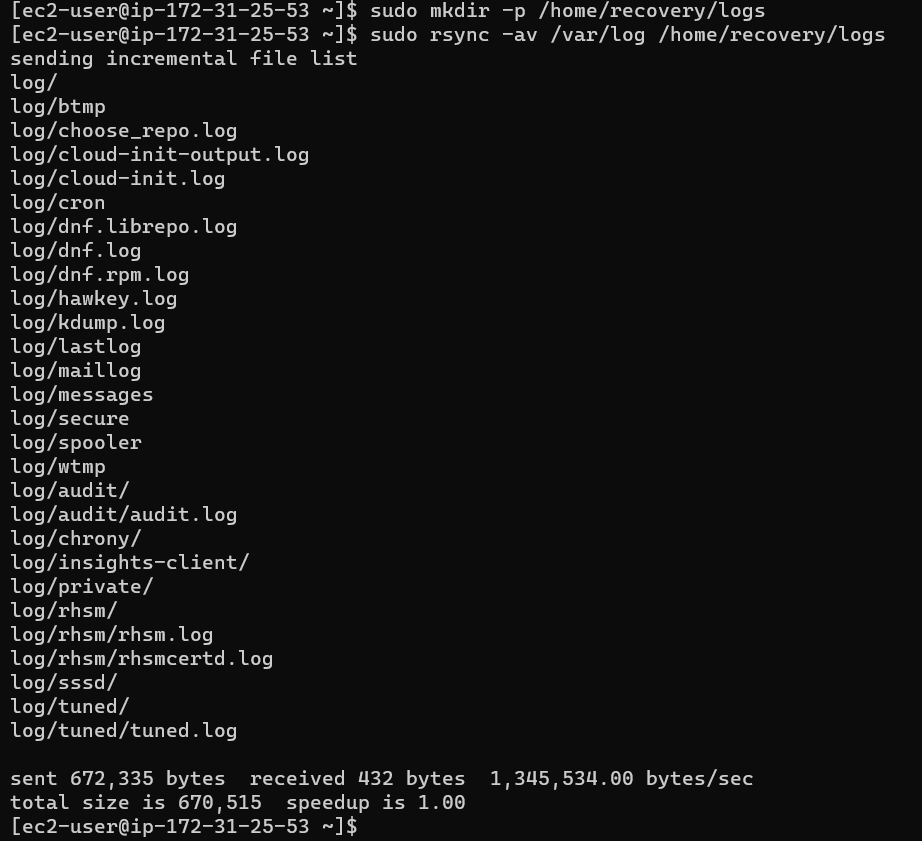

Now we mount /mnt/log to the new created logical volume and we restore log files.

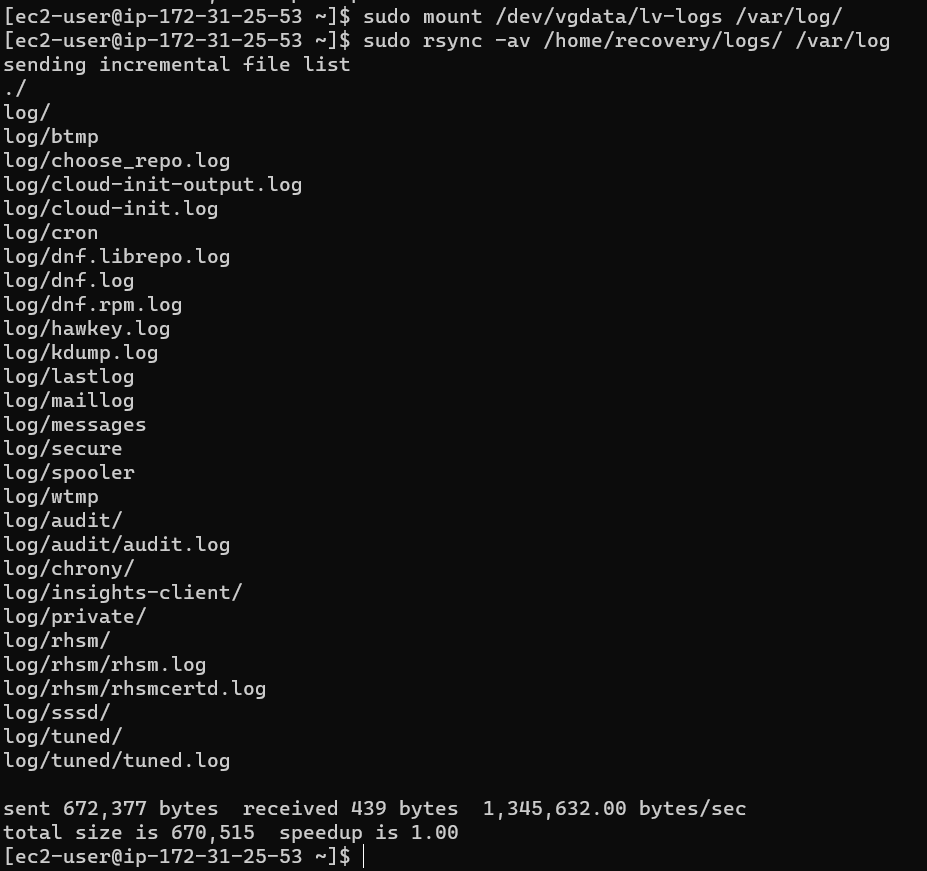

Mount the remaining LVs to their mountpoints ( /mnt/logs , /mnt/opt and /mnt/apps)


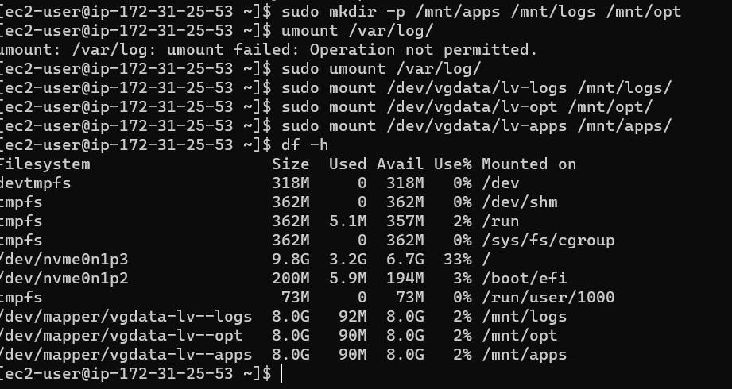
The filesystem preparation is now complete. We will proceed with the package installation phase.
>[!TIP]
>Before starting any major package installation, it is a best practice to check for available updates and ensure that the system is up to date.
```bash
sudo yum -y update
```

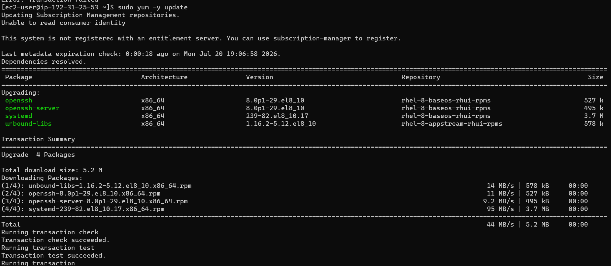
Install the nfs-utils package, which provides the NFS server components and the required utilities for managing NFS shares.

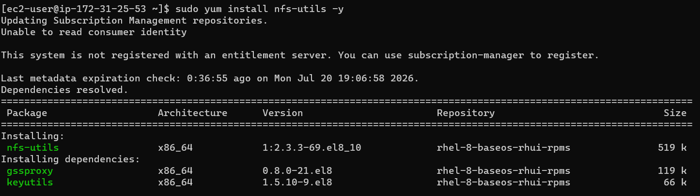

start and enable nfs-server for the next reboot to start automatically
```bash
sudo systemctl start nfs-server-utils
sudo systemctl enable nfs-server-utils
sudo systemctl status nfs-server-utils
```

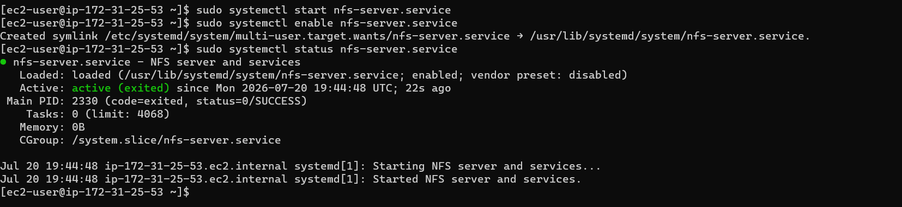

Create the mount points /mnt/{apps,logs,opt} and assign ownership to the nobody user with full access permissions. For this lab, we will use permissions 777, although this is not recommended in a production environment for security and compliance reasons.

The rationale behind using the nobody user is that Linux systems manage file ownership using user IDs (UIDs). The nobody account is a commonly available system user with a consistent UID mapping across many Unix/Linux systems, making it suitable for shared access scenarios such as NFS exports.


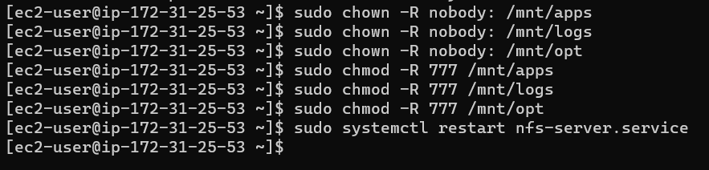

To make the NFS shares available to our web servers, we need to export them with the following options: rw, sync, no_all_squash, and no_root_squash.

To make the configuration persistent, add the export definitions to /etc/exports.

Apply the changes using the exportfs command.
For the purpose of this lab, we will use the same network for all web server clients. Make sure to note the IPv4 CIDR value ( 172.31.16.0/20).
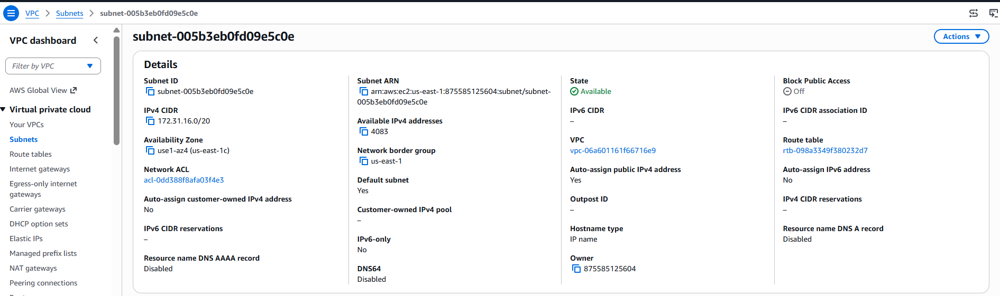
insert the following line to /etc/fstab:
```vi
/mnt/apps 172.31.16.0/20(rw,sync,no_all_squash,no_root_squash)
/mnt/logs 172.31.16.0/20(rw,sync,no_all_squash,no_root_squash)
/mnt/opt 172.31.16.0/20(rw,sync,no_all_squash,no_root_squash)
```
>[!TIP]
>Ensure that there is no space between the IP address and the parentheses.
To make the NFS shares available, apply the configuration changes by running the exportfs command.
```bash
sudo exportfs -arv
```
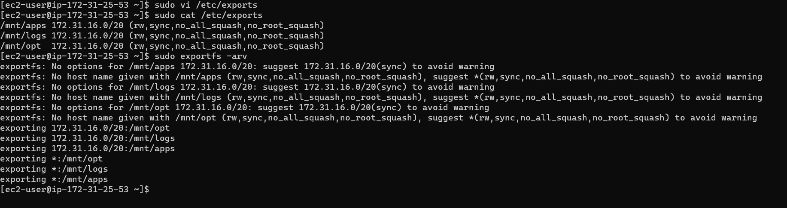

Chek which ports are used for nfs service with rpcinfo or netstat
```bash
sudo rpcinfo -p |grep nfs 
```
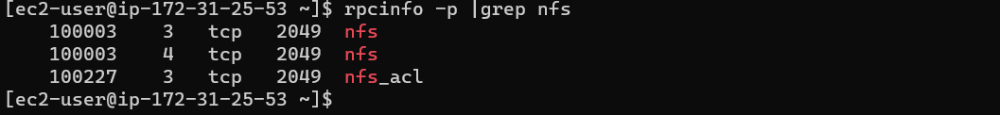
Add inbound security rules to allow ports 2049 and 111 for both TCP and UDP protocols, as shown below.
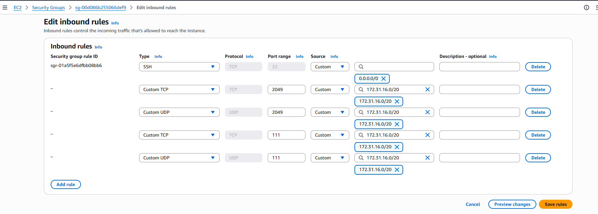


### Step2 Configure the Database Server
Create an EC2 instance named steghub-mysql-server and download the associated .pem key pair file.
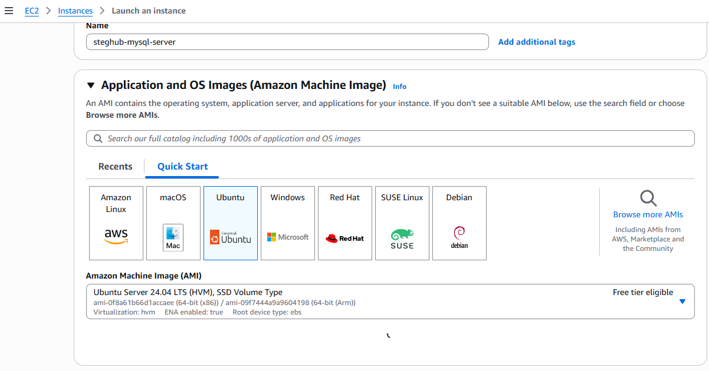
As ususal connect to the instance and refresh OS packages
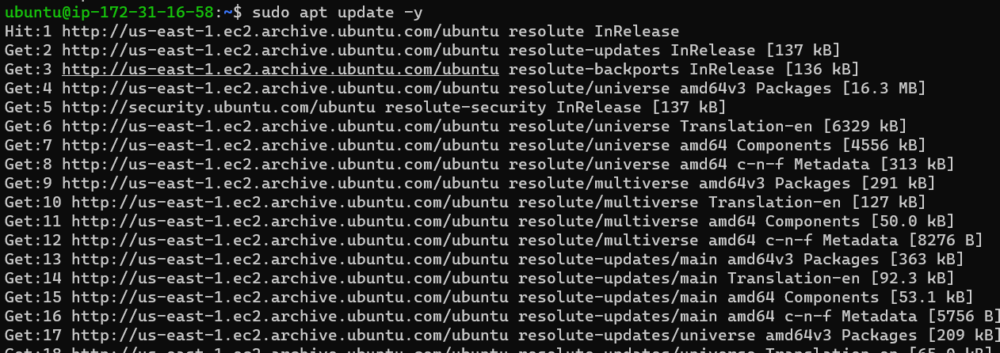
Install mysql-server with 

```bash
sudo install mysql-server
```

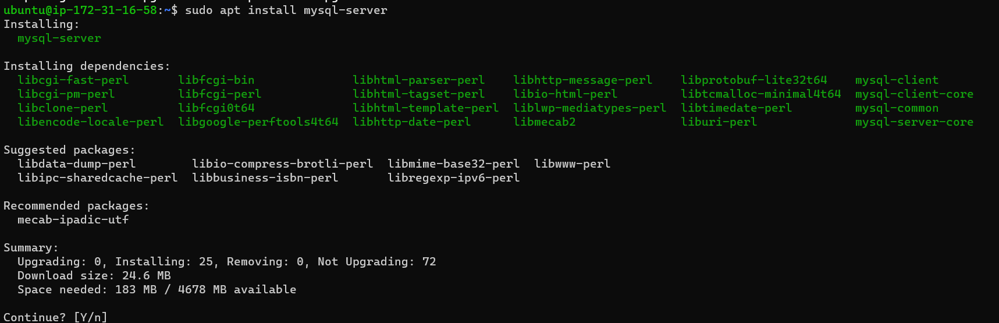
Configure the MySQL service to listen on all network interfaces by setting the bind address to 0.0.0.0. This change must be applied in the /etc/mysql/mysql.conf.d/mysqld.cnf configuration file.
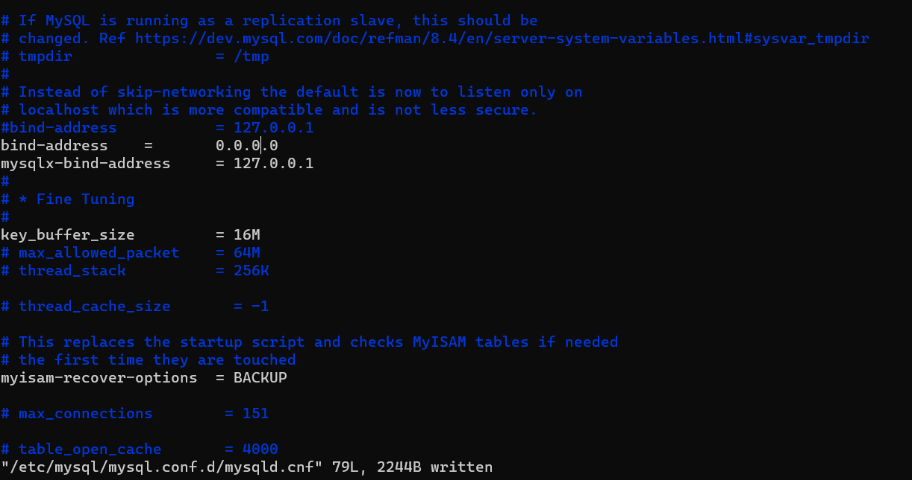
To interact with the database server we need a client tool like mysql-client
```bash
sudo apt install mysql-client
```
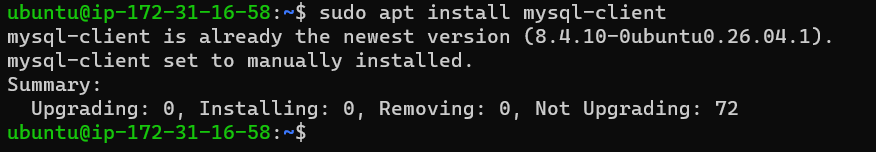
Add an inbound security rule to allow TCP traffic on port 3306 from the previously defined network 172.31.16.0/20.
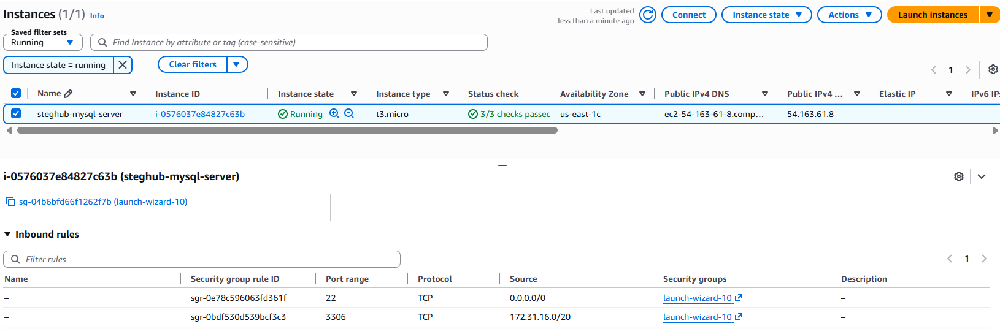
We will now secure our MySQL installation by running the mysql_secure_installation script.
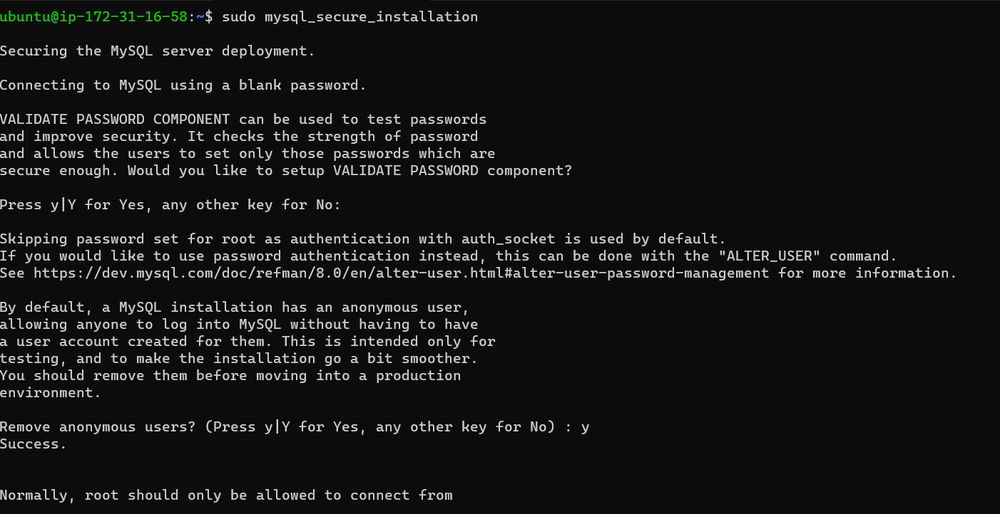
Connect to the local MySQL instance. Create the tooling database, then create a user named webaccess that is allowed to connect from the 172.31.0.0 network and grant it all privileges.
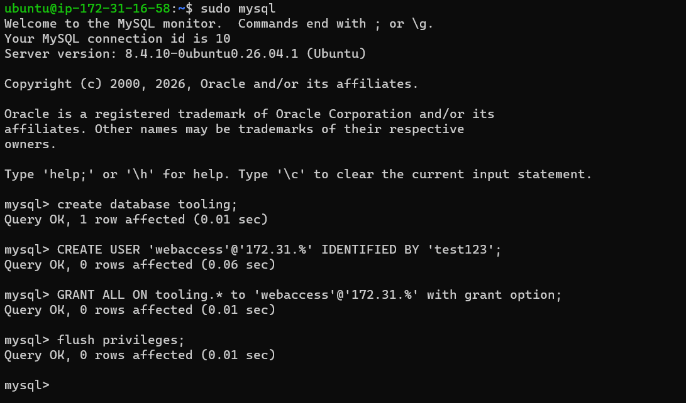

>[!TIP]
>


> [!NOTE]
> There is a reliable way to get the public IP address from the EC2 instance metadata service.


### Conclusion:

