## Ansible Configuration Management (Automate Project 7 to 10)
### Introduction:
When designing infrastructure for a real-world enterprise environment, it is common practice to deploy what is known as a jump host (or bastion host). This server acts as a controlled entry point for administrative access to the internal infrastructure.

By centralizing external access through a dedicated, hardened system, we reduce the overall attack surface and limit the exposure of internal systems to potential threats.

The architecture below depicts the target architecture that we will implement.
 


This lab consists of two parts:
1. Install and configure Ansible client to act as a Jump Server/Bastion Host
2. Create a simple ansible playbook to automate servers configuration
### Step 1 - install and Configure Ansible on EC2 Instance:

1. In previous labs, we used an AWS instance named steghub-jenkins. For the purpose of this lab, we will rename this instance to steghub-jenkins-ansible and configure it to act as our Jump Server (Bastion Host).

In the context of AWS, instance names are typically managed through Tags. Therefore, we will locate the Name tag associated with the instance in the AWS Management Console and update it accordingly.


2. In the Github account we created a new repository and named it **ansible-config-mgt**.


3. Install **Ansible** : 

- [ ]  Install with pip
- [x] Install with apt manager
In this case type the following system commands :
```bash
sudo apt update
sudo apt install ansible
```
Check that ansible is installed by running :
```bash
sudo ansible --version
```


>[!TIP]
>When installing Ansible with apt or yum, you get the latest Ansible version available in your distribution’s repositories, which is often older than the current upstream release. In contrast, installing Ansible with pip usually gives you the latest stable version published on PyPI, unless you explicitly pin a version.


4. Create a new Jenkins Item named ansible that archive the code change

- Create a freestyle project named **ansible**


- Fill in the **Repository URL** and **Credentials**

- Create a webhook by filling the **Payload URL** , for the moment "Disable SSL verification

- Set the webhook to trigger ansible build

- Configure a Post-build action that archive all files(**).

> [!NOTE]
> pay attention to use (**) as Files to Archive not (*)
 
You will see the ansible item checked in green after the first build integration.


Let’s check the status of the ansible item; it is indicated by #1, showing that it completed successfully.


By checking the Console Output, you can verify that the artifact was archived and that the build finished with **SUCCESS**.

5. You can check /var/lib/jenkins/jobs/ansible/builds/1/archive

In order to keep a fixed public IP address, we used an Elastic IP.

### Step 2 - Prepare your development environment using Visual Studio Code:

1. To improve productivity, we use an integrated development environment

 (IDE). For this bootcamp, our IDE of choice is Visual Studio Code because it:

- Integrates seamlessly with GitHub.

- Works directly with our Debian WSL environment.

- Connects to the jump host over SSH.

- Lets us browse remote files graphically as if they were local.

- Provides an integrated terminal.

- Includes a built-in debugger and interpreter support.

- Allows us to invoke an AI chatbot from within the editor.


2. We need to allow the jenkins-ansible host to push code to GitHub over SSH. To do this, we add its SSH public key to our GitHub account under Settings → SSH and GPG keys.


3. Clone the ansible-config-mgt.git to the jumphost VM with
```git
git clone git@github.com:ilyesbenothmen/ansible-config-mgt.git
```
As shown in the image below, we are connected to the jumphost shell through the integrated Terminal.
>[!Note]
>the README.md is from the remote repository on Github


The bottom of the following image indicates that we are successfully connected to the jumphost over SSH


### Step 3 - Begin Ansible Development :
1. Following GitFlow best practices, we classify branches by purpose: feature/, bugfix/, release/, hotfix/, and so on.


2. In this example, we are working on a new feature, so we create and use a feature branch:
```git
git checkout -b feature/prj11-ansible
git fetch
git checkout feature/prj11-ansible
```
At this stage we are working locally on our local repository on the newly created feature/prj11-ansible branch.


3. Create a directory and name it playbooks 

4. Create a directory and name it inventory

5. Within playbooks directory , create the first playbook and name it common.yml

6. Winthin the inventory folder , create an inventory file for each environment :  dev ,prod,uat and staging.


### Step 4 - Setup an Ansible Inventory:


To automate tasks with Ansible, the control node must be able to reach each managed node over SSH, ideally using key-based, passwordless authentication. Two common patterns are:

1. Single Ansible key pair: Generate an SSH key pair on the Ansible control node, and add the public key to the ~/.ssh/authorized_keys file of each managed host. The private key stays on the control node and can be loaded into ssh-agent to avoid repeated passphrase prompts.

2. Multiple SSH keys: When different managed nodes use different SSH key pairs (for example, per environment or per cloud provider), store the corresponding private keys on the control node, load them into ssh-agent, and reference them in your Ansible inventory with ansible_ssh_private_key_file as needed.


On the WSL terminal, start an SSH agent and load the private key for the jenkins-ansible host:
```bash

eval `ssh-agent -s`
ssh-add steghub-jenkins-ansible.pem
ssh-add -l
```

The first command starts ssh-agent in the current shell, the second adds your private key to the agent, and the third lists the keys currently loaded to confirm that the key was added successfully.


Now ssh into the Jenkin-ansible jumphost with 

```bash

ssh -A ubuntu@34.198.0.253

```


Update your inventory file with this snippet of code :

```vim

[nfs]
172.31.25.53  ansible_ssh_user=ec2-user

[webservers]
172.31.18.195 ansible_ssh_user=ec2-user
172.31.28.168 ansible_ssh_user=ec2-user

[db]
172.31.16.58 ansible_ssh_user=ubuntu

[lb]
172.31.24.59  ansible_ssh_user=ubuntu

```

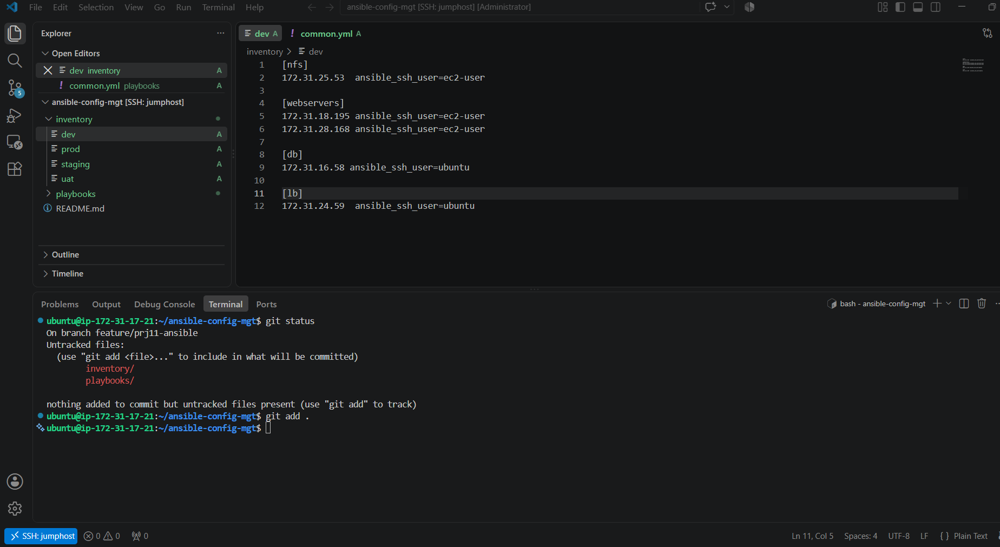

Checkout and update the inventory to the main remote repository.

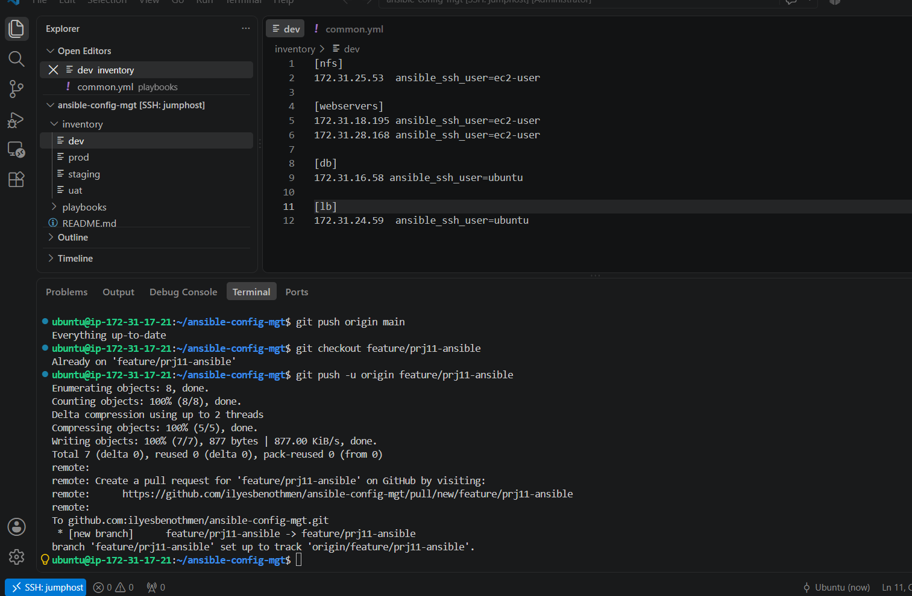

### Step 5 - Create a Common Playbook

Replace the content of playbooks/common.yml with the following:
```vim
- name: update web, nfs, and db servers
  hosts: nfs_server, web_servers, db_server
  become: yes
  tasks:
    - name: ensure wireshark is at the latest version
      yum:
        name: wireshark
        state: latest

- name: update LB server
  hosts: lb_server
  become: yes
  tasks:
    - name: Update apt repo
      apt:
        update_cache: yes

    - name: ensure wireshark is at the latest version
      apt:
        name: wireshark
        state: latest
```

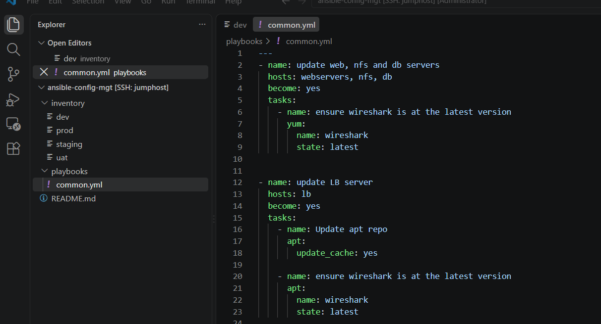
Commit change to local branch feature/prj11-ansible

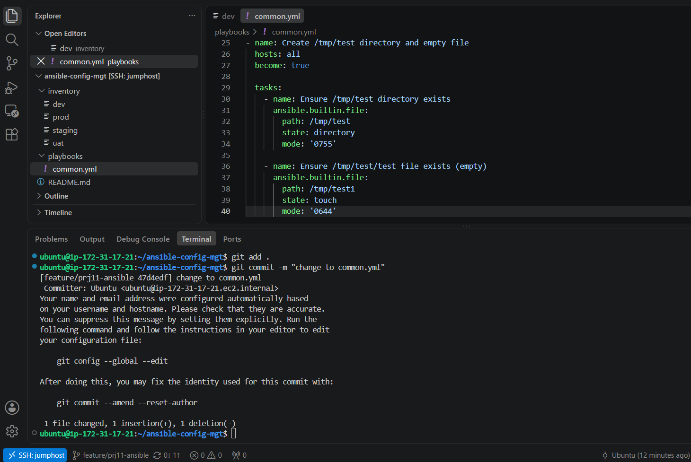
Push changes to remote repository

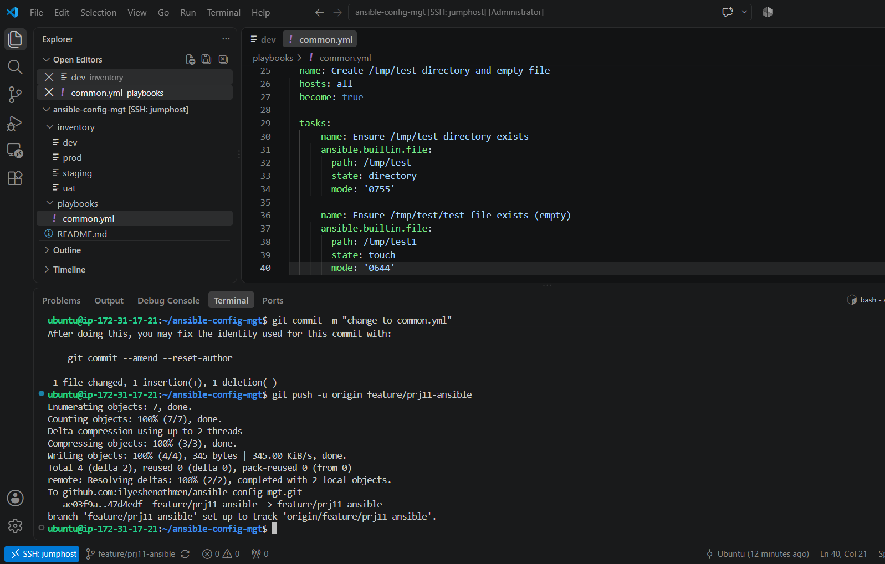


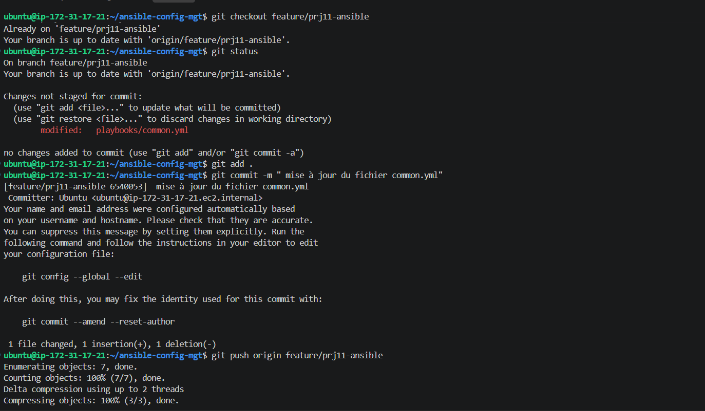

Apply for a PR (Pull Request) ,since we push to the remote prj11-ansible. The idea that the developer should ask the integrator/reviewer to merge its feature development into the remote main branch.

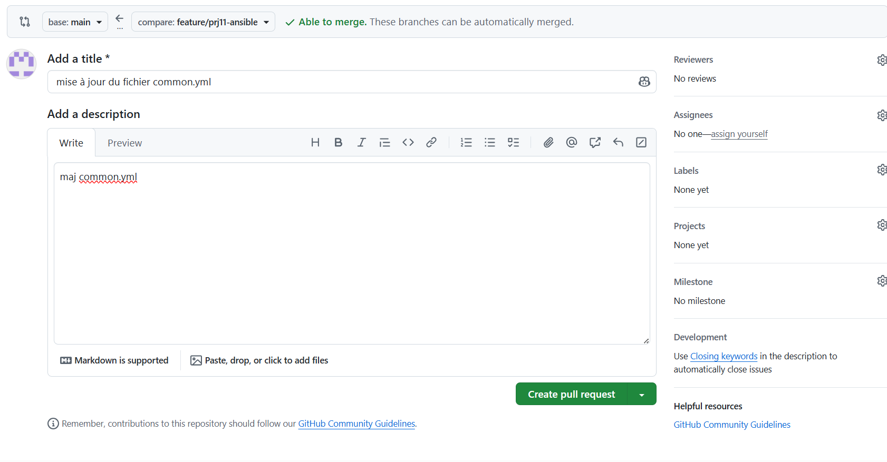
Here the integrator check that there is no conflict ,and will merge pull request
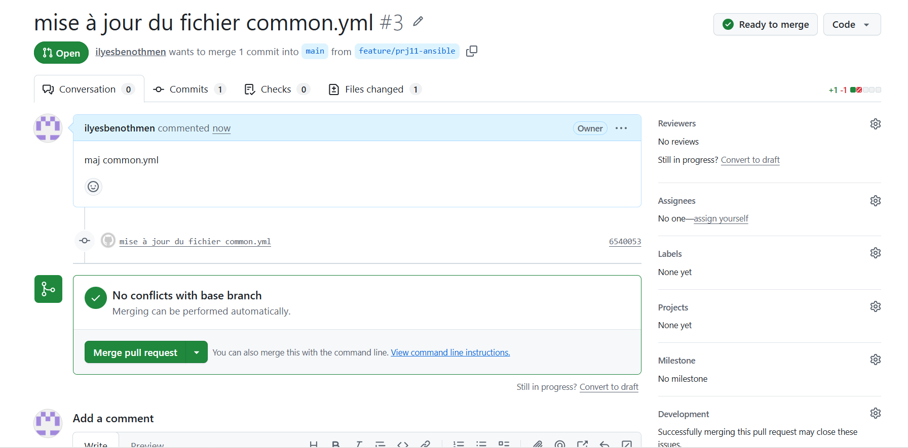
and confirm that merge
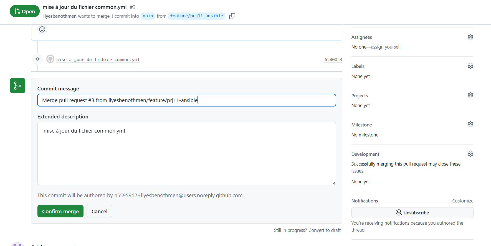

At this stage the feature/prj11-ansible can be safely deleted
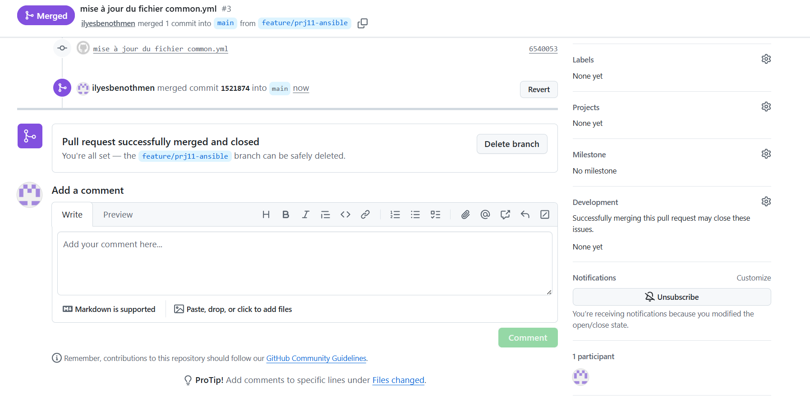

At this point, the Jenkins pipeline comes into play: as soon as the code is pushed to the main branch, the Jenkins job is automatically triggered.
Once your code changes appear in master branch - Jenkins will do its job and save all the files (build artifacts) to

/var/lib/jenkins/jobs/ansible/builds/<build_number>/archive/.

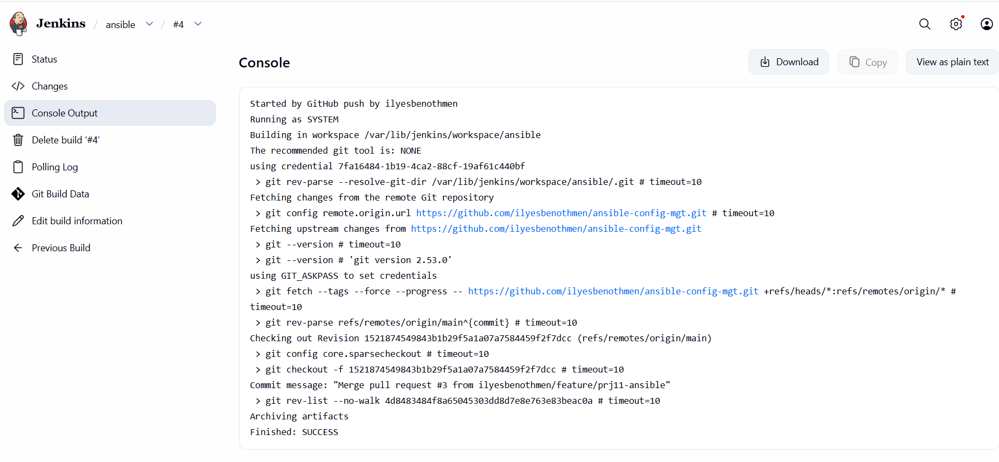


### Step 7 - RUN FIRST ANSIBLE TEST

Now, it is time to execute ansible-playbook command and verify if your playbook actually works:
```bash
ansible-playbook -i inventory/dev.yml playbooks/common.yml
```
In my environment it didn't work as expected!
It looks like a problem of python version. 
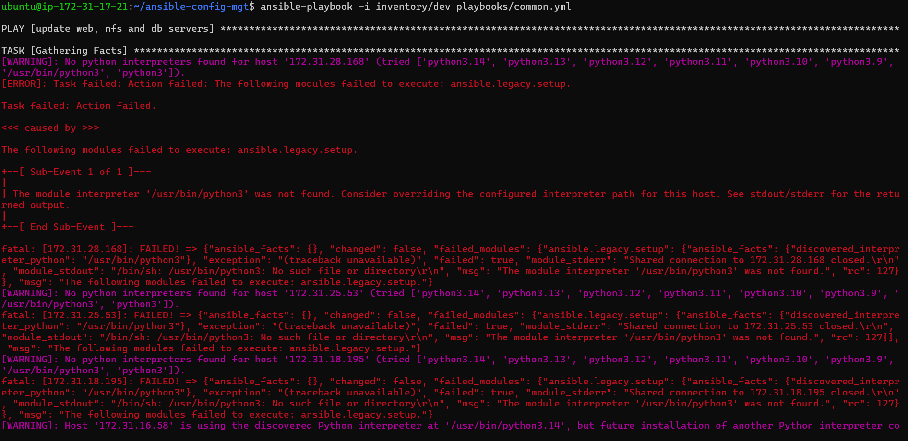

I have fixed the code with the following :
```yaml
---
- name: update web, nfs
  hosts: webservers, nfs
  remote_user: ec2-user
  become: yes
  vars:
    ansible_python_interpreter: /usr/bin/python3.9
  become_user: root
  tasks:
    - name: ensure wireshark is at the latest version
      ansible.builtin.command: dnf install -y wireshark
      register: dnf_output
      changed_when: "'Nothing to do' not in dnf_output.stdout"

- name: update LB server
  hosts: lb ,db
  remote_user: ubuntu
  become: yes
  become_user: root
  tasks:
    - name: Update apt repo
      apt:
        update_cache: yes

    - name: ensure wireshark is at the latest version
      apt:
        name: wireshark
        state: latest

```
The second execution of the playbook completed successfully.

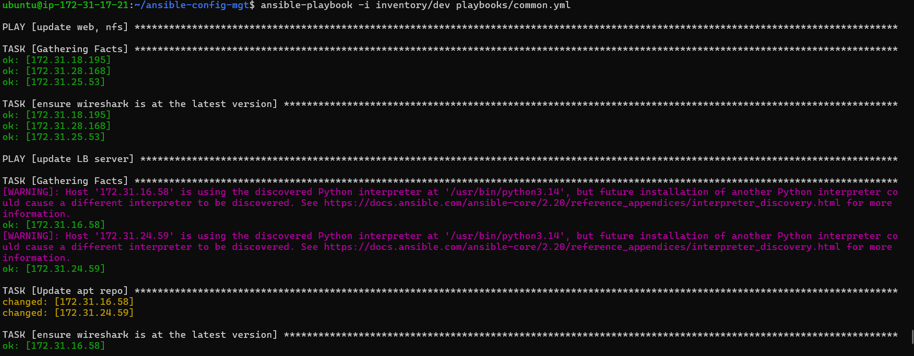


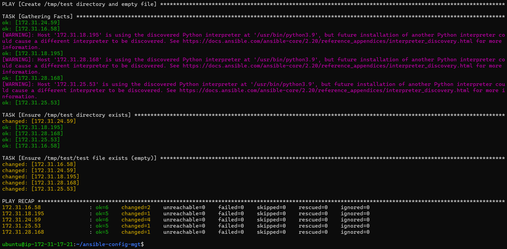
Let’s verify that Wireshark is installed on every node.
```bash
whick wireshark
```
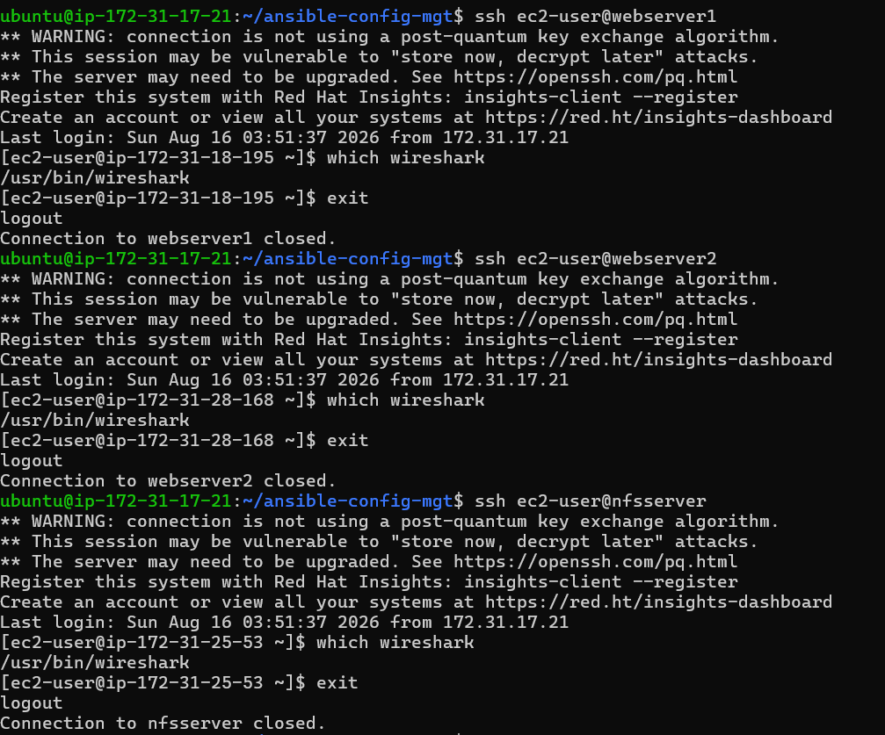
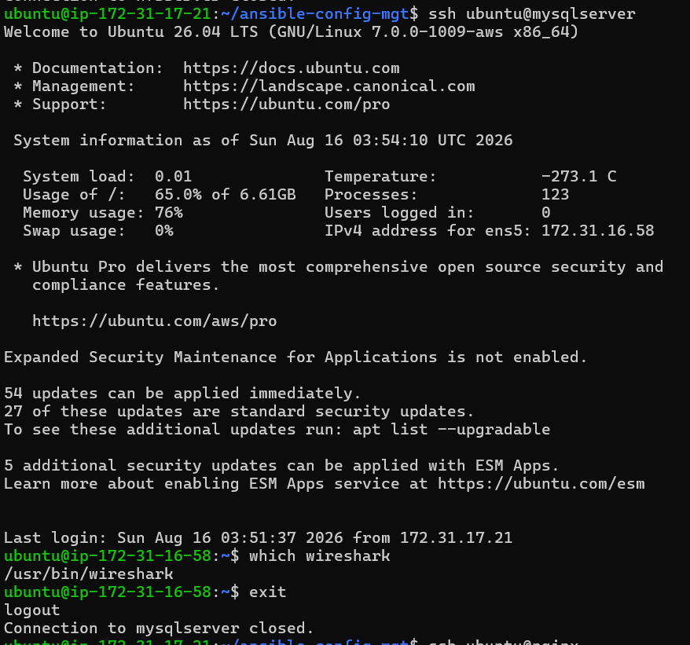
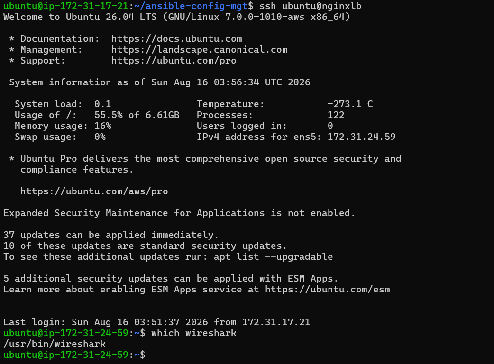

### Conclusion:

In this lab, we automated package deployment across the server nodes and laid the foundation on which further automation and CI will be built.